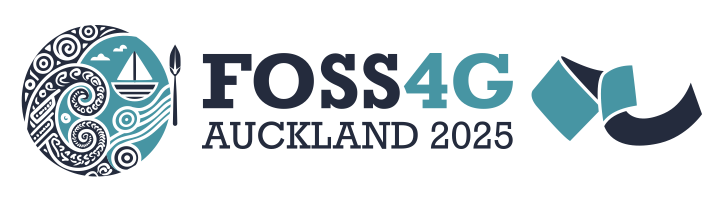

.. _community:

================================================================================
Community
================================================================================

GDAL's community interacts through `Mailing List`_, `GitHub`_, and
`Chat`_.  Please feel welcome to ask questions and participate in all of the
venues.  The `Mailing List`_ communication channel is for general questions,
development discussion, and feedback. The `GitHub`_ communication channel is
for development activities, bug reports, and testing. The `Chat`_
room is for real-time chat activities such as meetings and interactive
debugging sessions.

Code of Conduct
---------------

.. only:: html

    GDAL uses a :ref:`code_of_conduct` which governs how we behave in any GDAL
    forum or event and whenever we will be judged by our actions. We expect it to
    be honored by everyone who participates in the GDAL community formally or
    informally, or claims any affiliation with the project.

.. toctree::
   :hidden:

   code_of_conduct

.. _mailing_list:

Mailing List
------------

Developers and users of GDAL participate on the GDAL mailing list. It is OK to
ask questions about how to use GDAL, how to integrate GDAL into your own software,
and report issues that you might have.

http://lists.osgeo.org/mailman/listinfo/gdal-dev

GitHub
------

Visit http://github.com/OSGeo/GDAL to file issues you might be having with the
software. GitHub is also where you can obtain a current development version of the
software in the `git`_ revision control system. The GDAL project is eager to
take contributions in all forms, and we welcome those who are willing to roll
up their sleeves and start filing tickets, pushing code, generating builds, and
answering questions.

Chat
----

You can find some GDAL developers in the IRC channel #gdal on `Libera.Chat`_.
This mechanism is usually reserved for active meetings and other outreach
with the community.
The `Mailing List`_ and `GitHub`_ avenues are going to be more productive
communication channels in most situations.

.. _`git`: https://en.wikipedia.org/wiki/Git_(software)
.. _`Libera.Chat`: https://web.libera.chat/#gdal

Social media
------------

You can follow GDAL official news on the following platforms:

* Mastodon: https://mastodon.social/@gdal / ``@gdal@mastodon.social``
* LinkedIn: https://www.linkedin.com/company/gdalorg/

Conferences
-----------

Upcoming
++++++++

`FOSS4G 2025 <https://2025.foss4g.org//>`__ is the Open Source Geospatial Foundation (OSGeo) annual FOSS4G event.

Previous
++++++++

GDAL presentations have been given at FOSS4G, the leading annual conference for free and open source geospatial software.
It is the event for those interested in GDAL/OGR, other FOSS geospatial technologies and the community around them.

+ `State of GDAL 3.10 & 3.11 <https://download.osgeo.org/gdal/presentations/State%20of%20GDAL%20%28FOSS4G-E%202025%29.pdf>`__
  by Even Rouault, Spatialys, at `FOSS4G Europe 2025 <https://2025.europe.foss4g.org/>`_ in Mostar, Bosnia-Herzegovina.
+ `State of GDAL 3.8 & 3.9 <https://download.osgeo.org/gdal/presentations/State%20of%20GDAL%20%28FOSS4G-E%202024%29.pdf>`__
  by Even Rouault, Spatialys, at `FOSS4G Europe 2024 <https://2024.europe.foss4g.org/>`_ in Tartu, Estonia. `Recording <https://av.tib.eu/media/68541>`__.
+ `State of GDAL 3.6 & 3.7 <https://download.osgeo.org/gdal/presentations/State%20of%20GDAL%20%28FOSS4G%202023%29.pdf>`__
  by Even Rouault, Spatialys, at  `FOSS4G 2023 <https://2023.foss4g.org/>`_ in Prizren, Kosovo. `Recording <https://av.tib.eu/media/66550>`__.
+ `State of GDAL 3.4 & 3.5 <https://download.osgeo.org/gdal/presentations/State%20of%20GDAL%20%28FOSS4G%202022%29.pdf>`__
  by Even Rouault, Spatialys, at  `FOSS4G 2022 <https://2022.foss4g.org/>`_ in Firenze, Italy. `Recording <https://av.tib.eu/media/69002>`__.
+ `State of GDAL 3.1, 3.2, 3.3… <https://download.osgeo.org/gdal/presentations/State%20of%20GDAL%20%28FOSS4G%202021%29.pdf>`__
  by Even Rouault, Spatialys, at  `FOSS4G 2021 <https://2021.foss4g.org/>`_ in Buenos Aires, Argentina. `Recording <https://av.tib.eu/media/57241>`__.
+ `State of GDAL 2.4 and 3.0 <https://download.osgeo.org/gdal/presentations/GDAL%202.4%20and%203.0%20%28FOSS4G%202019%29.pdf>`__
  by Even Rouault, Spatialys, at  `FOSS4G 2019 <https://2019.foss4g.org/>`_ in Bucharest, Romania. `Recording <https://av.tib.eu/media/43447>`__.

.. spelling:word-list::
    Mostar
    Tartu
    Firenze
    Buenos

Governance and Community Participation
--------------------------------------

OSGeo Project Membership
++++++++++++++++++++++++

Originally, GDAL has been lead by Frank Warmerdam, the original author of much
of GDAL/OGR, though with contributions and input from a variety of people.
As of February 2006 GDAL/OGR became a founding project of the
`Open Source Geospatial Foundation (OSGeo) <https://www.osgeo.org/>`_
and began a transition to a more community oriented governance
model - in keeping with OSGeo expectations.

Membership as an OSGeo project provides assurances that a variety of best practices
are being employed by the GDAL/OGR project, and that users and contributors can be
assured of responsible project operation and continuity of the project. In particular:

- A consensus oriented Project Management Committee will be in charge of the project.
- Project source code and contributions will be vetted to ensure code is properly
  made available, protecting contributors and users of GDAL/OGR.
- Part of the systems infrastructure used by the project is provided by the foundation,
  with responsible backup and redundancy to minimize disruptions.

.. _psc:

Project Steering Committee
++++++++++++++++++++++++++

As of April 2006 (following the GDAL/OGR 1.3.2 release) the project has been
placed in the hands of a Project Steering Committee. This project steering
committee operates under the rules of :ref:`rfc-1`, and is overall responsible for
decisions related to the GDAL/OGR project. The current members are (@github username):

- Frank Warmerdam      (`@warmerdam <https://github.com/warmerdam>`__)
- Daniel Morissette    (`@dmorissette <https://github.com/dmorissette>`__)
- Howard Butler        (`@hobu <https://github.com/hobu>`__)
- Tamas Szekeres       (`@szekerest <https://github.com/szekerest>`__)
- Even Rouault (chair) (`@rouault <https://github.com/rouault>`__)
- Jukka Rahkonen       (`@jratike80 <https://github.com/jratike80>`__)
- Kurt Schwehr         (`@schwehr <https://github.com/schwehr>`__)
- Norman Barker        (`@normanb <https://github.com/normanb>`__)
- Javier Jimenez Shaw  (`@jjimenezshaw <https://github.com/jjimenezshaw>`__)
- Dan Baston           (`@dbaston <https://github.com/dbaston>`__)
- Michael Smith        (`@msmitherdc <https://github.com/msmitherdc>`__)

Past members:

- Andrey Kiselev       (@strezen) (retired in 2019)
- Mateusz Łoskot       (@mloskot) (retired in 2023)
- Sean Gillies         (@sgillies) (retired in 2025)

Note that discussion of proposals to the PSC take place on gdal-dev, and input
from all subscribers is welcome. A :ref:`list of past RFC <rfclist>` is available for review.

User survey
+++++++++++

Results of the :ref:`survey_2025` are available for review.

.. toctree::
   :hidden:

   user_survey_2024
   user_survey_2025

GDAL Service Providers
----------------------

.. only:: html

    GDAL is developed and supported by a rich ecosystem of businesses and
    individuals around the world. You can consult a list of :ref:`service_providers`
    who can assist you in getting the best out of your GDAL investment.

.. toctree::
   :hidden:

   service_providers
