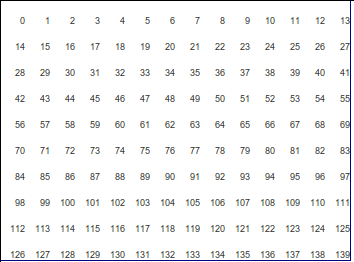
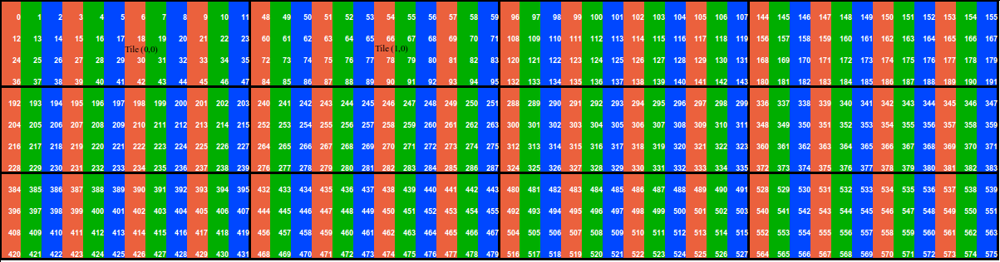

.. _rfc-45:

=======================================================================================
RFC 45: GDAL datasets and raster bands as virtual memory mappings
=======================================================================================

Authors: Even Rouault

Contact: even dot rouault at spatialys.com

Status: Adopted, implemented

Summary
-------

This document proposes additions to GDAL so that image data of GDAL
datasets and raster bands can be seen as virtual memory mappings, for
hopefully simpler usage.

Rationale
---------

When one wants to read or write image data from/into a GDAL dataset or
raster band, one must use the RasterIO() interface for the regions of
interest that are read or written. For small images, the most convenient
solution is usually to read/write the whole image in a single request
where the region of interest is the full raster extent. For larger
images, particularly when they do not fit entirely in RAM, this is not
possible, and if one wants to operate on the whole image, one must use a
windowing strategy to avoid memory issues : typically by proceeding
scanline (or group of scanlines) by scanline, or by blocks for tiled
images. This can make the writing of algorithms more complicated when
they need to access a neighbourhood of pixels around each pixel of
interest, since the size of this extra window must be taken into
account, leading to overlapping regions of interests. Nothing that
cannot be solved, but that requires some additional thinking that
distracts from the followed main purpose.

The proposed addition of this RFC is to make the image data appear as a
single array accessed with a pointer, without being limited by the size
of RAM with respect to the size of the dataset (excepted limitations
imposed by the CPU architecture and the operating system)

Technical solution
~~~~~~~~~~~~~~~~~~

Low-level machinery : cpl_virtualmem.h
^^^^^^^^^^^^^^^^^^^^^^^^^^^^^^^^^^^^^^

The low-level machinery to support this new capability is a
CPLVirtualMem object that represents an area of virtual memory ( on
Linux, an area of virtual memory allocated by the mmap() function ).
This virtual memory area is initially just reserved in terms of virtual
memory space, but has no actual allocation in physical memory. This
reserved virtual memory space is protected with an access permission
that cause any attempt to access it to result in an exception - a page
fault, that on POSIX systems triggers a SIGSEGV signal (segmentation
fault). Fortunately, segmentation faults can be caught by the software
with a signal handler. When such a segmentation fault occurs, our
specialized signal handler will check if it occurs in a virtual memory
region under its responsibility and, if so, it will proceed to fill the
part (a "page") of the virtual memory area that has been accessed with
sensible values (thanks to a user provided callback). It will then set
appropriate permissions to the page (read-only or read-write), before
attempting again the instruction that triggered the segmentation fault.
From the point of view of the user code that accesses the memory
mapping, this is completely transparent, and this is equivalent as if
the whole virtual memory area had been filled from the start.

For very large mappings that are larger than RAM, this would still cause
disk swapping to occur at a certain point. To avoid that, the
segmentation fault handler will evict the least recently used pages,
once a threshold defined at the creation of the CPLVirtualMem object has
been reached.

For write support, another callback can be passed. It will be called
before a page is evicted so that user code has a chance to flush its
content to a more persistent storage.

We also offer an alternative way of creating a CPLVirtualMem object, by
using memory file mapping mechanisms. This may be used by "raw" datasets
(EHdr driver for example) where the organization of data on disk
directly matches the organization of a in-memory array.

High-level usage
^^^^^^^^^^^^^^^^

Four new API are introduced (detailed in further section):

-  GDALDatasetGetVirtualMem() : takes almost the same arguments as
   GDALDatasetRasterIO(), with the notable exception of a pData buffer.
   It returns a CPLVirtualMem\* object, from which the base address of
   the virtual memory mapping can be obtained with
   CPLVirtualMemGetAddr().

-  GDALRasterBandGetVirtualMem(): equivalent of
   GDALDatasetGetVirtualMem() that operates on a raster band object
   rather than a dataset object.

-  GDALDatasetGetTiledVirtualMem(): this is a rather original API.
   Instead of presenting a 2D view of the image data (i.e. organized
   rows by rows), the mapping exposes it as an array of tiles, which is
   more suitable, performance wise, when the dataset is itself tiled.

.. image:: ../../../images/rfc45/rfc_tiled.png

When they are several bands, 3 different organizations of band
components are possible. To the best of our knowledge, there is no
standard way of calling those organizations, which consequently will be
best illustrated by the following schemas :

- TIP / Tile Interleaved by Pixel

- BIT / Band Interleaved by Tile

.. image:: ../../../images/rfc45/rfc_BIT.png
   :alt: BIT / Band Interleaved by Tile

- BSQ / Band SeQuential organization

.. image:: ../../../images/rfc45/rfc_BSQ.png
   :alt: BSQ / Band SeQuential organization

-  GDALRasterBandGetTiledVirtualMem(): equivalent of
   GDALDatasetGetTiledVirtualMem() that operates on a raster band object
   rather than a dataset object.

-  GDALGetVirtualMemAuto(): simplified version of
   GDALRasterBandGetVirtualMem() where the user only specifies the
   access mode. The pixel spacing and line spacing are returned by the
   function. This is implemented as a virtual method at the
   GDALRasterBand level, so that drivers have a chance of overriding the
   base implementation. The base implementation just uses
   GDALRasterBandGetVirtualMem(). Overridden implementation may use the
   memory file mapping mechanism instead. Such implementations will be
   done in the RawRasterBand object and in the GeoTIFF driver.

Details of new API
------------------

.. _implemented-by-cpl_virtualmemcpp:

Implemented by cpl_virtualmem.cpp
~~~~~~~~~~~~~~~~~~~~~~~~~~~~~~~~~

::

   /**
    * \file cpl_virtualmem.h
    *
    * Virtual memory management.
    *
    * This file provides mechanism to define virtual memory mappings, whose content
    * is allocated transparently and filled on-the-fly. Those virtual memory mappings
    * can be much larger than the available RAM, but only parts of the virtual
    * memory mapping, in the limit of the allowed the cache size, will actually be
    * physically allocated.
    *
    * This exploits low-level mechanisms of the operating system (virtual memory
    * allocation, page protection and handler of virtual memory exceptions).
    *
    * It is also possible to create a virtual memory mapping from a file or part
    * of a file.
    *
    * The current implementation is Linux only.
    */

   /** Opaque type that represents a virtual memory mapping. */
   typedef struct CPLVirtualMem CPLVirtualMem;

   /** Callback triggered when a still unmapped page of virtual memory is accessed.
     * The callback has the responsibility of filling the page with relevant values
     *
     * @param ctxt virtual memory handle.
     * @param nOffset offset of the page in the memory mapping.
     * @param pPageToFill address of the page to fill. Note that the address might
     *                    be a temporary location, and not at CPLVirtualMemGetAddr() + nOffset.
     * @param nToFill number of bytes of the page.
     * @param pUserData user data that was passed to CPLVirtualMemNew().
     */
   typedef void (*CPLVirtualMemCachePageCbk)(CPLVirtualMem* ctxt,
                                       size_t nOffset,
                                       void* pPageToFill,
                                       size_t nToFill,
                                       void* pUserData);

   /** Callback triggered when a dirty mapped page is going to be freed.
     * (saturation of cache, or termination of the virtual memory mapping).
     *
     * @param ctxt virtual memory handle.
     * @param nOffset offset of the page in the memory mapping.
     * @param pPageToBeEvicted address of the page that will be flushed. Note that the address might
     *                    be a temporary location, and not at CPLVirtualMemGetAddr() + nOffset.
     * @param nToBeEvicted number of bytes of the page.
     * @param pUserData user data that was passed to CPLVirtualMemNew().
     */
   typedef void (*CPLVirtualMemUnCachePageCbk)(CPLVirtualMem* ctxt,
                                         size_t nOffset,
                                         const void* pPageToBeEvicted,
                                         size_t nToBeEvicted,
                                         void* pUserData);

   /** Callback triggered when a virtual memory mapping is destroyed.
     * @param pUserData user data that was passed to CPLVirtualMemNew().
    */
   typedef void (*CPLVirtualMemFreeUserData)(void* pUserData);

   /** Access mode of a virtual memory mapping. */
   typedef enum
   {
       /*! The mapping is meant at being read-only, but writes will not be prevented.
           Note that any content written will be lost. */
       VIRTUALMEM_READONLY,
       /*! The mapping is meant at being read-only, and this will be enforced 
           through the operating system page protection mechanism. */
       VIRTUALMEM_READONLY_ENFORCED,
       /*! The mapping is meant at being read-write, and modified pages can be saved
           thanks to the pfnUnCachePage callback */
       VIRTUALMEM_READWRITE
   } CPLVirtualMemAccessMode;

   /** Return the size of a page of virtual memory.
    *
    * @return the page size.
    *
    * @since GDAL 1.11
    */
   size_t CPL_DLL CPLGetPageSize(void);

   /** Create a new virtual memory mapping.
    *
    * This will reserve an area of virtual memory of size nSize, whose size
    * might be potentially much larger than the physical memory available. Initially,
    * no physical memory will be allocated. As soon as memory pages will be accessed,
    * they will be allocated transparently and filled with the pfnCachePage callback.
    * When the allowed cache size is reached, the least recently used pages will
    * be unallocated.
    *
    * On Linux AMD64 platforms, the maximum value for nSize is 128 TB.
    * On Linux x86 platforms, the maximum value for nSize is 2 GB.
    *
    * Only supported on Linux for now.
    *
    * Note that on Linux, this function will install a SIGSEGV handler. The
    * original handler will be restored by CPLVirtualMemManagerTerminate().
    *
    * @param nSize size in bytes of the virtual memory mapping.
    * @param nCacheSize   size in bytes of the maximum memory that will be really
    *                     allocated (must ideally fit into RAM).
    * @param nPageSizeHint hint for the page size. Must be a multiple of the
    *                      system page size, returned by CPLGetPageSize().
    *                      Minimum value is generally 4096. Might be set to 0 to
    *                      let the function determine a default page size.
    * @param bSingleThreadUsage set to TRUE if there will be no concurrent threads
    *                           that will access the virtual memory mapping. This can
    *                           optimize performance a bit.
    * @param eAccessMode permission to use for the virtual memory mapping.
    * @param pfnCachePage callback triggered when a still unmapped page of virtual
    *                     memory is accessed. The callback has the responsibility
    *                     of filling the page with relevant values.
    * @param pfnUnCachePage callback triggered when a dirty mapped page is going to
    *                       be freed (saturation of cache, or termination of the
    *                       virtual memory mapping). Might be NULL.
    * @param pfnFreeUserData callback that can be used to free pCbkUserData. Might be
    *                        NULL
    * @param pCbkUserData user data passed to pfnCachePage and pfnUnCachePage.
    *
    * @return a virtual memory object that must be freed by CPLVirtualMemFree(),
    *         or NULL in case of failure.
    *
    * @since GDAL 1.11
    */

   CPLVirtualMem CPL_DLL *CPLVirtualMemNew(size_t nSize,
                                           size_t nCacheSize,
                                           size_t nPageSizeHint,
                                           int bSingleThreadUsage,
                                           CPLVirtualMemAccessMode eAccessMode,
                                           CPLVirtualMemCachePageCbk pfnCachePage,
                                           CPLVirtualMemUnCachePageCbk pfnUnCachePage,
                                           CPLVirtualMemFreeUserData pfnFreeUserData,
                                           void *pCbkUserData);

   /** Return if virtual memory mapping of a file is available.
    *
    * @return TRUE if virtual memory mapping of a file is available.
    * @since GDAL 1.11
    */
   int CPL_DLL CPLIsVirtualMemFileMapAvailable(void);

   /** Create a new virtual memory mapping from a file.
    *
    * The file must be a "real" file recognized by the operating system, and not
    * a VSI extended virtual file.
    *
    * In VIRTUALMEM_READWRITE mode, updates to the memory mapping will be written
    * in the file.
    *
    * On Linux AMD64 platforms, the maximum value for nLength is 128 TB.
    * On Linux x86 platforms, the maximum value for nLength is 2 GB.
    *
    * Only supported on Linux for now.
    *
    * @param  fp       Virtual file handle.
    * @param  nOffset  Offset in the file to start the mapping from.
    * @param  nLength  Length of the portion of the file to map into memory.
    * @param eAccessMode Permission to use for the virtual memory mapping. This must
    *                    be consistent with how the file has been opened.
    * @param pfnFreeUserData callback that is called when the object is destroyed.
    * @param pCbkUserData user data passed to pfnFreeUserData.
    * @return a virtual memory object that must be freed by CPLVirtualMemFree(),
    *         or NULL in case of failure.
    *
    * @since GDAL 1.11
    */
   CPLVirtualMem CPL_DLL *CPLVirtualMemFileMapNew( VSILFILE* fp,
                                                   vsi_l_offset nOffset,
                                                   vsi_l_offset nLength,
                                                   CPLVirtualMemAccessMode eAccessMode,
                                                   CPLVirtualMemFreeUserData pfnFreeUserData,
                                                   void *pCbkUserData );

   /** Create a new virtual memory mapping derived from an other virtual memory
    *  mapping.
    *
    * This may be useful in case of creating mapping for pixel interleaved data.
    *
    * The new mapping takes a reference on the base mapping.
    *
    * @param pVMemBase Base virtual memory mapping
    * @param nOffset   Offset in the base virtual memory mapping from which to start
    *                  the new mapping.
    * @param nSize     Size of the base virtual memory mapping to expose in the
    *                  the new mapping.
    * @param pfnFreeUserData callback that is called when the object is destroyed.
    * @param pCbkUserData user data passed to pfnFreeUserData.
    * @return a virtual memory object that must be freed by CPLVirtualMemFree(),
    *         or NULL in case of failure.
    *
    * @since GDAL 1.11
    */
   CPLVirtualMem CPL_DLL *CPLVirtualMemDerivedNew(CPLVirtualMem* pVMemBase,
                                                  vsi_l_offset nOffset,
                                                  vsi_l_offset nSize,
                                                  CPLVirtualMemFreeUserData pfnFreeUserData,
                                                  void *pCbkUserData);

   /** Free a virtual memory mapping.
    *
    * The pointer returned by CPLVirtualMemGetAddr() will no longer be valid.
    * If the virtual memory mapping was created with read/write permissions and that
    * they are dirty (i.e. modified) pages, they will be flushed through the
    * pfnUnCachePage callback before being freed.
    *
    * @param ctxt context returned by CPLVirtualMemNew().
    *
    * @since GDAL 1.11
    */
   void CPL_DLL CPLVirtualMemFree(CPLVirtualMem* ctxt);

   /** Return the pointer to the start of a virtual memory mapping.
    *
    * The bytes in the range [p:p+CPLVirtualMemGetSize()-1] where p is the pointer
    * returned by this function will be valid, until CPLVirtualMemFree() is called.
    *
    * Note that if a range of bytes used as an argument of a system call
    * (such as read() or write()) contains pages that have not been "realized", the
    * system call will fail with EFAULT. CPLVirtualMemPin() can be used to work
    * around this issue.
    *
    * @param ctxt context returned by CPLVirtualMemNew().
    * @return the pointer to the start of a virtual memory mapping.
    *
    * @since GDAL 1.11
    */
   void CPL_DLL *CPLVirtualMemGetAddr(CPLVirtualMem* ctxt);

   /** Return the size of the virtual memory mapping.
    *
    * @param ctxt context returned by CPLVirtualMemNew().
    * @return the size of the virtual memory mapping.
    *
    * @since GDAL 1.11
    */
   size_t CPL_DLL CPLVirtualMemGetSize(CPLVirtualMem* ctxt);

   /** Return if the virtual memory mapping is a direct file mapping.
    *
    * @param ctxt context returned by CPLVirtualMemNew().
    * @return TRUE if the virtual memory mapping is a direct file mapping.
    *
    * @since GDAL 1.11
    */
   int CPL_DLL CPLVirtualMemIsFileMapping(CPLVirtualMem* ctxt);

   /** Return the access mode of the virtual memory mapping.
    *
    * @param ctxt context returned by CPLVirtualMemNew().
    * @return the access mode of the virtual memory mapping.
    *
    * @since GDAL 1.11
    */
   CPLVirtualMemAccessMode CPL_DLL CPLVirtualMemGetAccessMode(CPLVirtualMem* ctxt);

   /** Return the page size associated to a virtual memory mapping.
    *
    * The value returned will be at least CPLGetPageSize(), but potentially
    * larger.
    *
    * @param ctxt context returned by CPLVirtualMemNew().
    * @return the page size
    *
    * @since GDAL 1.11
    */
   size_t CPL_DLL CPLVirtualMemGetPageSize(CPLVirtualMem* ctxt);

   /** Return TRUE if this memory mapping can be accessed safely from concurrent
    *  threads.
    *
    * The situation that can cause problems is when several threads try to access
    * a page of the mapping that is not yet mapped.
    *
    * The return value of this function depends on whether bSingleThreadUsage has
    * been set of not in CPLVirtualMemNew() and/or the implementation.
    *
    * On Linux, this will always return TRUE if bSingleThreadUsage = FALSE.
    *
    * @param ctxt context returned by CPLVirtualMemNew().
    * @return TRUE if this memory mapping can be accessed safely from concurrent
    *         threads.
    *
    * @since GDAL 1.11
    */
   int CPL_DLL CPLVirtualMemIsAccessThreadSafe(CPLVirtualMem* ctxt);

   /** Declare that a thread will access a virtual memory mapping.
    *
    * This function must be called by a thread that wants to access the
    * content of a virtual memory mapping, except if the virtual memory mapping has
    * been created with bSingleThreadUsage = TRUE.
    *
    * This function must be paired with CPLVirtualMemUnDeclareThread().
    *
    * @param ctxt context returned by CPLVirtualMemNew().
    *
    * @since GDAL 1.11
    */
   void CPL_DLL CPLVirtualMemDeclareThread(CPLVirtualMem* ctxt);

   /** Declare that a thread will stop accessing a virtual memory mapping.
    *
    * This function must be called by a thread that will no longer access the
    * content of a virtual memory mapping, except if the virtual memory mapping has
    * been created with bSingleThreadUsage = TRUE.
    *
    * This function must be paired with CPLVirtualMemDeclareThread().
    *
    * @param ctxt context returned by CPLVirtualMemNew().
    *
    * @since GDAL 1.11
    */
   void CPL_DLL CPLVirtualMemUnDeclareThread(CPLVirtualMem* ctxt);

   /** Make sure that a region of virtual memory will be realized.
    *
    * Calling this function is not required, but might be useful when debugging
    * a process with tools like gdb or valgrind that do not naturally like
    * segmentation fault signals.
    *
    * It is also needed when wanting to provide part of virtual memory mapping
    * to a system call such as read() or write(). If read() or write() is called
    * on a memory region not yet realized, the call will fail with EFAULT.
    *
    * @param ctxt context returned by CPLVirtualMemNew().
    * @param pAddr the memory region to pin.
    * @param nSize the size of the memory region.
    * @param bWriteOp set to TRUE if the memory are will be accessed in write mode.
    *
    * @since GDAL 1.11
    */
   void CPL_DLL CPLVirtualMemPin(CPLVirtualMem* ctxt,
                                 void* pAddr, size_t nSize, int bWriteOp);

   /** Cleanup any resource and handlers related to virtual memory.
    *
    * This function must be called after the last CPLVirtualMem object has
    * been freed.
    *
    * @since GDAL 1.11
    */
   void CPL_DLL CPLVirtualMemManagerTerminate(void);

.. _implemented-by-gdalvirtualmemcpp:

Implemented by gdalvirtualmem.cpp
~~~~~~~~~~~~~~~~~~~~~~~~~~~~~~~~~

::

   /** Create a CPLVirtualMem object from a GDAL dataset object.
    *
    * Only supported on Linux for now.
    *
    * This method allows creating a virtual memory object for a region of one
    * or more GDALRasterBands from  this dataset. The content of the virtual
    * memory object is automatically filled from dataset content when a virtual
    * memory page is first accessed, and it is released (or flushed in case of a
    * "dirty" page) when the cache size limit has been reached.
    *
    * The pointer to access the virtual memory object is obtained with
    * CPLVirtualMemGetAddr(). It remains valid until CPLVirtualMemFree() is called.
    * CPLVirtualMemFree() must be called before the dataset object is destroyed.
    *
    * If p is such a pointer and base_type the C type matching eBufType, for default
    * values of spacing parameters, the element of image coordinates (x, y)
    * (relative to xOff, yOff) for band b can be accessed with
    * ((base_type*)p)[x + y * nBufXSize + (b-1)*nBufXSize*nBufYSize].
    *
    * Note that the mechanism used to transparently fill memory pages when they are
    * accessed is the same (but in a controlled way) than what occurs when a memory
    * error occurs in a program. Debugging software will generally interrupt program
    * execution when that happens. If needed, CPLVirtualMemPin() can be used to avoid
    * that by ensuring memory pages are allocated before being accessed.
    *
    * The size of the region that can be mapped as a virtual memory object depends
    * on hardware and operating system limitations.
    * On Linux AMD64 platforms, the maximum value is 128 TB.
    * On Linux x86 platforms, the maximum value is 2 GB.
    *
    * Data type translation is automatically done if the data type
    * (eBufType) of the buffer is different than
    * that of the GDALRasterBand.
    *
    * Image decimation / replication is currently not supported, i.e. if the
    * size of the region being accessed (nXSize x nYSize) is different from the
    * buffer size (nBufXSize x nBufYSize).
    *
    * The nPixelSpace, nLineSpace and nBandSpace parameters allow reading into or
    * writing from various organization of buffers. Arbitrary values for the spacing
    * parameters are not supported. Those values must be multiple of the size of the
    * buffer data type, and must be either band sequential organization (typically
    * nPixelSpace = GDALGetDataTypeSize(eBufType) / 8, nLineSpace = nPixelSpace * nBufXSize,
    * nBandSpace = nLineSpace * nBufYSize), or pixel-interleaved organization
    * (typically nPixelSpace = nBandSpace * nBandCount, nLineSpace = nPixelSpace * nBufXSize,
    * nBandSpace = GDALGetDataTypeSize(eBufType) / 8)
    *
    * @param hDS Dataset object
    *
    * @param eRWFlag Either GF_Read to read a region of data, or GF_Write to
    * write a region of data.
    *
    * @param nXOff The pixel offset to the top left corner of the region
    * of the band to be accessed.  This would be zero to start from the left side.
    *
    * @param nYOff The line offset to the top left corner of the region
    * of the band to be accessed.  This would be zero to start from the top.
    *
    * @param nXSize The width of the region of the band to be accessed in pixels.
    *
    * @param nYSize The height of the region of the band to be accessed in lines.
    *
    * @param nBufXSize the width of the buffer image into which the desired region
    * is to be read, or from which it is to be written.
    *
    * @param nBufYSize the height of the buffer image into which the desired
    * region is to be read, or from which it is to be written.
    *
    * @param eBufType the type of the pixel values in the data buffer. The
    * pixel values will automatically be translated to/from the GDALRasterBand
    * data type as needed.
    *
    * @param nBandCount the number of bands being read or written. 
    *
    * @param panBandMap the list of nBandCount band numbers being read/written.
    * Note band numbers are 1 based. This may be NULL to select the first 
    * nBandCount bands.
    *
    * @param nPixelSpace The byte offset from the start of one pixel value in
    * the buffer to the start of the next pixel value within a scanline. If defaulted
    * (0) the size of the datatype eBufType is used.
    *
    * @param nLineSpace The byte offset from the start of one scanline in
    * the buffer to the start of the next. If defaulted (0) the size of the datatype
    * eBufType * nBufXSize is used.
    *
    * @param nBandSpace the byte offset from the start of one bands data to the
    * start of the next. If defaulted (0) the value will be 
    * nLineSpace * nBufYSize implying band sequential organization
    * of the data buffer.
    *
    * @param nCacheSize   size in bytes of the maximum memory that will be really
    *                     allocated (must ideally fit into RAM)
    *
    * @param nPageSizeHint hint for the page size. Must be a multiple of the
    *                      system page size, returned by CPLGetPageSize().
    *                      Minimum value is generally 4096. Might be set to 0 to
    *                      let the function determine a default page size.
    *
    * @param bSingleThreadUsage set to TRUE if there will be no concurrent threads
    *                           that will access the virtual memory mapping. This can
    *                           optimize performance a bit. If set to FALSE,
    *                           CPLVirtualMemDeclareThread() must be called.
    *
    * @param papszOptions NULL terminated list of options. Unused for now.
    *
    * @return a virtual memory object that must be freed by CPLVirtualMemFree(),
    *         or NULL in case of failure.
    *
    * @since GDAL 1.11
    */

   CPLVirtualMem CPL_DLL* GDALDatasetGetVirtualMem( GDALDatasetH hDS,
                                            GDALRWFlag eRWFlag,
                                            int nXOff, int nYOff,
                                            int nXSize, int nYSize,
                                            int nBufXSize, int nBufYSize,
                                            GDALDataType eBufType,
                                            int nBandCount, int* panBandMap,
                                            int nPixelSpace,
                                            GIntBig nLineSpace,
                                            GIntBig nBandSpace,
                                            size_t nCacheSize,
                                            size_t nPageSizeHint,
                                            int bSingleThreadUsage,
                                            char **papszOptions );

   ** Create a CPLVirtualMem object from a GDAL raster band object.
    *
    * Only supported on Linux for now.
    *
    * This method allows creating a virtual memory object for a region of a
    * GDALRasterBand. The content of the virtual
    * memory object is automatically filled from dataset content when a virtual
    * memory page is first accessed, and it is released (or flushed in case of a
    * "dirty" page) when the cache size limit has been reached.
    *
    * The pointer to access the virtual memory object is obtained with
    * CPLVirtualMemGetAddr(). It remains valid until CPLVirtualMemFree() is called.
    * CPLVirtualMemFree() must be called before the raster band object is destroyed.
    *
    * If p is such a pointer and base_type the C type matching eBufType, for default
    * values of spacing parameters, the element of image coordinates (x, y)
    * (relative to xOff, yOff) can be accessed with
    * ((base_type*)p)[x + y * nBufXSize].
    *
    * Note that the mechanism used to transparently fill memory pages when they are
    * accessed is the same (but in a controlled way) than what occurs when a memory
    * error occurs in a program. Debugging software will generally interrupt program
    * execution when that happens. If needed, CPLVirtualMemPin() can be used to avoid
    * that by ensuring memory pages are allocated before being accessed.
    *
    * The size of the region that can be mapped as a virtual memory object depends
    * on hardware and operating system limitations.
    * On Linux AMD64 platforms, the maximum value is 128 TB.
    * On Linux x86 platforms, the maximum value is 2 GB.
    *
    * Data type translation is automatically done if the data type
    * (eBufType) of the buffer is different than
    * that of the GDALRasterBand.
    *
    * Image decimation / replication is currently not supported, i.e. if the
    * size of the region being accessed (nXSize x nYSize) is different from the
    * buffer size (nBufXSize x nBufYSize).
    *
    * The nPixelSpace and nLineSpace parameters allow reading into or
    * writing from various organization of buffers. Arbitrary values for the spacing
    * parameters are not supported. Those values must be multiple of the size of the
    * buffer data type and must be such that nLineSpace >= nPixelSpace * nBufXSize.
    *
    * @param hBand Rasterband object
    *
    * @param eRWFlag Either GF_Read to read a region of data, or GF_Write to
    * write a region of data.
    *
    * @param nXOff The pixel offset to the top left corner of the region
    * of the band to be accessed.  This would be zero to start from the left side.
    *
    * @param nYOff The line offset to the top left corner of the region
    * of the band to be accessed.  This would be zero to start from the top.
    *
    * @param nXSize The width of the region of the band to be accessed in pixels.
    *
    * @param nYSize The height of the region of the band to be accessed in lines.
    *
    * @param nBufXSize the width of the buffer image into which the desired region
    * is to be read, or from which it is to be written.
    *
    * @param nBufYSize the height of the buffer image into which the desired
    * region is to be read, or from which it is to be written.
    *
    * @param eBufType the type of the pixel values in the data buffer. The
    * pixel values will automatically be translated to/from the GDALRasterBand
    * data type as needed.
    *
    * @param nPixelSpace The byte offset from the start of one pixel value in
    * the buffer to the start of the next pixel value within a scanline. If defaulted
    * (0) the size of the datatype eBufType is used.
    *
    * @param nLineSpace The byte offset from the start of one scanline in
    * the buffer to the start of the next. If defaulted (0) the size of the datatype
    * eBufType * nBufXSize is used.
    *
    * @param nCacheSize   size in bytes of the maximum memory that will be really
    *                     allocated (must ideally fit into RAM)
    *
    * @param nPageSizeHint hint for the page size. Must be a multiple of the
    *                      system page size, returned by CPLGetPageSize().
    *                      Minimum value is generally 4096. Might be set to 0 to
    *                      let the function determine a default page size.
    *
    * @param bSingleThreadUsage set to TRUE if there will be no concurrent threads
    *                           that will access the virtual memory mapping. This can
    *                           optimize performance a bit. If set to FALSE,
    *                           CPLVirtualMemDeclareThread() must be called.
    *
    * @param papszOptions NULL terminated list of options. Unused for now.
    *
    * @return a virtual memory object that must be freed by CPLVirtualMemFree(),
    *         or NULL in case of failure.
    *
    * @since GDAL 1.11
    */

   CPLVirtualMem CPL_DLL* GDALRasterBandGetVirtualMem( GDALRasterBandH hBand,
                                            GDALRWFlag eRWFlag,
                                            int nXOff, int nYOff,
                                            int nXSize, int nYSize,
                                            int nBufXSize, int nBufYSize,
                                            GDALDataType eBufType,
                                            int nPixelSpace,
                                            GIntBig nLineSpace,
                                            size_t nCacheSize,
                                            size_t nPageSizeHint,
                                            int bSingleThreadUsage,
                                            char **papszOptions );

   typedef enum
   {
       /*! Tile Interleaved by Pixel: tile (0,0) with internal band interleaved
           by pixel organization, tile (1, 0), ...  */
       GTO_TIP,
       /*! Band Interleaved by Tile : tile (0,0) of first band, tile (0,0) of second
           band, ... tile (1,0) of first band, tile (1,0) of second band, ... */
       GTO_BIT,
       /*! Band SeQuential : all the tiles of first band, all the tiles of following band... */
       GTO_BSQ
   } GDALTileOrganization;

   /** Create a CPLVirtualMem object from a GDAL dataset object, with tiling
    * organization
    *
    * Only supported on Linux for now.
    *
    * This method allows creating a virtual memory object for a region of one
    * or more GDALRasterBands from  this dataset. The content of the virtual
    * memory object is automatically filled from dataset content when a virtual
    * memory page is first accessed, and it is released (or flushed in case of a
    * "dirty" page) when the cache size limit has been reached.
    *
    * Contrary to GDALDatasetGetVirtualMem(), pixels will be organized by tiles
    * instead of scanlines. Different ways of organizing pixel within/across tiles
    * can be selected with the eTileOrganization parameter.
    *
    * If nXSize is not a multiple of nTileXSize or nYSize is not a multiple of
    * nTileYSize, partial tiles will exists at the right and/or bottom of the region
    * of interest. Those partial tiles will also have nTileXSize * nTileYSize dimension,
    * with padding pixels.
    *
    * The pointer to access the virtual memory object is obtained with
    * CPLVirtualMemGetAddr(). It remains valid until CPLVirtualMemFree() is called.
    * CPLVirtualMemFree() must be called before the dataset object is destroyed.
    *
    * If p is such a pointer and base_type the C type matching eBufType, for default
    * values of spacing parameters, the element of image coordinates (x, y)
    * (relative to xOff, yOff) for band b can be accessed with :
    *  - for eTileOrganization = GTO_TIP, ((base_type*)p)[tile_number(x,y)*nBandCount*tile_size + offset_in_tile(x,y)*nBandCount + (b-1)].
    *  - for eTileOrganization = GTO_BIT, ((base_type*)p)[(tile_number(x,y)*nBandCount + (b-1)) * tile_size + offset_in_tile(x,y)].
    *  - for eTileOrganization = GTO_BSQ, ((base_type*)p)[(tile_number(x,y) + (b-1)*nTilesCount) * tile_size + offset_in_tile(x,y)].
    *
    * where nTilesPerRow = ceil(nXSize / nTileXSize)
    *       nTilesPerCol = ceil(nYSize / nTileYSize)
    *       nTilesCount = nTilesPerRow * nTilesPerCol
    *       tile_number(x,y) = (y / nTileYSize) * nTilesPerRow + (x / nTileXSize)
    *       offset_in_tile(x,y) = (y % nTileYSize) * nTileXSize  + (x % nTileXSize)
    *       tile_size = nTileXSize * nTileYSize
    *
    * Note that for a single band request, all tile organizations are equivalent.
    *
    * Note that the mechanism used to transparently fill memory pages when they are
    * accessed is the same (but in a controlled way) than what occurs when a memory
    * error occurs in a program. Debugging software will generally interrupt program
    * execution when that happens. If needed, CPLVirtualMemPin() can be used to avoid
    * that by ensuring memory pages are allocated before being accessed.
    *
    * The size of the region that can be mapped as a virtual memory object depends
    * on hardware and operating system limitations.
    * On Linux AMD64 platforms, the maximum value is 128 TB.
    * On Linux x86 platforms, the maximum value is 2 GB.
    *
    * Data type translation is automatically done if the data type
    * (eBufType) of the buffer is different than
    * that of the GDALRasterBand.
    *
    * @param hDS Dataset object
    *
    * @param eRWFlag Either GF_Read to read a region of data, or GF_Write to
    * write a region of data.
    *
    * @param nXOff The pixel offset to the top left corner of the region
    * of the band to be accessed.  This would be zero to start from the left side.
    *
    * @param nYOff The line offset to the top left corner of the region
    * of the band to be accessed.  This would be zero to start from the top.
    *
    * @param nXSize The width of the region of the band to be accessed in pixels.
    *
    * @param nYSize The height of the region of the band to be accessed in lines.
    *
    * @param nTileXSize the width of the tiles.
    *
    * @param nTileYSize the height of the tiles.
    *
    * @param eBufType the type of the pixel values in the data buffer. The
    * pixel values will automatically be translated to/from the GDALRasterBand
    * data type as needed.
    *
    * @param nBandCount the number of bands being read or written. 
    *
    * @param panBandMap the list of nBandCount band numbers being read/written.
    * Note band numbers are 1 based. This may be NULL to select the first 
    * nBandCount bands.
    *
    * @param eTileOrganization tile organization.
    *
    * @param nCacheSize   size in bytes of the maximum memory that will be really
    *                     allocated (must ideally fit into RAM)
    *
    * @param bSingleThreadUsage set to TRUE if there will be no concurrent threads
    *                           that will access the virtual memory mapping. This can
    *                           optimize performance a bit. If set to FALSE,
    *                           CPLVirtualMemDeclareThread() must be called.
    *
    * @param papszOptions NULL terminated list of options. Unused for now.
    *
    * @return a virtual memory object that must be freed by CPLVirtualMemFree(),
    *         or NULL in case of failure.
    *
    * @since GDAL 1.11
    */

   CPLVirtualMem CPL_DLL* GDALDatasetGetTiledVirtualMem( GDALDatasetH hDS,
                                                 GDALRWFlag eRWFlag,
                                                 int nXOff, int nYOff,
                                                 int nXSize, int nYSize,
                                                 int nTileXSize, int nTileYSize,
                                                 GDALDataType eBufType,
                                                 int nBandCount, int* panBandMap,
                                                 GDALTileOrganization eTileOrganization,
                                                 size_t nCacheSize,
                                                 int bSingleThreadUsage,
                                                 char **papszOptions );

   /** Create a CPLVirtualMem object from a GDAL rasterband object, with tiling
    * organization
    *
    * Only supported on Linux for now.
    *
    * This method allows creating a virtual memory object for a region of one
    * GDALRasterBand. The content of the virtual
    * memory object is automatically filled from dataset content when a virtual
    * memory page is first accessed, and it is released (or flushed in case of a
    * "dirty" page) when the cache size limit has been reached.
    *
    * Contrary to GDALDatasetGetVirtualMem(), pixels will be organized by tiles
    * instead of scanlines.
    *
    * If nXSize is not a multiple of nTileXSize or nYSize is not a multiple of
    * nTileYSize, partial tiles will exists at the right and/or bottom of the region
    * of interest. Those partial tiles will also have nTileXSize * nTileYSize dimension,
    * with padding pixels.
    *
    * The pointer to access the virtual memory object is obtained with
    * CPLVirtualMemGetAddr(). It remains valid until CPLVirtualMemFree() is called.
    * CPLVirtualMemFree() must be called before the raster band object is destroyed.
    *
    * If p is such a pointer and base_type the C type matching eBufType, for default
    * values of spacing parameters, the element of image coordinates (x, y)
    * (relative to xOff, yOff) can be accessed with :
    *  ((base_type*)p)[tile_number(x,y)*tile_size + offset_in_tile(x,y)].
    *
    * where nTilesPerRow = ceil(nXSize / nTileXSize)
    *       nTilesCount = nTilesPerRow * nTilesPerCol
    *       tile_number(x,y) = (y / nTileYSize) * nTilesPerRow + (x / nTileXSize)
    *       offset_in_tile(x,y) = (y % nTileYSize) * nTileXSize  + (x % nTileXSize)
    *       tile_size = nTileXSize * nTileYSize
    *
    * Note that the mechanism used to transparently fill memory pages when they are
    * accessed is the same (but in a controlled way) than what occurs when a memory
    * error occurs in a program. Debugging software will generally interrupt program
    * execution when that happens. If needed, CPLVirtualMemPin() can be used to avoid
    * that by ensuring memory pages are allocated before being accessed.
    *
    * The size of the region that can be mapped as a virtual memory object depends
    * on hardware and operating system limitations.
    * On Linux AMD64 platforms, the maximum value is 128 TB.
    * On Linux x86 platforms, the maximum value is 2 GB.
    *
    * Data type translation is automatically done if the data type
    * (eBufType) of the buffer is different than
    * that of the GDALRasterBand.
    *
    * @param hBand Rasterband object
    *
    * @param eRWFlag Either GF_Read to read a region of data, or GF_Write to
    * write a region of data.
    *
    * @param nXOff The pixel offset to the top left corner of the region
    * of the band to be accessed.  This would be zero to start from the left side.
    *
    * @param nYOff The line offset to the top left corner of the region
    * of the band to be accessed.  This would be zero to start from the top.
    *
    * @param nXSize The width of the region of the band to be accessed in pixels.
    *
    * @param nYSize The height of the region of the band to be accessed in lines.
    *
    * @param nTileXSize the width of the tiles.
    *
    * @param nTileYSize the height of the tiles.
    *
    * @param eBufType the type of the pixel values in the data buffer. The
    * pixel values will automatically be translated to/from the GDALRasterBand
    * data type as needed.
    *
    * @param nCacheSize   size in bytes of the maximum memory that will be really
    *                     allocated (must ideally fit into RAM)
    *
    * @param bSingleThreadUsage set to TRUE if there will be no concurrent threads
    *                           that will access the virtual memory mapping. This can
    *                           optimize performance a bit. If set to FALSE,
    *                           CPLVirtualMemDeclareThread() must be called.
    *
    * @param papszOptions NULL terminated list of options. Unused for now.
    *
    * @return a virtual memory object that must be freed by CPLVirtualMemFree(),
    *         or NULL in case of failure.
    *
    * @since GDAL 1.11
    */

   CPLVirtualMem CPL_DLL* GDALRasterBandGetTiledVirtualMem( GDALRasterBandH hBand,
                                                 GDALRWFlag eRWFlag,
                                                 int nXOff, int nYOff,
                                                 int nXSize, int nYSize,
                                                 int nTileXSize, int nTileYSize,
                                                 GDALDataType eBufType,
                                                 size_t nCacheSize,
                                                 int bSingleThreadUsage,
                                                 char **papszOptions );

.. _implemented-by-gdalrasterbandcpp:

Implemented by gdalrasterband.cpp
~~~~~~~~~~~~~~~~~~~~~~~~~~~~~~~~~

::

   /** \brief Create a CPLVirtualMem object from a GDAL raster band object.
    *
    * Only supported on Linux for now.
    *
    * This method allows creating a virtual memory object for a GDALRasterBand,
    * that exposes the whole image data as a virtual array.
    *
    * The default implementation relies on GDALRasterBandGetVirtualMem(), but specialized
    * implementation, such as for raw files, may also directly use mechanisms of the
    * operating system to create a view of the underlying file into virtual memory
    * ( CPLVirtualMemFileMapNew() )
    *
    * At the time of writing, the GeoTIFF driver and "raw" drivers (EHdr, ...) offer
    * a specialized implementation with direct file mapping, provided that some
    * requirements are met :
    *   - for all drivers, the dataset must be backed by a "real" file in the file
    *     system, and the byte ordering of multi-byte datatypes (Int16, etc.)
    *     must match the native ordering of the CPU.
    *   - in addition, for the GeoTIFF driver, the GeoTIFF file must be uncompressed, scanline
    *     oriented (i.e. not tiled). Strips must be organized in the file in sequential
    *     order, and be equally spaced (which is generally the case). Only power-of-two
    *     bit depths are supported (8 for GDT_Bye, 16 for GDT_Int16/GDT_UInt16,
    *     32 for GDT_Float32 and 64 for GDT_Float64)
    *
    * The pointer returned remains valid until CPLVirtualMemFree() is called.
    * CPLVirtualMemFree() must be called before the raster band object is destroyed.
    *
    * If p is such a pointer and base_type the type matching GDALGetRasterDataType(),
    * the element of image coordinates (x, y) can be accessed with
    * *(base_type*) ((GByte*)p + x * *pnPixelSpace + y * *pnLineSpace)
    *
    * This method is the same as the C GDALGetVirtualMemAuto() function.
    *
    * @param eRWFlag Either GF_Read to read the band, or GF_Write to
    * read/write the band.
    *
    * @param pnPixelSpace Output parameter giving the byte offset from the start of one pixel value in
    * the buffer to the start of the next pixel value within a scanline.
    *
    * @param pnLineSpace Output parameter giving the byte offset from the start of one scanline in
    * the buffer to the start of the next.
    *
    * @param papszOptions NULL terminated list of options.
    *                     If a specialized implementation exists, defining USE_DEFAULT_IMPLEMENTATION=YES
    *                     will cause the default implementation to be used.
    *                     When requiring or falling back to the default implementation, the following
    *                     options are available : CACHE_SIZE (in bytes, defaults to 40 MB),
    *                     PAGE_SIZE_HINT (in bytes),
    *                     SINGLE_THREAD ("FALSE" / "TRUE", defaults to FALSE)
    *
    * @return a virtual memory object that must be unreferenced by CPLVirtualMemFree(),
    *         or NULL in case of failure.
    *
    * @since GDAL 1.11
    */

   CPLVirtualMem  *GDALRasterBand::GetVirtualMemAuto( GDALRWFlag eRWFlag,
                                                      int *pnPixelSpace,
                                                      GIntBig *pnLineSpace,
                                                      char **papszOptions ):

   CPLVirtualMem CPL_DLL* GDALGetVirtualMemAuto( GDALRasterBandH hBand,
                                                 GDALRWFlag eRWFlag,
                                                 int *pnPixelSpace,
                                                 GIntBig *pnLineSpace,
                                                 char **papszOptions );

Portability
-----------

The CPLVirtualMem low-level machinery is only implemented for Linux now.
It assumes that returning from a SIGSEGV handler is possible, which is a
blatant violation of POSIX, but in practice it seems that most POSIX
(and non POSIX such as Windows) systems should be able to resume
execution after a segmentation fault.

Porting to other POSIX operating systems such as MacOSX should be doable
with moderate effort. Windows has API that offer similar capabilities as
POSIX API with VirtualAlloc(), VirtualProtect() and
SetUnhandledExceptionFilter(), although the porting would undoubtly
require more effort.

The existence of `libsigsegv <http://www.gnu.org/software/libsigsegv>`__
that run on various OS is an evidence on its capacity of being ported to
other platforms.

The trickiest part is ensuring that things will work reliably when two
concurrent threads that try to access the same initially unmapped page.
Without special care, one thread could manage to access the page that is
being filled by the other thread, before it is completely filled. On
Linux this can be easily avoided with the mremap() call. When a page is
filled, we don't actually pass the target page to the user callback, but
a temporary page. When the callback has finished its job, this temporary
page is mremap()'ed to its target location, which is an atomic
operation. An alternative implementation for POSIX systems that don't
have this mremap() call has been tested : any declared threads that can
access the memory mapping are paused before the temporary page is
memcpy'ed to its target location, and are resumed afterwards. This
requires threads to priorly declare their "interest" for a memory
mapping with CPLVirtualMemDeclareThread(). Pausing a thread is
interestingly non-obvious : the solution found to do so is to send it a
SIGUSR1 signal and make it wait in a signal handler for this SIGUSR1
signal... It has not been investigated if/how this could be done on
Windows. CPLVirtualMemIsAccessThreadSafe() has been introduced for that
purpose.

As far as CPLVirtualMemFileMapNew() is concerned, memory file mapping on
POSIX systems with mmap() should be portable. Windows has
CreateFileMapping() and MapViewOfFile() API that have similar
capabilities as mmap().

Performance
-----------

No miraculous performance gain should be expected from this new
capability, when compared to code that carefully uses GDALRasterIO().
Handling segmentation faults has a cost ( the operating system catches a
hardware exception, then calls the user program segmentation fault
handler, which does the normal GDAL I/O operations, and plays with page
mappings and permissions which invalidate some CPU caches, etc... ).
However, when a page has been realized, access to it should be really
fast, so with appropriate access patterns and cache size, good
performance should be expected.

It should also be noted that in the current implementation, the
realization of pages is done in a serialized way, that is to say if 2
threads which use 2 different memory mappings cause a segmentation fault
at the same time, they will not be dealt by 2 different threads, but one
after the other one.

The overhead of virtual memory objects returned by GetVirtualMemAuto(),
when using the memory file mapping, should be lesser than the manual
management of page faults. However, GDAL has no control of the strategy
used by the operating system to cache pages.

Limitations
-----------

The maximum size of the virtual memory space (and thus a virtual memory
mapping) depends on the CPU architecture and OS limitations :

-  on Linux AMD64, 128 TB.
-  on Linux x86, 2 GB.
-  On Windows AMD64 (unsupported by the current implementation), 8 TB.
-  On Windows x86 (unsupported by the current implementation), 2 GB.

Clearly, the main interest of this new functionality is for AMD64
platforms.

On a Linux AMD64 machine with 4 GB RAM, the Python binding of
GDALDatasetGetTiledVirtualMem() has been successfully used to access
random points on the new `Europe 3'' DEM
dataset <http://www.eea.europa.eu/data-and-maps/data/eu-dem/#tab-original-data>`__,
which is a 20 GB compressed GeoTIFF ( and 288000 \* 180000 \* 4 = 193 GB
uncompressed )

Related thoughts
----------------

Some issues with system calls such as read() or write(), or easier
multi-threading could potentially be solved by making a FUSE (File
system in USEr space) driver that would expose a GDAL dataset as a file,
and the mmap()'ing the file itself. However FUSE drivers are only
available on POSIX OS, and need root privilege to be mounted (a FUSE
filesystem does not need root privilege to run, but the mounting
operation does).

Open questions
--------------

Due to the fact that it currently only works on Linux, should we mark
the API as experimental for now ?

Backward compatibility issues
-----------------------------

C/C++ API --> compatible (new API). C ABI --> compatible (new API). C++
ABI --> incompatibility because GDALRasterBand has a new virtual method.

Updated drivers
---------------

The RawRasterBand object and GeoTIFF drivers will be updated to
implement GetVirtualMemAuto() and offer memory file mapping when
possible (see above documented restrictions on when this is possible).

In future steps, other drivers such as the VRT driver (for
VRTRawRasterBand) could also offer a specialized implementation of
GetVirtualMemAuto().

SWIG bindings
-------------

The high level API (dataset and raster band) API is available in Python
bindings.

GDALDatasetGetVirtualMem() is mapped as Dataset.GetVirtualArray(), which
returns a NumPy array.

::

       def GetVirtualMemArray(self, eAccess = gdalconst.GF_Read, xoff=0, yoff=0,
                              xsize=None, ysize=None, bufxsize=None, bufysize=None,
                              datatype = None, band_list = None, band_sequential = True,
                              cache_size = 10 * 1024 * 1024, page_size_hint = 0, options = None):
           """Return a NumPy array for the dataset, seen as a virtual memory mapping.
              If there are several bands and band_sequential = True, an element is
              accessed with array[band][y][x].
              If there are several bands and band_sequential = False, an element is
              accessed with array[y][x][band].
              If there is only one band, an element is accessed with array[y][x].
              Any reference to the array must be dropped before the last reference to the
              related dataset is also dropped.
           """

Similarly for GDALDatasetGetTiledVirtualMem() :

::

       def GetTiledVirtualMemArray(self, eAccess = gdalconst.GF_Read, xoff=0, yoff=0,
                              xsize=None, ysize=None, tilexsize=256, tileysize=256,
                              datatype = None, band_list = None, tile_organization = gdalconst.GTO_BSQ,
                              cache_size = 10 * 1024 * 1024, options = None):
           """Return a NumPy array for the dataset, seen as a virtual memory mapping with
              a tile organization.
              If there are several bands and tile_organization = gdal.GTO_BIP, an element is
              accessed with array[tiley][tilex][y][x][band].
              If there are several bands and tile_organization = gdal.GTO_BTI, an element is
              accessed with array[tiley][tilex][band][y][x].
              If there are several bands and tile_organization = gdal.GTO_BSQ, an element is
              accessed with array[band][tiley][tilex][y][x].
              If there is only one band, an element is accessed with array[tiley][tilex][y][x].
              Any reference to the array must be dropped before the last reference to the
              related dataset is also dropped.
           """

And the Band object has the following 3 methods :

::

     def GetVirtualMemArray(self, eAccess = gdalconst.GF_Read, xoff=0, yoff=0,
                            xsize=None, ysize=None, bufxsize=None, bufysize=None,
                            datatype = None,
                            cache_size = 10 * 1024 * 1024, page_size_hint = 0, options = None):
           """Return a NumPy array for the band, seen as a virtual memory mapping.
              An element is accessed with array[y][x].
              Any reference to the array must be dropped before the last reference to the
              related dataset is also dropped.
           """

     def GetVirtualMemAutoArray(self, eAccess = gdalconst.GF_Read, options = None):
           """Return a NumPy array for the band, seen as a virtual memory mapping.
              An element is accessed with array[y][x].

     def GetTiledVirtualMemArray(self, eAccess = gdalconst.GF_Read, xoff=0, yoff=0,
                              xsize=None, ysize=None, tilexsize=256, tileysize=256,
                              datatype = None,
                              cache_size = 10 * 1024 * 1024, options = None):
           """Return a NumPy array for the band, seen as a virtual memory mapping with
              a tile organization.
              An element is accessed with array[tiley][tilex][y][x].
              Any reference to the array must be dropped before the last reference to the
              related dataset is also dropped.
           """

Note: dataset/Band.GetVirtualMem()/GetTiledVirtualMem() methods are also
available. They return a VirtualMem python object that has a GetAddr()
method that returns a Python memoryview object (Python 2.7 or later
required). However, using such object does not seem practical for
non-Byte data types.

Test Suite
----------

The autotest suite will be extended to test the Python API of this RFC.
It will also test the specialized implementations of GetVirtualMemAuto()
in RawRasterBand and the GeoTIFF drivers. In autotest/cpp, a
test_virtualmem.cpp file tests concurrent access to the same pages by 2
threads.

Implementation
--------------

Implementation will be done by Even Rouault in GDAL/OGR trunk. The
proposed implementation is attached as a
`patch <http://trac.osgeo.org/gdal/attachment/wiki/rfc45_virtualmem/virtualmem.patch>`__.

Voting history
--------------

+1 from EvenR, FrankW, DanielM and JukkaR
