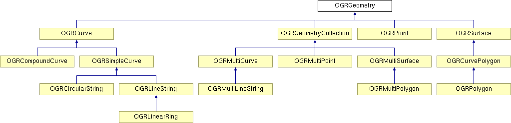

.. _rfc-49:

=======================================================================================
RFC 49: Curve geometries
=======================================================================================

Author: Even Rouault

Contact: even dot rouault at spatialys dot com

Status: Adopted, implemented in GDAL 2.0

Summary
-------

The current geometry model in GDAL 1.X makes use of points, lines,
polygons and aggregations of them (multipoints, multilines,
multipolygons and geometry collections). It was modeled from the
geometry class hierarchy of the "OpenGIS Simple Feature Access Part 1 :
Common Architecture" (in its 1.1.0 version).

This RFC covers the addition of new geometry types that have been added
in ISO/IEC 13249 Part 3 Spatial (abbreviated as ISO SQL/MM Part 3):

-  circular string: a circular arc, or a sequence of connected circular
   arcs, each of them describe by 3 points: the first point of the arc,
   an intermediate point and the final point
-  compound curve: a sequence of connected curves, either line strings
   or circular strings
-  curve polygon: polygon consisting of one outer ring, and zero or more
   inner ring. Each ring can be one of the curve implementations: line
   strings, circular strings, compound curves.
-  multicurve: a collection of curves (line strings, circular strings,
   compound curves)
-  multisurface: a collection of surfaces (polygons, curve polygons)

The scope of this RFC consists in :

-  adding the new geometry classes to the existing geometry class
   hierarchy, with the corresponding importer and exporter of WKT (Well
   Known Text) and WKB (Well Known Binary) encodings
-  adding methods to convert those curve geometries into their
   approximated linear version, and to do the reverse operation
-  upgrading some of the drivers that can support such geometries : GML
   (and indirectly NAS, WFS), PostGIS/PGDump, GeoPackage, SQLite, CSV,
   VRT.

Reference documents
-------------------

The following documents have been used for the implementation :

-  `Old draft version of ISO/IEC 13249 Part 3 Spatial, dating from
   2004-05-09 <http://jtc1sc32.org/doc/N1101-1150/32N1107-WD13249-3--spatial.pdf>`__,
   a.k.a SQL/MM Part 3 : Caution the WKB codes given at page 137 and
   following are not the latest ones used. Refer to SFA 1.2.1

-  `OpenGIS Simple Feature Access Part 1 : Common Architecture,v
   1.2.1 <http://portal.opengeospatial.org/files/?artifact_id=25355>`__,
   a.k.a. SFA 1.2.1

-  `BNF of WKT
   encoding <https://github.com/postgis/postgis/blob/svn-trunk/doc/bnf-wkt.txt>`__:
   extracted from SQL/MM Part 3

-  `BNF of WKB
   encoding <https://github.com/postgis/postgis/blob/svn-trunk/doc/bnf-wkb.txt>`__:
   extracted from SQL/MM Part 3

Core changes
------------

New cass hierarchy
~~~~~~~~~~~~~~~~~~

The new class hierarchy is the following and is mostly consistent with
SQL/MM Part 3

The only exceptions are :

-  OGRLinearRing: this class present in GDAL 1.X is kept for backward
   compatibility and also because it is still present in SFA 1.2.1, even
   if absent from SQL/MM Part 3
-  OGRSimpleCurve: this abstract class is an implementation detail in
   OGR that simplifies the implementation of OGRCircularString, by
   sharing code with what was in OGRLineString only.

Geometry types
~~~~~~~~~~~~~~

The OGRwkbGeometryType enumeration has been extended with the following
values :

::

       wkbCircularString = 8,  /**< one or more circular arc segments connected end to end,
                                *   ISO SQL/MM Part 3. GDAL >= 2.0 */
       wkbCompoundCurve = 9,   /**< sequence of contiguous curves, ISO SQL/MM Part 3. GDAL >= 2.0 */
       wkbCurvePolygon = 10,   /**< planar surface, defined by 1 exterior boundary
                                *   and zero or more interior boundaries, that are curves.
                                *    ISO SQL/MM Part 3. GDAL >= 2.0 */
       wkbMultiCurve = 11,     /**< GeometryCollection of Curves, ISO SQL/MM Part 3. GDAL >= 2.0 */
       wkbMultiSurface = 12,   /**< GeometryCollection of Surfaces, ISO SQL/MM Part 3. GDAL >= 2.0 */

       wkbCircularStringZ = 1008,  /**< wkbCircularString with Z component. ISO SQL/MM Part 3. GDAL >= 2.0 */
       wkbCompoundCurveZ = 1009,   /**< wkbCompoundCurve with Z component. ISO SQL/MM Part 3. GDAL >= 2.0 */
       wkbCurvePolygonZ = 1010,    /**< wkbCurvePolygon with Z component. ISO SQL/MM Part 3. GDAL >= 2.0 */
       wkbMultiCurveZ = 1011,      /**< wkbMultiCurve with Z component. ISO SQL/MM Part 3. GDAL >= 2.0 */
       wkbMultiSurfaceZ = 1012,    /**< wkbMultiSurface with Z component. ISO SQL/MM Part 3. GDAL >= 2.0 */

The codes have been taken from SFA 1.2.1, and are consistent with the
PostGIS 2 implementation. Note that ISO SQL/MM Part 3 allows alternates
values for wkbCircularString (8 or 1000001) : see Table 15 in the above
mentioned draft. The values in the range 10000XX probably date back
from an earlier draft version. OGR will import them, but will use the
values from SFA 1.2.1 when exporting WKB.

It has been considered if it would worth to modify the enumeration
values of the existing 2.5D geometries (wkbPoint25D, etc...) to conform
with the WKB codes of ISO SQL/MM Part 3 / SFA 1.2.1, but there was not a
clear advantage in doing so, with respect to the impact on existing
users of OGR API.

Note: the mix of different ways of expression the Z dimension (wkb25DBit
bit for "old" geometry types, and +1000 for "new" geometry types) has no
direct impact on the export of geometries as WKB. There is no direct
coupling between the values of OGRwkbGeometryType and what goes to WKB
geometries. The exportToWkb() method of OGRGeometry takes a wkbVariant
parameter to select the variant of WKB that is wished.

The use of the wkb25DBit value (0x8000000) that was sometimes used to
test if a geometry type was 3D is now clearly deprecated since it will
not work for the new geometry type. The wkbHasZ() and wkbSetZ() have
been added to respectively test if a geometry type is 3D, or modify a
geometry type to be 3D. The wkb25DBit constant is now disabled for all
code in GDAL (but still accessible by user code) and all drivers have
been converted to use the new macros.

A new family of functions have been used to operate on geometry types :

::

   OGRwkbGeometryType CPL_DLL OGR_GT_Flatten( OGRwkbGeometryType eType );
       --> Returns the 2D geometry type corresponding to the passed geometry type.

   OGRwkbGeometryType CPL_DLL OGR_GT_SetZ( OGRwkbGeometryType eType );
       --> Returns the 3D geometry type corresponding to the passed geometry type.

   OGRwkbGeometryType CPL_DLL OGR_GT_SetModifier( OGRwkbGeometryType eType, int bSetZ, int bSetM );
       --> Returns a 2D or 3D geometry type depending on parameter.

   int                CPL_DLL OGR_GT_HasZ( OGRwkbGeometryType eType );
       --> Return if the geometry type is a 3D geometry type.

   int                CPL_DLL OGR_GT_IsSubClassOf( OGRwkbGeometryType eType,
                                                   OGRwkbGeometryType eSuperType );
       --> Returns if a type is a subclass of another one

   int                CPL_DLL OGR_GT_IsCurve( OGRwkbGeometryType );
       -->  Return if a geometry type is an instance of Curve
           (i.e. wkbLineString, wkbCircularString or wkbCompoundCurve)

   int                CPL_DLL OGR_GT_IsSurface( OGRwkbGeometryType );
       -->  Return if a geometry type is an instance of Surface
           (i.e. wkbPolygon or wkbCurvePolygon)

   int                CPL_DLL OGR_GT_IsNonLinear( OGRwkbGeometryType );
       --> Return if a geometry type is a non-linear geometry type.
           Such geometry type are wkbCircularString, wkbCompoundCurve, wkbCurvePolygon,
           wkbMultiCurve, wkbMultiSurface and their 3D variant.

   OGRwkbGeometryType CPL_DLL OGR_GT_GetCollection( OGRwkbGeometryType eType );
       -->  Returns the collection type that can contain the passed geometry type

   OGRwkbGeometryType CPL_DLL OGR_GT_GetCurve( OGRwkbGeometryType eType );
       --> Returns the curve geometry type that can contain the passed geometry type.
           Handled conversions are : wkbPolygon -> wkbCurvePolygon,
           wkbLineString->wkbCompoundCurve, wkbMultiPolygon->wkbMultiSurface
           and wkbMultiLineString->wkbMultiCurve.

   OGRwkbGeometryType CPL_DLL OGR_GT_GetLinear( OGRwkbGeometryType eType );
       --> Returns the non-curve geometry type that can contain the passed geometry type
           Handled conversions are : wkbCurvePolygon -> wkbPolygon,
           wkbCircularString->wkbLineString, wkbCompoundCurve->wkbLineString,
           wkbMultiSurface->wkbMultiPolygon and wkbMultiCurve->wkbMultiLineString.

The existing wkbFlatten() is an alias of OGR_GT_Flatten(), the new
wkbHasZ() an alias of OGR_GT_HasZ() and wkbSetZ() an alias of
OGR_GT_SetZ().

New methods
~~~~~~~~~~~

-  In OGRGeometry class :

::

       virtual OGRBoolean hasCurveGeometry(int bLookForNonLinear = FALSE) const;

   /**
    * \brief Returns if this geometry is or has curve geometry.
    *
    * Returns if a geometry is, contains or may contain a CIRCULARSTRING, COMPOUNDCURVE,
    * CURVEPOLYGON, MULTICURVE or MULTISURFACE.
    *
    * If bLookForNonLinear is set to TRUE, it will be actually looked if the
    * geometry or its subgeometries are or contain a non-linear geometry in them. In which
    * case, if the method returns TRUE, it means that getLinearGeometry() would
    * return an approximate version of the geometry. Otherwise, getLinearGeometry()
    * would do a conversion, but with just converting container type, like
    * COMPOUNDCURVE -> LINESTRING, MULTICURVE -> MULTILINESTRING or MULTISURFACE -> MULTIPOLYGON,
    * resulting in a "loss-less" conversion.
    */

       virtual OGRGeometry* getCurveGeometry(const char* const* papszOptions = NULL) const;

   /**
    * \brief Return curve version of this geometry.
    *
    * Returns a geometry that has possibly CIRCULARSTRING, COMPOUNDCURVE, CURVEPOLYGON,
    * MULTICURVE or MULTISURFACE in it, by de-approximating curve geometries.
    *
    * If the geometry has no curve portion, the returned geometry will be a clone
    * of it.
    *
    * The ownership of the returned geometry belongs to the caller.
    *
    * The reverse method is OGRGeometry::getLinearGeometry().
    *
    * This function is the same as C function OGR_G_GetCurveGeometry().
    *
    * @param papszOptions options as a null-terminated list of strings.
    *                     Unused for now. Must be set to NULL.
    */

       virtual OGRGeometry* getLinearGeometry(double dfMaxAngleStepSizeDegrees = 0,
                                                const char* const* papszOptions = NULL) const;

   /**
    * \brief Return, possibly approximate, non-curve version of this geometry.
    *
    * Returns a geometry that has no CIRCULARSTRING, COMPOUNDCURVE, CURVEPOLYGON,
    * MULTICURVE or MULTISURFACE in it, by approximating curve geometries.
    *
    * The ownership of the returned geometry belongs to the caller.
    *
    * The reverse method is OGRGeometry::getCurveGeometry().
    *
    * This method is the same as the C function OGR_G_GetLinearGeometry().
    *
    * @param dfMaxAngleStepSizeDegrees the largest step in degrees along the
    * arc, zero to use the default setting.
    * @param papszOptions options as a null-terminated list of strings.
    *                     See OGRGeometryFactory::curveToLineString() for valid options.
    */

-  In OGRGeometryFactory class :

::

   static OGRLineString* curveToLineString(
                                               double x0, double y0, double z0,
                                               double x1, double y1, double z1,
                                               double x2, double y2, double z2,
                                               int bHasZ,
                                               double dfMaxAngleStepSizeDegrees,
                                               const char*const* papszOptions )
   /**
    * \brief Converts an arc circle into an approximate line string
    *
    * The arc circle is defined by a first point, an intermediate point and a
    * final point.
    *
    * The provided dfMaxAngleStepSizeDegrees is a hint. The discretization
    * algorithm may pick a slightly different value.
    *
    * So as to avoid gaps when rendering curve polygons that share common arcs,
    * this method is guaranteed to return a line with reversed vertex if called
    * with inverted first and final point, and identical intermediate point.
    *
    * @param x0 x of first point
    * @param y0 y of first point
    * @param z0 z of first point
    * @param x1 x of intermediate point
    * @param y1 y of intermediate point
    * @param z1 z of intermediate point
    * @param x2 x of final point
    * @param y2 y of final point
    * @param z2 z of final point
    * @param bHasZ TRUE if z must be taken into account
    * @param dfMaxAngleStepSizeDegrees  the largest step in degrees along the
    * arc, zero to use the default setting.
    * @param papszOptions options as a null-terminated list of strings or NULL.
    * Recognized options:
    * <ul>
    * <li>ADD_INTERMEDIATE_POINT=STEALTH/YES/NO (Default to STEALTH).
    *         Determine if and how the intermediate point must be output in the linestring.
    *         If set to STEALTH, no explicit intermediate point is added but its
    *         properties are encoded in low significant bits of intermediate points
    *         and OGRGeometryFactory::curveFromLineString() can decode them.
    *         This is the best compromise for round-tripping in OGR and better results
    *         with PostGIS <a href="http://postgis.org/docs/ST_LineToCurve.html">ST_LineToCurve()</a>
    *         If set to YES, the intermediate point is explicitly added to the linestring.
    *         If set to NO, the intermediate point is not explicitly added.
    * </li>
    * </ul>
    */

   --> This method is used by OGRCircularString::getLinearGeometry()

   OGRCurve* OGRGeometryFactory::curveFromLineString(const OGRLineString* poLS,
                                                     CPL_UNUSED const char*const* papszOptions)

   /**
    * \brief Try to convert a linestring approximating curves into a curve.
    *
    * This method can return a COMPOUNDCURVE, a CIRCULARSTRING or a LINESTRING.
    *
    * This method is the reverse of curveFromLineString().
    *
    * @param poLS handle to the geometry to convert.
    * @param papszOptions options as a null-terminated list of strings.
    *                     Unused for now. Must be set to NULL.
    */

   --> This method is used by OGRLineString::getCurveGeometry()

   OGRGeometry* OGRGeometryFactory::forceTo( OGRGeometry* poGeom,
                                             OGRwkbGeometryType eTargetType,
                                             const char*const* papszOptions )
    *
    * Tries to force the provided geometry to the specified geometry type.
    *
    * It can promote 'single' geometry type to their corresponding collection type
    * (see OGR_GT_GetCollection()) or the reverse. non-linear geometry type to
    * their corresponding linear geometry type (see OGR_GT_GetLinear()), by
    * possibly approximating circular arcs they may contain.
    * Regarding conversion from linear geometry types to curve geometry types, only
    * "wrapping" will be done. No attempt to retrieve potential circular arcs by
    * de-approximating stroking will be done. For that, OGRGeometry::getCurveGeometry()
    * can be used.
    *
    * The passed in geometry is consumed and a new one returned (or potentially the same one).
    *
    * @param poGeom the input geometry - ownership is passed to the method.
    * @param eTargetType target output geometry type.
    * @param papszOptions options as a null-terminated list of strings or NULL.
    * @return new geometry.
    */

   --> This method generalizes the existing forceToPolygon(), forceToLineString(),
   forceToMultiPolygon(), forceToMultiLineString(), that have been extended to
   deal with the new geometry types. forceTo() and actually calls them if they
   can be used for the requested conversion, and also deal with conversion between
   linear and non-linear geometry types.

Implementation of existing OGRGeometry methods
~~~~~~~~~~~~~~~~~~~~~~~~~~~~~~~~~~~~~~~~~~~~~~

As GEOS does not support curve geometries for now, all GEOS related
operations, the ones returning a boolean value such as Intersects(), or
the ones returning a new geometry such as Intersection(), have been
adapted so that non-linear geometries are first converted to their
linear approximation (this might be revisited if GEOS supports curve
geometries in the future) When GEOS returns a geometry, and that one of
the input parameters was a non-linear geometry, the reverse operation is
done to attempt retrieving as much as possible of the curve geometry. Of
course, the result will not generally perfect, but it is better than
nothing.

Simple example doing the union of 2 half-circles that are contiguous:

::

       g1 = ogr.CreateGeometryFromWkt('CURVEPOLYGON(COMPOUNDCURVE(CIRCULARSTRING (0 0,1 1,2 0),(2 0,0 0)))')
       g2 = ogr.CreateGeometryFromWkt('CURVEPOLYGON(COMPOUNDCURVE(CIRCULARSTRING (0 0,1 -1,2 0),(2 0,0 0)))')
       g3 = g1.Union(g2)
       assert g3.ExportToWkt() == 'CURVEPOLYGON (CIRCULARSTRING (0 0,1 1,2 0,1 -1,0 0))'

Or using GetCurveGeometry() explicitly on the result of a buffer
operation:

::

       g1 = ogr.CreateGeometryFromWkt('POINT(1 2)')
       g2 = g1.Buffer(0.5)
       g3 = g2.GetCurveGeometry()
       assert g3.ExportToWkt() != 'CURVEPOLYGON (CIRCULARSTRING (1.5 2.0,0.5 2.0,1.5 2.0))'

The Length() operation on OGRCircularString (and thus OGRCompoundCurve)
uses circle geometry to compute the exact length, without falling back
to linear approximation. The Area() operation on OGRCurvePolygon will
generally need to go to linear approximation. When operating on a full
circle, or a curve polygon that is convex, an optimization is done to
avoid this (by computing the area of the polygon formed with all the
vertex including in the circular parts of the description, and adding
the area of the `circular
segments <http://en.wikipedia.org/wiki/Circular_segment>`__)

C API changes
~~~~~~~~~~~~~

Deprecation:

-  wkb25DBit still present, but deprecated since incompatible with the
   new geometry type. Use the wkbFlatten(), wkbHasZ(), wkbSetZ() macros
   instead

Additions:

-  OGR_GT_xxxx (for Geometry Type): described above
-  OGRErr OGR_G_ExportToIsoWkb( OGRGeometryH, OGRwkbByteOrder, unsigned
   char*) : Export geometry as WKB conforming to ISO SQL/MM Part 3.
-  OGRErr OGR_G_ExportToIsoWkt( OGRGeometryH, char \*\* ) : Export
   geometry as WKT conforming to ISO SQL/MM Part 3, i.e. 2.5D geometries
   names are suffixed by " Z", e.g. "POINT Z (1 2 3)".
-  OGRGeometryH OGR_G_Value( OGRGeometryH, double dfDistance ) : mapping
   of existing OGRGeometry::Value()
-  int OGR_G_HasCurveGeometry( OGRGeometryH, int bLookForNonLinear ) :
   mapping of OGRGeometry::hasCurveGeometry()
-  OGRGeometryH OGR_G_GetLinearGeometry( OGRGeometryH hGeom, double
   dfMaxAngleStepSizeDegrees, char*\* papszOptions) : mapping of
   OGRGeometry::hasCurveGeometry()
-  OGRGeometryH OGR_G_GetCurveGeometry( OGRGeometryH hGeom, char*\*
   papszOptions ) : mapping of OGRGeometry::hasCurveGeometry()
-  void OGRSetNonLinearGeometriesEnabledFlag(int bFlag) : discussed in
   Backward compatibility section
-  int OGRGetNonLinearGeometriesEnabledFlag() : discussed in Backward
   compatibility section

Changes in drivers
------------------

-  GML geometry importer: Arc, ArcString, ArcByBulge, ArcByCenterPoint,
   Circle and CircleByCenterPoints GML elements will be returned as
   circular string OGR geometries. If they are included in other GML
   elements such as CurveComposite, MultiCurve, Surface, corresponding
   non-linear OGR geometries will be returned as well. When reading
   geometries that are made of or consist of Surface, MultiSurface,
   Curve, MultiCurve, an effort is made to return the OGR geometry class
   of a linear type as much as possible, i.e. OGRCurvePolygon,
   OGRCompoundCurve, etc... will only be returned if there's a circular
   string in the geometry.

-  GML geometry exporter: can generate ArcString and Circle GML elements
   when passed a geometry with circular string in it.

-  GML driver: Can read/write all the new geometry types. When reading
   GML3 application schemas, declarations of geometry fields such as
   CurvePropertyType, SurfacePropertyType, MultiCurvePropertyType or
   MultiSurfacePropertyType will be also interpreted as being potential
   non-linear geometries, and corresponding OGR geometry type will be
   used for the layer geometry type, and the geometries of the feature
   will also follow that layer geometry type. This can affect the WFS
   drivers.

-  NAS driver: Can return the new geometry types. NAS layers will use
   the new geometry types only if the NAS file contains arcs.

-  PG/PostGIS: Can read/write all the new geometry types for both
   PostGIS 2.X and PostGIS 1.X. For PostGIS 1.X compatibility, special
   processing must be done in the importFromWkb()/exportToWkb() to deal
   with the non standard codes used by PostGIS 1.X for curvepolygon,
   multicurve and multisurface. This is done with a wkbVariantPostGIS1
   value added to OGRwkbVariant enumeration used by those methods.

-  PGDump: Can write all new geometry types. Above remark related to the
   differences among version make it important to specify correctly the
   POSTGIS_VERSION dataset creation option.

-  GeoPackage: Can read/write all the new geometry types. Note: this
   isn't in the core of the GeoPackage specification, but it is still a
   registered extension.

-  SQLite: Can read/write all the new geometry types for databases that
   are NOT Spatialite databases, since Spatialite does no support curve
   geometry types. However an attempt (well a hack) is done so that the
   SQLite SQL dialect can still be used. Basically when converting a OGR
   geometry to Spatialite, if it is of one of the curve geometry type,
   the resulting blob will first contain the spatialite compatible blob
   of the linear geometry, and afterwards the WKB of the curve geometry.
   Spatialite functions, if called with a ST\_ function for example,
   will ignore the later one. When reading a blob from sqlite, if the
   added WKB of the curve geometry is still there, it will be used.
   Otherwise the spatialite geometry blob will be used. So SELECT
   statement just selecting the geometry column without doing any
   operation on it should preserve curve geometries.

-  MEM: Can read/write all the new geometry types.

-  CSV: Can read/write all the new geometry types.

-  VRT: Declared as compatible with all the new geometry types. Actual
   capability will depend on the underlying layers wrapped by the VRT.

Changes in utilities
--------------------

-  ogr2ogr: the new geometry names (CIRCULARSTRING, etc...) are
   supported in the -nlt option. "-nlt CONVERT_TO_LINEAR" can also be
   used to ask curve geometries to be converted into their linear
   approximation ( what is used to do that is forceTo(xxx,
   OGR_GT_GetLinear()) ). Note: this isn't strictly necessary as all
   drivers should be able to deal with the non-linear geometry types
   with the compatibility mechanism described in Backward compatibility.
   But this might be useful to produce a PostGIS table or GeoPackage
   database with linear geometry types even if the source contains
   non-linear geometries. "-nlt CONVERT_TO_LINEAR" can be combined with
   "-nlt PROMOTE_TO_MULTI".

Changes in SWIG bindings
------------------------

Addition of :

-  the new geometry types as ogr.wkbXXXXX
-  ogr.ForceTo()
-  Geometry.ExportToIsoWkt()
-  Geometry.ExportToIsoWkb()
-  Geometry.HasCurveGeometry(int bLookForCircular = FALSE)
-  Geometry.GetLinearGeometry(double dfMaxAngleStepSizeDegrees =
   0.0,char*\* options = NULL)
-  Geometry.GetCurveGeometry(char*\* options = NULL)
-  ogr.SetNonLinearGeometriesEnabledFlag(int bFlag)
-  ogr.GetNonLinearGeometriesEnabledFlag()
-  ogr.GT_xxxxx functions

Using ogr.wkb25DBit will issue a deprecation warning

Related changes that are *NOT* included in this RFC
---------------------------------------------------

-  Support for other ISO SQL/MM geometries such as Polyhedral Surface,
   Triangulated Irregular Network (TIN), Triangle.
-  Support for the M (Measure) dimension of geometries.
-  Upgrade of other drivers that could make use of curve geometries :
   MSSQL Spatial, Oracle Spatial, DXF, DWG, ...
-  Support for arbitrary new geometry types: Conceptually one could hope
   that a new class extending OGRCurve (Bezier or Spline curve) for
   example could be added without touching OGR core. This isn't
   currently possible: changes in OGRGeometryFactory and the OGR_GT\_
   functions would be needed to remove a few hardcoded assumptions.

Backward compatibility
----------------------

Regarding code using GDAL
~~~~~~~~~~~~~~~~~~~~~~~~~

Many applications will not be able to properly deal with the new
geometry types that may now be returned by some drivers. If they don't
want to test the geometry type and explicitly calling the conversion
function, they can call OGRSetNonLinearGeometriesEnabledFlag(FALSE) (the
default value is TRUE, i.e. non-linear geometries can be returned). In
which case, they will be transformed into their closest linear geometry,
by doing linear approximation, with OGR_G_ForceTo().

This flag has only an effect on the OGR_F_GetGeometryRef(),
OGR_F_GetGeomFieldRef(), OGR_L_GetGeomType(), OGR_GFld_GetType() and
OGR_FD_GetGeomType() C API, and corresponding methods in the SWIG
bindings.

Libraries should generally *not* use that method, since that could
interfere with other libraries or applications.

Note that it does *not* affect the behavior of the C++ API. It has been
deemed dangerous/complicated to try doing that at the C++ level as it
could confuse drivers since they might call GetGeomType() for example.

Regarding OGR drivers
~~~~~~~~~~~~~~~~~~~~~

Drivers that can deal with the new geometry types SHOULD declare the new
dataset level ODsCCurveGeometries AND layer level OLCCurveGeometries
capabilities. The virtual methods CreateFeature() and SetFeature()
implemented by drivers have been renamed ICreateFeature() and
ISetFeature(). OGRLayer has now a non-virtual CreateFeature() and
SetFeature() that checks if the layer has curve geometry capability. If
it has not, and that the passed feature has non-linear geometries, they
will be transparently converted to their linear approximation before
calling the driver ICreateFeature()/ISetFeature() method. Similarly the
CreateLayer() method at datasource level will convert the passed
geometry type to a non-linear corresponding type if necessary.

All in-tree drivers have been converted to switch from CreateFeature()
to ICreateFeature() and SetFeature() to ISetFeature(). Out-of-tree
drivers will have to be adapted similarly otherwise those methods will
fails (the now non-virtual methods in OGRLayer class will try to create
the default implementation of the same class, which will fail).

Documentation
-------------

All new methods and OGR geometry classes are documented. Driver
documentation is updated when necessary. MIGRATION_GUIDE.TXT is updated
with a summary of the text of this RFC.

Testing
-------

Very few changes have been made so that the existing autotest suite
still passes. Very comprehensive testing of new geometry classes and
conversion methods has been added to ogr_geom.py and ogr_gml_geom.py.
Updated drivers have received new tests also.

Implementation
--------------

Implementation will be done by Even Rouault. Coordinated with Sourcepole
(see `QGIS Enhancement 8: Geometry
redesign <https://github.com/mhugent/QGIS-Enhancement-Proposals/blob/master/QEP-8-geometry_redesign.rst>`__),
sponsored by Swiss QGIS User Group.

The proposed implementation lies in the "curve_geometries" branch of the
`https://github.com/rouault/gdal2/tree/curve_geometries <https://github.com/rouault/gdal2/tree/curve_geometries>`__
repository.

The list of changes :
`https://github.com/rouault/gdal2/compare/curve_geometries <https://github.com/rouault/gdal2/compare/curve_geometries>`__

Voting history
--------------

+1 from TamasS, JukkaR and EvenR

