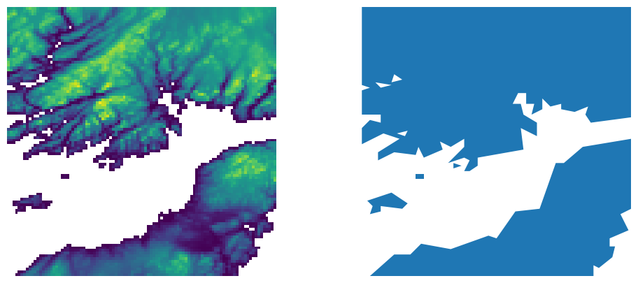

.. _gdal_raster_footprint:

================================================================================
``gdal raster footprint``
================================================================================

.. versionadded:: 3.11

.. only:: html

    Compute the footprint of a raster dataset

.. Index:: gdal raster footprint

Synopsis
--------

.. program-output:: gdal raster footprint --help-doc

Description
-----------

:program:`gdal raster footprint` computes the footprint of
a raster file, taking into account nodata values (or more generally the mask
band attached to the raster bands), and generating polygons/multipolygons
corresponding to areas where pixels are valid, and write to an output vector file.

Since GDAL 3.12, this algorithm can be part of a :ref:`gdal_pipeline`.

The :program:`gdal raster clean-collar` utility may be run as a pre-processing
step to generate proper mask bands.

Example footprint calculated with default options of :program:`gdal raster footprint`.

Post-vectorization geometric operations are applied in the following order:

* optional splitting (:option:`--split-multipolygons`)
* optional densification (:option:`--densify-distance`)
* optional reprojection (:option:`--dst-crs`)
* optional filtering by minimum ring area (:option:`--min-ring-area`)
* optional application of convex hull (:option:`--convex-hull`)
* optional simplification (:option:`--simplify-tolerance`)
* limitation of number of points (:option:`--max-points`)

.. GDALG output (on-the-fly / streamed dataset)
.. --------------------------------------------

.. versionadded:: 3.12

.. include:: gdal_cli_include/gdalg_vector_compatible_non_natively_streamable.rst

Program-Specific Options
------------------------

.. option:: --absolute-path

    Enables writing the absolute path of the input dataset. By default, the
    filename is written in the location field exactly as specified on the
    command line.

.. option:: -b, --band <band>

    Select an input <band> to be processed. Bands are numbered from 1.
    Multiple :option:`-b` switches may be used to select a set of input bands.
    If not specified, all bands are taken into account. The way multiple bands
    are combined is controlled by :option:`--combine-bands`

.. option:: --combine-bands union|intersection

    Defines how the mask bands of the selected bands are combined to generate
    a single mask band, before being vectorized.
    The default value is ``union``: that is a pixel is valid if it is valid at least
    for one of the selected bands.
    ``intersection`` means that a pixel is valid only if it is valid for all
    selected bands.

.. option:: --coordinate-system pixel|georeferenced

    Target coordinate system. By default if the input dataset is georeferenced,
    ``georeferenced`` is implied, that is the footprint geometry will be expressed
    as coordinates in the CRS of the raster (or the one specified with :option:`--dst-crs`).
    If specifying ``pixel``, the coordinates of the footprint geometry are
    column and line indices.

.. option:: --convex-hull

    When specified, the convex hull of (multi)polygons is computed.

.. option:: --densify-distance <value>

    The specified value of this option is the maximum distance between 2
    consecutive points of the output geometry.
    The unit of the distance is in pixels if :option:`--coordinate-system` equals ``pixel``,
    or otherwise in georeferenced units of the source raster.
    This option is applied before the reprojection implied by :option:`--dst-crs`.

.. option:: --dst-crs <CRS_DEF>

    Target CRS of the output file.  The <CRS_DEF> may be any of
    the usual GDAL/OGR forms, complete WKT, PROJ.4, EPSG:n or a file containing
    the WKT.
    Specifying this option implies ``--coordinate-system=georeferenced``.
    The footprint is reprojected from the CRS of the source raster to the
    specified CRS.

.. option:: --location-field <field_name>

    Specifies the name of the field in the resulting vector dataset where the
    path of the input dataset will be stored. The default field name is
    "location". To prevent writing the path of the input dataset, use
    :option:`--no-location-field`

.. option:: --max-points <value>|unlimited

    Maximum number of points of each output geometry (not counting the closing
    point of each ring, which is always identical to the first point).
    The default value is 100. ``unlimited`` can be used to remove that limitation.

.. option:: --min-ring-area <value>

    Minimum value for the area of a ring
    The unit of the area is in square pixels if :option:`--coordinate-system` equals ``pixel``,
    or otherwise in georeferenced units of the target vector dataset.
    This option is applied after the reprojection implied by :option:`--dst-crs`

.. option:: --no-location-field

    Turns off the writing of the path of the input dataset as a field in the
    output vector dataset.

.. option:: --output-layer <OUTPUT-LAYER>

    Output layer name. Defaults to ``footprint``.

.. option:: --overview <index>

   To specify which overview level of source file must be used, when overviews
   are available on the source raster. By default the full resolution level is
   used. The index is 0-based, that is 0 means the first overview level.
   This option is mutually exclusive with :option:`--src-nodata`.

.. option:: --simplify-tolerance <value>

    The specified value of this option is the tolerance used to merge
    consecutive points of the output geometry using the
    :cpp:func:`OGRGeometry::Simplify` method.
    The unit of the distance is in pixels if :option:`--coordinate-system` equals ``pixel``,
    or otherwise in georeferenced units of the target vector dataset.
    This option is applied after the reprojection implied by :option:`--dst-crs`.

.. option:: --split-multipolygons

    When specified, multipolygons are split as several features each with one
    single polygon.

.. option:: --src-nodata <value>

    Set nodata values for input bands (different values can be supplied for each band).
    If a single value is specified, it applies to all selected bands.
    If more than one value is supplied, there should be as many values as the number
    of selected bands, and all values should be quoted to keep them
    together as a single operating system argument.
    If the option is not specified, the intrinsic mask band of each selected
    bands will be used.

Standard Options
----------------

.. collapse:: Details

    .. include:: gdal_options/append_vector.rst

    .. include:: gdal_options/co.rst

    .. include:: gdal_options/if.rst

    .. include:: gdal_options/lco.rst

    .. include:: gdal_options/oo.rst

    .. include:: gdal_options/of_vector.rst

    .. include:: gdal_options/overwrite.rst

Examples
--------

.. example::
   :title: Write the footprint of a GeoTIFF file into a GeoJSON file.

   .. code-block:: bash

       gdal raster footprint my_raster.tif footprint.geojson
