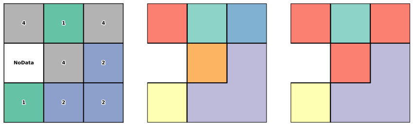

.. _gdal_raster_polygonize:

================================================================================
``gdal raster polygonize``
================================================================================

.. versionadded:: 3.11

.. only:: html

    Create a polygon feature dataset from a raster band

.. Index:: gdal raster polygonize

Synopsis
--------

.. program-output:: gdal raster polygonize --help-doc

Description
-----------

:program:`gdal raster polygonize` creates vector polygons for all connected
regions of pixels in the raster sharing a common pixel value.
Each polygon is created with an attribute indicating the pixel value of that
polygon. Pixels that are set to the NoData value, or masked using an external mask
band, are not included in processing.

The utility can create the output vector dataset if it does not already exist,
otherwise it may append to an existing one.

The utility is based on the ::cpp:func:`GDALPolygonize` function which has additional
details on the algorithm.

Since GDAL 3.12, this algorithm can be part of a :ref:`gdal_pipeline`.

   Polygonization of a 3x3 raster input. The middle figure shows the default behavior,
   where separate polygons are created for pixel regions that are connected only to
   a diagonal neighbor.
   In the figure on the right, :option:`--connect-diagonal-pixels`
   has been specified, and a single polygon has been created for pixels with value 4.

.. GDALG output (on-the-fly / streamed dataset)
.. --------------------------------------------

.. versionadded:: 3.12

.. include:: gdal_cli_include/gdalg_vector_compatible_non_natively_streamable.rst

Program-Specific Options
------------------------

.. option:: --attribute-name <ELEVATION-NAME>

    The name of the field to create (defaults to "DN").

.. option:: -b, --band <BAND>

    Picks a particular band to polygonize. Defaults to band 1.

.. option:: -c, --connect-diagonal-pixels

    Consider diagonal pixels (pixels at the corners) as connected.
    The default behavior is to only consider pixels that are touching the edges
    as connected, which is the same as 4-connectivity. When this option is
    selected, the algorithm will also consider pixels at the corners as connected,
    which is the same as 8-connectivity.

.. option:: --nln, --output-layer <OUTPUT-LAYER>

    Provides a name for the output vector layer. Defaults to "polygonize".

Standard Options
----------------

.. collapse:: Details

    .. include:: gdal_options/append_vector.rst

    .. include:: gdal_options/co.rst

    .. include:: gdal_options/if.rst

    .. include:: gdal_options/lco.rst

    .. include:: gdal_options/of_vector.rst

    .. include:: gdal_options/oo.rst

    .. include:: gdal_options/output_oo.rst

    .. include:: gdal_options/overwrite.rst

    .. include:: gdal_options/overwrite_layer.rst

    .. include:: gdal_options/update.rst

Examples
--------

.. example::
   :title: Create a shapefile with polygons for the connected regions of band 1 of the input GeoTIFF.

    .. code-block:: bash

        gdal raster polygonize input.tif polygonize.shp
