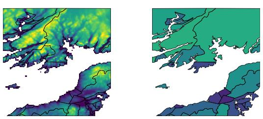

.. _gdal_raster_zonal_stats:

================================================================================
``gdal raster zonal-stats``
================================================================================

.. versionadded:: 3.12

.. only:: html

    Compute raster zonal statistics.

.. Index:: gdal raster zonal-stats

Synopsis
--------

.. program-output:: gdal raster zonal-stats --help-doc

Description
-----------

:program:`gdal raster zonal-stats` computes raster zonal statistics -- a summary of pixel values within zones specified either polygon features or a categorical raster.

   Mean elevation calculated for each polygon from an elevation raster.

A weighting raster may be provided in addition to the source raster, allowing calculation of statistics such as population-weighted mean weather conditions.

All inputs should be provided in the same spatial reference system. If input rasters use different resolutions they will be resampled to a consistent resolution using average resampling. However, no reprojection is performed.

Pixel inclusion and weighting
^^^^^^^^^^^^^^^^^^^^^^^^^^^^^

When zones are defined using polygons, three methods are available for determining which pixels to include in the calculation.
By default, the geometries are rasterized using default parameters, and pixels included in the rasterization are used in the calculation with equal weighting.
By using ``--pixels all-touched``, all pixels touched by the polygon are used in the calculation, again with equal weighting.
If using ``--pixels fractional``, the fraction of each pixel that is covered by the polygon is computed, and pixels are weighted according to this fraction.
This option requires GDAL be built against version 3.14 or later of the GEOS library.

.. _zonal-supported-stats:

Supported stats
^^^^^^^^^^^^^^^

.. list-table::
    :width: 100%
    :header-rows: 1

    * - Name
      - Description

    * - center_x
      - Array with cell center x-coordinate for each cell that intersects the polygon. Each cell center 
        may or may not be inside the polygon.
    * - center_y       
      - Array with cell center y-coordinate for each cell that intersects the polygon. Each cell center may or may not be inside the polygon. 
    * - count          
      - Sum of all cell coverage fractions. 
    * - coverage       
      - Array with coverage fraction of each cell that intersects the polygon 
    * - frac           
      - Fraction of covered cells that are occupied by each distinct raster value, as provided by ``unique``.
    * - majority       
      - The raster value occupying the greatest number of cells, taking into account cell coverage fractions but not weighting raster values. 
    * - max            
      - Maximum value of cells that intersect the polygon, not taking coverage fractions or weighting raster values into account.  
    * - max_center_x   
      - Cell center x-coordinate for the cell containing the maximum value intersected by the polygon. The center of this cell may or may not be inside the polygon. 
    * - max_center_y   
      - Cell center y-coordinate for the cell containing the maximum value intersected by the polygon. The center of this cell may or may not be inside the polygon. 
    * - mean           
      - Mean value of cells that intersect the polygon, weighted by the percent of each cell that is covered. 
    * - min            
      - Minimum value of cells that intersect the polygon, not taking coverage fractions or weighting raster values into account. 
    * - min_center_x   
      - Cell center x-coordinate for the cell containing the minimum value intersected by the polygon. The center of this cell may or may not be inside the polygon. 
    * - min_center_y   
      - Cell center y-coordinate for the cell containing the minimum value intersected by the polygon. The center of this cell may or may not be inside the polygon. 
    * - minority       
      - The raster value occupying the least number of cells, taking into account cell coverage fractions but not weighting raster values. 
    * - stdev          
      - Population standard deviation of cell values that intersect the polygon, taking into account coverage fraction. 
    * - sum            
      - Sum of values of raster cells that intersect the polygon, with each raster value weighted by its coverage fraction. 
    * - unique         
      - Array of unique raster values for cells that intersect the polygon 
    * - values         
      - Array of raster values for each cell that intersects the polygon 
    * - variance       
      - Population variance of cell values that intersect the polygon, taking into account coverage fraction. 
    * - variety        
      - The number of distinct raster values in cells wholly or partially covered by the polygon. 
    * - weighted_frac  
      - Fraction of covered cells that are occupied by each distinct raster value, weighted by the value of a second weighting raster. Order corresponds to
        values returned by ``unique``.
    * - weighted_mean  
      - Mean value of cells that intersect the polygon, weighted by the product over the coverage fraction and the weighting raster. 
    * - weighted_stdev 
      - Weighted version of ``stdev``. 
    * - weighted_variance 
      - Weighted version of ``variance`` 
    * - weights        
      - Array of weight values for each cell that intersects the polygon 

This algorithm can be part of a :ref:`gdal_pipeline`.

Program-Specific Options
------------------------

.. option:: --band, -b <BAND>

   Input band(s) to be processed.

.. option:: --chunk-size <MEMORY>

   Defines the maximum size of raster chunks to read. May be expressed as either an amount of memory (500 MB, 2 GB, etc.) or as a percentage of
   available RAM (e.g. 10%).

.. option:: --include-field <INCLUDE-FIELD>

   Specifies one or more fields from the zones to be copied to the output. Only
   available when vector zones are used.

.. option:: --pixels <PIXELS>

   Method to determine which pixels should be included in the calculation: ``default``, ``all-touched``, or ``fractional``.

.. option:: --stat <STAT>

   Specifies one or more of the :ref:`zonal-supported-stats` to compute for each zone.

.. option:: --strategy <STRATEGY>

   Specifies the the processing strategy (``raster`` or ``feature``), when vector zones are used.
   In the default strategy (``--strategy feature``), GDAL will iterate over the features in the zone dataset, read the corresponding pixels from the raster, and write the statistics for that feature. This avoids the need to read the entire feature dataset into memory at once, but may cause the same pixels to be read multiple times if the polygon features are large or not ordered spatially. If ``--strategy raster`` is used, GDAL will iterate over chunks of the raster dataset, find corresponding polygon zones, and update the statistics for those features. (The size of the raster chunks can be controlled using :option:``--chunk-size``.) This ensures that raster pixels are only read once, but may cause the same features to be processed multiple times.

.. option:: --weights <WEIGHTS>

   Optional path to a dataset to use for weighting.

.. option:: --weights-band <WEIGHTS-BAND>

   Specifies the raster band from which weights can be read.

.. option:: --zones <ZONES>

   The path to a dataset that defines the zones. If the dataset has more than 1 raster band or feature layer, :option:`--zones-band` or :option:`--zones-layer` must be specified.

.. option:: --zones-band <ZONES-BAND>

   Specifies the raster band from which zones can be read.

.. option:: --zones-layer <ZONES-LAYER>

   Specifies the feature layer from which zones can be read.

Standard Options
----------------

.. collapse:: Details

    .. include:: gdal_options/append_vector.rst

    .. include:: gdal_options/co_vector.rst

    .. include:: gdal_options/if.rst

    .. include:: gdal_options/lco.rst

    .. include:: gdal_options/oo.rst

    .. include:: gdal_options/of_vector.rst

    .. include:: gdal_options/output_layer.rst

    .. include:: gdal_options/output_oo.rst

    .. include:: gdal_options/overwrite.rst

    .. include:: gdal_options/overwrite_layer.rst

    .. include:: gdal_options/skip_errors.rst

    .. include:: gdal_options/update.rst

    .. include:: gdal_options/upsert.rst
       
Examples
--------

.. example::
   :title: Summarize mean elevation within 200m of points of interest

   .. code-block:: bash

      gdal pipeline read dem.tif ! \
          zonal-stats \
            --zones [ read points.geojson ! buffer 200 ] \
            --stat mean ! \
          write \
            --output-format CSV \
            --output /vsistdout/

.. example::
   :title: Create a layer with the highest points in each watershed

   .. code-block:: bash

      gdal pipeline read dem.tif !
          zonal-stats \
            --zones watersheds.shp \
            --stat max_center_x \
            --stat max_center_y !
          make-point \
            --x max_center_x \
            --y max_center_y \
            --dst-crs EPSG:4326 !
          write out.geojson
