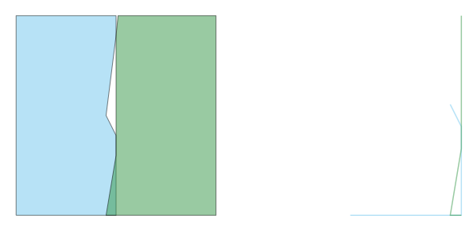

.. _gdal_vector_check_coverage:

================================================================================
``gdal vector check-coverage``
================================================================================

.. versionadded:: 3.12

.. only:: html

    Checks whether a polygon dataset forms a valid coverage.

.. Index:: gdal vector check-coverage

Synopsis
--------

.. program-output:: gdal vector check-coverage --help-doc

Description
-----------

:program:`gdal vector check-coverage` checks whether a polygon dataset forms a valid coverage, meaning:

- no polygons overlap
- all shared edges have nodes at the same locations
- any gaps between polygons are larger than a specified width

For each polygon not satisfying these criteria, a linear feature with the geometry of the invalid edge is output.
If the coverage is valid, the output dataset will be empty unless :option:`--include-valid` is used.

It is assumed that the individual polygons are themselves valid according to the :term:`OGC` Simple Features standard. This can be checked by :ref:`gdal_vector_check_geometry`.

   Polygon dataset (left) and locations of invalid coverage edges (right).

.. note:: This command requires a GDAL build against the GEOS library (version 3.12 or greater).

.. GDALG output (on-the-fly / streamed dataset)
.. --------------------------------------------

.. include:: gdal_cli_include/gdalg_vector_compatible_non_natively_streamable.rst

Program-Specific Options
------------------------

.. option:: --geometry-field

   Specify the name of the geometry field to test, for layers having multiple geometry fields. By default the first
   geometry field will be used.

.. option:: --include-valid

   Include features for valid geometries in the output, maintaining 1:1 correspondence between input and output features.
   The geometry of valid features will be an empty geometry.

.. option:: --input-layer

   Specifies the name of the layer to process. By default, all layers will be processed.

.. option:: --output-layer

   Specifies the name of the layer to which features will be written. If not
   specified and there is a single input layer, the name "invalid_edge" will
   be used. If not specified and there are multiple input layers, features
   for each input layer will be written to a separate output layer in the
   format "invalid_edge_{INPUT_LAYER}".

.. option:: --maximum-gap-width <MAXIMUM-GAP-WIDTH>

   Defines the largest area that should be considered a gap.

Standard Options
----------------

.. collapse:: Details

    .. include:: gdal_options/append_vector.rst

    .. include:: gdal_options/co_vector.rst

    .. include:: gdal_options/if.rst

    .. include:: gdal_options/lco.rst

    .. include:: gdal_options/oo.rst

    .. include:: gdal_options/of_vector.rst

    .. include:: gdal_options/output_oo.rst

    .. include:: gdal_options/overwrite.rst

    .. include:: gdal_options/overwrite_layer.rst

    .. include:: gdal_options/skip_errors.rst

    .. include:: gdal_options/update.rst

    .. include:: gdal_options/upsert.rst

Examples
--------

.. example::
   :title: Output coverage errors in a :ref:`TopoJSON <vector.topojson>` file to a :ref:`GeoJSON <vector.geojson>` file

   .. code-block:: bash

        $ gdal vector check-coverage "https://cdn.jsdelivr.net/npm/us-atlas@3/counties-albers-10m.json" --layer counties counties-errors.geojson

.. example::
   :title: Output invalid coverage features to the command-line as part of a pipeline

   .. tabs::

      .. code-tab:: bash

        gdal vector pipeline \
            ! read "https://cdn.jsdelivr.net/npm/us-atlas@3/counties-albers-10m.json" --layer counties \
            ! check-coverage \
            ! info --features

      .. code-tab:: powershell

        gdal vector pipeline `
            ! read "https://cdn.jsdelivr.net/npm/us-atlas@3/counties-albers-10m.json" --layer counties `
            ! check-coverage `
            ! info --features
