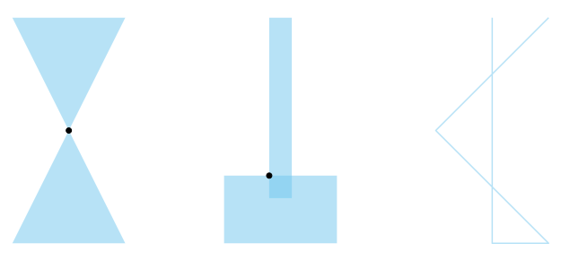

.. _gdal_vector_check_geometry:

================================================================================
``gdal vector check-geometry``
================================================================================

.. versionadded:: 3.12

.. only:: html

    Checks that geometries are valid and simple according to the :term:`OGC` Simple Features standard.

.. Index:: gdal vector check-geometry

Synopsis
--------

.. program-output:: gdal vector check-geometry --help-doc

Description
-----------

:program:`gdal vector check-geometry` checks that individual elements of a dataset are valid and simple according to the :term:`OGC` Simple Features standard. For each invalid or non-simple feature, it will output a description and, in most cases, a point location of the error.

The following checks are performed, depending on the input geometry type:

- Polygons and MultiPolygons are checked for validity. A single point error point will be reported even if there are multiple causes of invalidity.
- LineStrings and MultiLineStrings are checked for simplicity. All self-intersection locations will be reported if GDAL is built using version 3.14 or later of the GEOS library. With earlier versions, self-intersection locations are not reported.
- GeometryCollections are checked that their individual elements are valid / simple. A single error point will be reported even if there are multiple causes of invalidity.
- Other geometry types are not checked.

Validity/simplicity checking is performed by the GEOS library and should be consistent with results of software such as PostGIS, QGIS, and shapely that also use that library. GEOS does not consider repeated points to be a cause of invalidity or non-simplicity.

   Error locations reported by :program:`gdal vector check-geometry` for Polygon, MultiPolyon, and LineString inputs.

.. warning::

   Curved geometries are linearized before converting to GEOS. Linearized geometries may be valid/simple where the original geometries are not,
   and vice-versa.

.. GDALG output (on-the-fly / streamed dataset)
.. --------------------------------------------

.. include:: gdal_cli_include/gdalg_vector_compatible_non_natively_streamable.rst

Program-Specific Options
------------------------

.. option:: --geometry-field

   Specify the name of the geometry field to test, for layers having multiple geometry fields. By default the first
   geometry field will be used.

.. option:: --include-field

   .. versionadded:: 3.12.1

   Optional field(s) to copy from the input features to the output. Since GDAL 3.13, the value ``ALL`` can be used to include all fields
   from the source layer.

.. option:: --include-valid

   Include features for valid/simple geometries in the output, maintaining 1:1 correspondence between input and output features.

.. include:: gdal_options/input_layer.rst

.. option:: --output-layer

   Specifies the name of the layer to which features will be written. If not
   specified and there is a single input layer, the name "error_location" will
   be used. If not specified and there are multiple input layers, features
   for each input layer will be written to a separate output layer in the
   format "error_location_{INPUT_LAYER}".

Standard Options
----------------

.. collapse:: Details

    .. include:: gdal_options/append_vector.rst

    .. include:: gdal_options/co_vector.rst

    .. include:: gdal_options/if.rst

    .. include:: gdal_options/lco.rst

    .. include:: gdal_options/oo.rst

    .. include:: gdal_options/of_vector.rst

    .. include:: gdal_options/output_oo.rst

    .. include:: gdal_options/overwrite.rst

    .. include:: gdal_options/overwrite_layer.rst

    .. include:: gdal_options/skip_errors.rst

    .. include:: gdal_options/update.rst

    .. include:: gdal_options/upsert.rst

Examples
--------

.. example::
   :title: Print invalidity locations to console

   .. code-block:: console

       $ gdal vector check-geometry ne_10m_admin_0_countries.shp \
                --quiet \
                -f CSV \
                --lco GEOMETRY=AS_XY \
                --lco SEPARATOR=TAB \
                /vsistdout/
       # X	Y	error
       # 35.6210871060001	23.1392929140001	Ring Self-intersection

