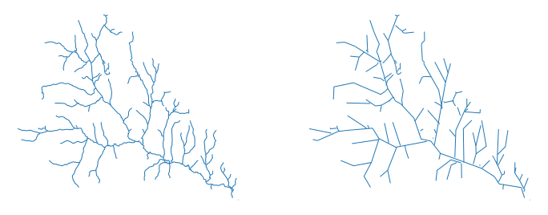

.. _gdal_vector_simplify:

================================================================================
``gdal vector simplify``
================================================================================

.. versionadded:: 3.12

.. only:: html

    Simplify geometries of a vector dataset.

.. Index:: gdal vector simplify

Synopsis
--------

.. program-output:: gdal vector simplify --help-doc

Description
-----------

:program:`gdal vector simplify` simplifies geometries, ensuring that
the result is a valid geometry having the same dimension and number of
components as the input.

The simplification uses a maximum distance difference algorithm
similar to the one used in the Douglas-Peucker algorithm.

This done by the :cpp:func:`OGRGeometry::SimplifyPreserveTopology` method which
preserves the topology per feature, but not for a whole layer.
Thus gaps or overlaps between geometries that were initially contiguous may
happen. To perform simplification that preserves shared boundaries between geometries, see :ref:`gdal_vector_simplify_coverage`.

This command can also be used as a step of :ref:`gdal_vector_pipeline`.

   Line dataset before (left) and after (right) simplification with :program:`gdal vector simplify`.

.. note:: This command requires a GDAL build against the GEOS library.

.. GDALG output (on-the-fly / streamed dataset)
.. --------------------------------------------

.. include:: gdal_cli_include/gdalg_vector_compatible.rst

Program-Specific Options
------------------------

.. option:: --tolerance <TOLERANCE>

    The specified value of this option is the tolerance used to merge
    consecutive points of the output geometry using the
    :cpp:func:`OGRGeometry::SimplifyPreserveTopology` method
    The unit of the distance is in georeferenced units of the source layer.

Standard Options
----------------

.. collapse:: Details

    .. include:: gdal_options/active_geometry.rst

    .. include:: gdal_options/active_layer.rst

    .. include:: gdal_options/append_vector.rst

    .. include:: gdal_options/co_vector.rst

    .. include:: gdal_options/if.rst

    .. include:: gdal_options/input_layer.rst

    .. include:: gdal_options/lco.rst

    .. include:: gdal_options/oo.rst

    .. include:: gdal_options/of_vector.rst

    .. include:: gdal_options/output_layer.rst

    .. include:: gdal_options/output_oo.rst

    .. include:: gdal_options/overwrite.rst

    .. include:: gdal_options/overwrite_layer.rst

    .. include:: gdal_options/skip_errors.rst

    .. include:: gdal_options/update.rst

    .. include:: gdal_options/upsert.rst

Examples
--------

.. example::
   :title: Simplify geometries using a tolerance of one km (assuming the CRS is in meters)

   .. code-block:: bash

        $ gdal vector simplify --tolerance=1000 in.gpkg out.gpkg --overwrite

.. below is an allow-list for spelling checker.

.. spelling:word-list::
        Peucker
