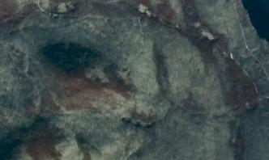
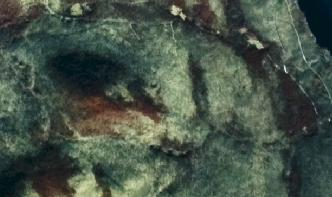

.. _gdalenhance:

================================================================================
gdalenhance
================================================================================

.. only:: html

    Enhance the contrast of raster images using histogram equalization.

.. Index:: gdalenhance

Synopsis
--------

.. code-block::

    gdalenhance [--help-general]
                [-of format] [-co "NAME=VALUE"]*
                [-ot {Byte/Int16/UInt16/UInt32/Int32/Float32/Float64/
                        CInt16/CInt32/CFloat32/CFloat64}]
                [-equalize]
                [-config filename]
                <src_raster> [<dst_raster>]

Description
-----------

The :program:`gdalenhance` utility enhances the contrast of raster images using
histogram equalization. It can either generate a LUT (look-up-table) that can
later be applied to enhance contrast, or it can write the enhanced image
directly.

   Original image.

   Image after histogram equalization using :program:`gdalenhance`.

.. program:: gdalenhance

.. include:: options/help_and_help_general.rst

.. option:: -of format

    Select the output format. The default is GeoTIFF (GTiff).

.. include:: options/co.rst

.. include:: options/ot.rst

.. option:: -equalize

    Get source image histogram and compute equalization LUTs from
    it.

.. option:: -config <filename>

    Apply a specified LUT to enhance the contrast of the image.
    The number of lines in the LUT file should be equal to the number of bands
    of the images.
    Example of LUT file:

    .. code-block::

        1:Band -0.5:ScaleMin 255.5:ScaleMax 0 0 8 16 16 17 17 17 17 18 18 18 18 18 18 19 19 19 19 20 20 20 21 21 21 22 22 22 23 23 24 24 25 25 26 27 27 28 29 30 30 31 32 33 34 35 36 37 38 39 40 42 43 44 46 47 48 50 51 53 55 56 58 60 62 63 65 67 69 71 73 75 77 79 81 83 85 87 89 91 93 95 97 99 101 103 105 107 109 111 113 115 117 119 121 123 125 127 129 131 133 135 137 138 140 142 144 146 148 150 152 153 155 157 159 161 162 164 166 168 169 171 173 174 176 178 179 181 182 184 186 187 189 190 192 193 195 196 198 199 200 202 203 205 206 207 208 210 211 212 213 214 216 217 218 219 220 221 222 223 224 225 226 227 228 229 230 231 232 233 234 234 235 236 237 238 239 239 240 241 241 242 243 244 244 245 245 246 246 247 247 248 248 249 249 250 250 250 251 251 251 251 251 252 252 252 252 252 252 252 252 252 252 253 253 253 253 253 253 253 253 253 253 253 253 253 253 253 254 254 254 254 254 254 255 255 255 255 255 255 255 255 255 255 255 255 255 255 255 255 255 255 255 255 255 255
        2:Band -0.5:ScaleMin 255.5:ScaleMax 0 0 8 16 16 16 17 17 17 17 17 17 17 17 17 18 18 18 18 18 18 19 19 19 19 19 20 20 20 20 21 21 22 22 23 23 24 24 25 26 27 27 28 29 30 31 32 33 34 35 36 37 38 39 41 42 43 45 46 47 49 51 52 54 55 57 59 60 62 64 66 67 69 71 73 75 77 79 81 83 85 87 89 91 93 95 97 99 101 103 105 108 110 112 114 116 118 120 122 124 126 128 130 132 134 136 138 140 142 144 146 148 150 152 154 156 157 159 161 163 165 166 168 170 172 173 175 177 179 180 182 183 185 187 188 190 191 193 194 196 197 199 200 202 203 204 206 207 208 209 211 212 213 214 215 216 217 218 219 220 221 222 223 224 225 226 227 228 229 230 230 231 232 233 234 235 235 236 237 238 239 239 240 241 241 242 243 243 244 245 245 246 246 247 247 248 248 248 249 249 250 250 250 250 251 251 251 251 252 252 252 252 252 252 252 252 252 252 253 253 253 253 253 253 253 253 253 253 253 253 253 253 253 253 253 254 254 254 254 254 254 255 255 255 255 255 255 255 255 255 255 255 255 255 255 255
        3:Band -0.5:ScaleMin 255.5:ScaleMax 0 0 9 17 17 18 18 18 18 18 19 19 19 19 19 19 20 20 20 20 20 20 21 21 21 21 21 21 22 22 22 22 22 23 23 23 24 24 24 25 25 26 26 27 28 28 29 30 31 32 33 34 35 36 37 38 39 40 41 42 44 45 46 47 48 50 51 53 54 56 57 59 60 62 63 65 67 69 70 72 74 76 78 80 82 84 86 88 90 92 94 97 99 101 103 105 107 109 111 113 115 116 118 120 122 124 126 127 129 131 133 134 136 138 139 141 143 144 146 147 149 151 152 154 155 157 159 160 162 163 165 167 168 170 171 173 175 176 178 179 181 182 184 186 187 189 190 192 193 195 197 198 200 201 203 204 206 207 209 210 212 213 214 216 217 218 219 220 222 223 224 225 226 227 228 229 230 231 232 233 233 234 235 236 237 238 239 239 240 241 242 243 243 244 245 246 246 247 247 248 248 249 249 250 250 251 251 251 251 252 252 252 252 252 252 252 252 253 253 253 253 253 253 253 253 253 253 253 253 253 253 253 253 253 253 253 253 253 253 253 253 253 253 253 253 253 253 254 254 255 255 255 255 255 255 2550

Examples
--------

.. example::
   :title: Apply equalization histogram to enhance the contrast of the image

   .. code-block::

       gdalenhance -equalize rgb.tif rgb_equalize_enhance.tif

.. example::
   :title: Write an equalization LUT to the console

   .. code-block::

       gdalenhance -equalize rgb.tif

.. example::
   :title: Apply a custom LUT (look up-table) to enhance the contrast of the image

   .. code-block::

       gdalenhance -config enhance_config rgb.tif rgb_custom_enhance.tif

