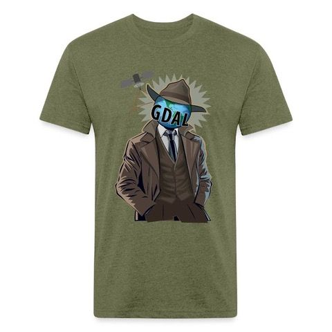

.. _sponsors:

================================================================================
Sponsors
================================================================================

Gold
--------------------------------------------------------------------------------

  .. _gold-sponsors:
  .. container:: horizontal-logos

    .. container:: horizontal-logo

        .. image:: ../../images/sponsors/logo-esri.png
           :class: img-logos
           :width: 250 px
           :target: https://www.esri.com

    .. container:: horizontal-logo

        .. image:: ../../images/sponsors/logo-planet.png
           :class: img-logos
           :width: 250 px
           :target: https://www.planet.com

    .. container:: horizontal-logo

        .. image:: ../../images/sponsors/logo-nasa.png
           :class: img-logos
           :width: 250 px
           :target: https://www.nasa.gov

Silver
--------------------------------------------------------------------------------

  .. _silver-sponsors:
  .. container:: horizontal-logos

    .. container:: horizontal-logo

        .. image:: ../../images/sponsors/logo-safe.png
           :class: img-logos
           :width: 240 px
           :target: https://www.safe.com

    .. container:: horizontal-logo

        .. image:: ../../images/sponsors/logo-google.png
           :class: img-logos
           :width: 240 px
           :target: https://google.com

Bronze
--------------------------------------------------------------------------------

  .. _bronze-sponsors:
  .. container:: horizontal-logos

    .. container:: horizontal-logo

        .. image:: ../../images/sponsors/logo-geoczech.png
           :class: img-logos
           :width: 150 px
           :target: https://geoczech.org

    .. container:: horizontal-logo

        .. image:: ../../images/sponsors/logo-linz.png
           :class: img-logos
           :width: 150 px
           :target: https://www.linz.govt.nz

    .. container:: horizontal-logo

        .. image:: ../../images/sponsors/logo-miramon.png
           :class: img-logos
           :width: 150 px
           :target: https://www.miramon.cat/Index_eng.htm

    .. container:: horizontal-logo

        .. image:: ../../images/sponsors/logo-vantor.png
           :class: img-logos
           :width: 150 px
           :target: https://www.vantor.com

Supporter
--------------------------------------------------------------------------------

  .. _supporter-sponsors:
  .. container:: horizontal-logos

    .. container:: horizontal-logo

        `Dynamic Graphics, Inc. <https://www.dgi.com/>`__

    .. container:: horizontal-logo

        `Kaplan Open Source Consulting <https://kaplanopensource.co.il/>`__

    .. container:: horizontal-logo

        `Robin Wilson <https://www.rtwilson.com/>`__

    .. container:: horizontal-logo

        `Satelligence <https://satelligence.com/>`__

    .. container:: horizontal-logo

        `T-Kartor <https://www.t-kartor.com/>`__

    .. container:: horizontal-logo

        `UAV4GEO <https://uav4geo.com/>`__

.. raw:: html

   

.. only:: html

    .. note::
        Sponsors are listed in randomized order within their sponsorship level.

Sponsorship Program
--------------------------------------------------------------------------------

You can support GDAL by direct participation in its development and community,
by contracting development via :ref:`service_providers`, or by financially
contributing to the GDAL Sponsorship Program (GSP) as a corporation or
individually.

GSP supports development of GDAL activities that no single organization
would directly contribute through a service provider or in-kind effort. GSP
funds are undirected resources the :ref:`psc` manages to repay technical debt,
address performance and security issues, and add new project-wide features such
as the recently added :ref:`gdal_program`.

GDAL collaborates with `NumFOCUS <https://numfocus.org>`__, a nonprofit
dedicated to supporting the open source scientific computing community, as a
`NumFOCUS Sponsored Project <https://numfocus.org/sponsored-projects>`__ to
have it provide administrative support for the GSP.  Donations in support of
the GSP are made to NumFOCUS and it provides administrative support of the
program for a fee.

.. note::

    NumFOCUS is 501(c)(3) non-profit charity in the United States (and soon in
    France); as such, donations to NumFOCUS are tax-deductible as allowed by
    law. As with any donation, you should consult with your personal tax
    adviser or the IRS about your particular tax situation.

Donations
~~~~~~~~~~~~~~~~~~~~~~~~~~~~~~~~~~~~~~~~~~~~~~~~~~~~~~~~~~~~~~~~~~~~~~~~~~~~~~~~

If your organization benefits from GDAL we recommend joining the group of
sponsors above to "pay it forward" and ensure the project has the resources to
stay healthy and grow. To learn about the benefits of becoming a sponsor at
various levels start with the `Sustainable GDAL Sponsorship Prospectus`_.  If
you are interested, need help convincing your key decision-makers, or have any
questions, don't hesitate to contact ``gdal-sponsors@osgeo.org``

Levels
++++++++++++++++++++++++++++++++++++++++++++++++++++++++++++++++++++++++++++++++

GDAL (and NumFOCUS) annual sponsorship levels are as follows:

* Gold – $50,000+ USD
* Silver – $25,000+ USD
* Bronze - $10,000+ USD
* Supporter – $1,000-$10,000 USD

Corporate
++++++++++++++++++++++++++++++++++++++++++++++++++++++++++++++++++++++++++++++++

The GDAL project primarily targets corporate donations due to their efficiency.
If you represent an organization the leverages GDAL and would like to coordinate
your organization's resources to help sponsor the project, please email
``gdal-sponsors@osgeo.org``.

Individual
++++++++++++++++++++++++++++++++++++++++++++++++++++++++++++++++++++++++++++++++

Individuals can target donation to the GDAL project by donating
to NumFOCUS through `https://numfocus.org/donate-to-gdal <https://numfocus.org/donate-to-gdal>`__.

.. note::

    If your workplace has a corporate giving program, please consider enrolling GDAL
    in it for a match.

Government
++++++++++++++++++++++++++++++++++++++++++++++++++++++++++++++++++++++++++++++++

Government donations (grants) often have significant constraints on their
acquisition, usage, and amount. While the project is happy to accept government
support through NumFOCUS, note that it can be difficult to meet all requirements.
If you are a government organization that desires to support the project
through NumFOCUS, please email ``gdal-sponsors@osgeo.org``.

T-shirts
++++++++++++++++++++++++++++++++++++++++++++++++++++++++++++++++++++++++++++++++

Profit from swag orders in the NumFOCUS Spreadshirt online shop directly contribute
to the project.

.. note::

    The design comes from Lindsey Nield saying "`Every new geospatial tool is
    just GDAL in a trench coat
    <https://www.linkedin.com/posts/gdalorg_at-the-cloud-native-geospatial-forum-cng-activity-7384239841418395648-51Wf>`__"

Past Sponsors
++++++++++++++++++++++++++++++++++++++++++++++++++++++++++++++++++++++++++++++++

:ref:`past_sponsors` have been critical to enable many feature, security, and
performance improvements to the project over the past three years. The project
thanks them for their contribution and hopes they can sponsor the project in
the future.

Administration
~~~~~~~~~~~~~~~~~~~~~~~~~~~~~~~~~~~~~~~~~~~~~~~~~~~~~~~~~~~~~~~~~~~~~~~~~~~~~~~~

`Howard Butler <https://howardbutler.com/>`__ is the GDAL Sponsorship Program
Lead and :ref:`psc` member. Contact him for questions or information about the
program.

The GDAL Maintainers Meeting is every fourth Thursday at 1300 UTC. Any PSC or
PR contributor is welcome to join. Contact Howard for an invite and look for
the minutes on the :ref:`mailing_list`.

Impact
~~~~~~~~~~~~~~~~~~~~~~~~~~~~~~~~~~~~~~~~~~~~~~~~~~~~~~~~~~~~~~~~~~~~~~~~~~~~~~~~

Since its creation in 2021, the GDAL Sponsorship Program has had a huge impact on the
administration and development of the GDAL project. It has allowed the project to work
to pay back nearly 30 years of accumulated technical and user experience debt that
otherwise would not be addressed. Some specific things the GSP enabled include:

* Conversion to the CMake build system
* Implementing the :ref:`gdal_program` CLI https://www.youtube.com/watch?v=ZKdrYm3TiBU
* Security remediation in libgdal and supporting libraries
* The :ref:`survey_2024` and activities resulting from its direction

.. note::

    You can browse GitHub tickets by searching for the `funded through GSP` label
    to see a listing of activities made possible by the program. https://github.com/OSGeo/gdal/pulls?q=is%3Apr+label%3A%22funded+through+GSP%22+is%3Aclosed

Related Resources
~~~~~~~~~~~~~~~~~~~~~~~~~~~~~~~~~~~~~~~~~~~~~~~~~~~~~~~~~~~~~~~~~~~~~~~~~~~~~~~~

- `Sustainable GDAL Sponsorship Prospectus`_.
- :ref:`Sponsoring frequently asked questions (FAQ) <sponsoring-faq>`.
- :ref:`rfc-80`
- :ref:`rfc-83`

.. container:: horizontal-logos

    .. container:: horizontal-logo

        .. image:: ../../images/logo-osgeo.png
           :class: img-logos
           :width: 150 px
           :target: https://www.osgeo.org

    .. container:: horizontal-logo

        .. image:: ../../images/logo-numfocus.png
           :class: img-logos
           :width: 150 px
           :target: https://numfocus.org

.. Source of the PDF is at https://docs.google.com/document/d/1yhMWeI_LgEXPUkngqOitqcKfp7ov6WsS41v5ulz-kd0/edit#

.. _Sustainable GDAL Sponsorship Prospectus: ../_static/Sustainable%20GDAL%20Sponsorship%20Prospectus.pdf

..
    Developer comment: make html includes a hack to hide the table from
    the index.html file. We need to keep it visible so that the top-level
    index.html lists those pages.

.. toctree::
   :maxdepth: 0
   :hidden:

   faq

.. below is an allow-list for spelling checker.

.. spelling:word-list::
    Nield
    Spreadshirt
