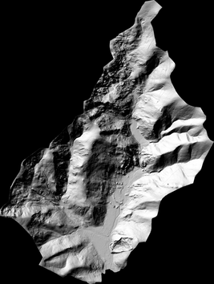
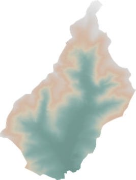

.. _dtm_tut:

================================================================================
Working with a Digital Terrain Model (DTM)
================================================================================

.. contents::
    :depth: 3

Overview
--------

This tutorial demonstrates how to work with a :term:`DTM` (Digital Terrain Model), using freely available datasets.
You'll learn how to create a raster tile index, clip data to a polygon, and generate hillshade, aspect, and slope images with various GDAL commands.

Code examples assume a Bash shell on Linux. Where syntax differs, equivalent PowerShell commands are provided for Windows users.
The tutorial covers both the unified :ref:`gdal command-line interface <programs_gdal>` and the :ref:`traditional <programs_traditional>`
individual GDAL tools. The tutorial uses a Conda environment with GDAL installed, see :ref:`Conda setup <conda>` for setting this up.

Getting the Data
----------------

We'll use open data from IGN (Institut national de l'information géographique et forestière), France's national mapping agency.
IGN provides a national DTM (the RGEALTI dataset) available at https://geoservices.ign.fr/rgealti.

This tutorial focuses on department 90 - "Territoire de Belfort" (a department is an administrative unit in France).
The DTM for this area is available as a ``.7z`` archive: `RGEALTI_2-0_5M_ASC_LAMB93-IGN69_D090_2021-01-13.7z`_ (45 MB).
You can automate the download and extraction using the commands below.

.. tabs::

   .. code-tab:: bash

        # ensure 7-zip is installed
        apt-get update && apt-get install curl p7zip-full -y

        # use curl to download the file
        curl -O https://data.geopf.fr/telechargement/download/RGEALTI/RGEALTI_2-0_5M_ASC_LAMB93-IGN69_D090_2021-01-13/RGEALTI_2-0_5M_ASC_LAMB93-IGN69_D090_2021-01-13.7z

        # unzip the contents
        7z x RGEALTI_2-0_5M_ASC_LAMB93-IGN69_D090_2021-01-13.7z

   .. code-tab:: ps1

        # hiding progress output significantly speeds up downloading files
        $ProgressPreference = "SilentlyContinue"

        # download the zip file
        Invoke-WebRequest `
          -Uri "https://data.geopf.fr/telechargement/download/RGEALTI/RGEALTI_2-0_5M_ASC_LAMB93-IGN69_D090_2021-01-13/RGEALTI_2-0_5M_ASC_LAMB93-IGN69_D090_2021-01-13.7z" `
          -OutFile "RGEALTI_2-0_5M_ASC_LAMB93-IGN69_D090_2021-01-13.7z"

        # download the 7-zip installer
        Invoke-WebRequest -Uri "https://www.7-zip.com/a/7z2409-x64.exe" -OutFile "7z-x64.exe"

        # unzip the contents
        Start-Process -FilePath "7z-x64.exe" -ArgumentList "/S" -Wait
        & "C:\Program Files\7-Zip\7z.exe" x "RGEALTI_2-0_5M_ASC_LAMB93-IGN69_D090_2021-01-13.7z" -y

Creating a Raster Tile Index
----------------------------

The archive contains individual tiles in the ASCII raster (``.asc``) format - a plain text format commonly used for gridded spatial data. The following commands rely on the
:ref:`raster.aaigrid` driver being installed (this is typically included in standard GDAL builds).

Rather than working with each file separately, we can treat them as a single virtual raster dataset using the :ref:`GDAL Raster Tile Index <raster.gti>` driver.
The tile index can be created using the new CLI tool :ref:`gdal_driver_gti_create` or with :ref:`gdaltindex` from the traditional GDAL tools.
This creates a vector dataset with one record per raster tile, allowing the tiles to be accessed as a unified raster in GDAL, MapServer, or QGIS (version 3.4+).

.. tabs::

   .. code-tab:: bash gdal CLI

        files="RGEALTI_2-0_5M_ASC_LAMB93-IGN69_D090_2021-01-13/RGEALTI/1_DONNEES_LIVRAISON_2021-10-00009/RGEALTI_MNT_5M_ASC_LAMB93_IGN69_D090/*.asc"
        gdal driver gti create --layer dtm --dst-crs EPSG:2154 $files tileindex.gti.fgb

   .. code-tab:: bash Traditional

        files="RGEALTI_2-0_5M_ASC_LAMB93-IGN69_D090_2021-01-13/RGEALTI/1_DONNEES_LIVRAISON_2021-10-00009/RGEALTI_MNT_5M_ASC_LAMB93_IGN69_D090/*.asc"
        gdaltindex -lyr_name dtm -t_srs EPSG:2154 tileindex.gti.fgb $files

   .. code-tab:: powershell

        # create a GTI from all the asc files
        $files = "RGEALTI_2-0_5M_ASC_LAMB93-IGN69_D090_2021-01-13/RGEALTI/1_DONNEES_LIVRAISON_2021-10-00009/RGEALTI_MNT_5M_ASC_LAMB93_IGN69_D090/*.asc"
        gdal driver gti create --layer dtm --dst-crs EPSG:2154 $files tileindex.gti.fgb

Clipping the DTM
----------------

Next, we'll clip the DTM using a polygon representing department 90. Instead of downloading a national dataset of all departments, we can use a WFS server
to retrieve only the feature we need.

For the traditional approach we'll use :ref:`ogr2ogr` and the :ref:`vector.wfs` driver.
Starting with GDAL 3.11, the same result can be achieved using the GDAL CLI and the :ref:`gdal_vector_pipeline`. In both cases, your GDAL installation must include the
the :ref:`vector.gml` driver.

We will explicitly set the output layer name to *commune* to avoid the auto-generated name *ADMINEXPRESS-COG.2017:commune*.
When using ``ogr2ogr`` it's also important to set the geometry type with ``-nlt POLYGON``, otherwise, clipping the raster will fail with the error:
``ERROR 1: Cutline not of polygon type``.

.. tabs::

   .. code-tab:: bash gdal CLI

        gdal vector pipeline \
            ! read WFS:"https://data.geopf.fr/wfs/ows?version=2.0.0&typename=ADMINEXPRESS-COG.2017:commune" \
            ! set-geom-type --geometry-type Polygon \
            ! filter --where "insee_com='90065'" \
            ! write --output-layer=commune commune.fgb

   .. code-tab:: bash Traditional

        ogr2ogr -f FlatGeobuf commune.fgb \
            WFS:"https://data.geopf.fr/wfs/ows?version=2.0.0&typename=ADMINEXPRESS-COG.2017:commune" \
            -nln commune \
            -nlt POLYGON \
            -where "insee_com = '90065'"

   .. code-tab:: powershell

        gdal vector pipeline `
            ! read WFS:"https://data.geopf.fr/wfs/ows?version=2.0.0&typename=ADMINEXPRESS-COG.2017:commune" `
            ! set-geom-type --geometry-type Polygon `
            ! filter --where "insee_com='90065'" `
            ! write --output-layer=commune commune.fgb

The image below shows the polygon downloaded from the WFS server overlaid on the raster tile index. We will
clip the tiled raster using this polygon to create a new  **clipped.tif** file using :ref:`gdal_raster_clip` for the CLI approach,
and :ref:`gdalwarp` for the traditional method.

.. tabs::

   .. code-tab:: bash gdal CLI

        gdal raster clip --like commune.fgb  tileindex.gti.fgb clipped.tif --overwrite

   .. code-tab:: bash Traditional

        gdalwarp -cutline commune.fgb -crop_to_cutline -of GTiff tileindex.gti.fgb clipped.tif

.. note::

    To perform spatial operations such as clipping, your GDAL installation must be built with the :term:`GEOS` (Geometry Engine - Open Source) dependency.
    You can verify this using the GDAL Python library provided in the GDAL Conda environment.

    .. code-block:: bash

        # if GEOS is installed the following will output the GEOS version number
        $ python -c "from osgeo import ogr; print(ogr.GetGEOSVersionMajor())"
        3

    If GEOS is not installed, you may encounter errors like the following:

    .. code-block:: bash

        # ERROR 6: GEOS support not enabled.

Processing the DTM
------------------

With a raster covering our area of interest, we can now use GDAL's powerful raster tools.
For an excellent overview of creating relief maps with GDAL, see
`A Gentle Introduction to GDAL Part 5: Shaded Relief <https://medium.com/@robsimmon/a-gentle-introduction-to-gdal-part-5-shaded-relief-ec29601db654>`__.

The traditional tools for analyzing and visualizing :term:`DEM` s and :term:`DTM` s are the :ref:`gdaldem` commands. The new CLI provides similar functionality
under the ``gdal raster`` subcommands.

First we'll create a shaded relief map using :ref:`gdaldem` and ``hillshade`` (traditional approach) or :ref:`gdal_raster_hillshade` with the GDAL CLI.
Both commands support various parameters, such as light azimuth, altitude, and vertical exaggeration. In this example, we'll set the vertical exaggeration factor
to ``2`` (using the ``-z 2`` and ``--zfactor=2`` options) to enhance the shading effect.

Refer to the command help pages for full details, and feel free to experiment with the examples below.

.. tabs::

   .. code-tab:: bash gdal CLI

        gdal raster hillshade --zfactor=2 clipped.tif hillshade.tif --overwrite

   .. code-tab:: bash Traditional

        gdaldem hillshade -z 2 clipped.tif hillshade.tif

The output of this command is shown below. Note that images have been converted to the PNG format and resized for the GDAL documentation.

Next, we'll create a slope map using :ref:`gdaldem` and ``slope`` (traditional approach), or :ref:`gdal_raster_slope` with the GDAL CLI.
Feel free to experiment with the available settings to produce a visualization that best represents the data.

.. tabs::

   .. code-tab:: bash gdal CLI

        gdal raster slope clipped.tif slope.tif --overwrite

   .. code-tab:: bash Traditional

        gdaldem slope clipped.tif slope.tif

Now we'll create an image showing terrain aspect using :ref:`gdaldem` and ``aspect`` (traditional approach) or :ref:`gdal_raster_aspect` with the GDAL CLI.

.. tabs::

   .. code-tab:: bash gdal CLI

        gdal raster aspect clipped.tif aspect.tif --overwrite

   .. code-tab:: bash Traditional

        gdaldem aspect clipped.tif aspect.tif

Next, we'll apply color to the DTM based on elevation values. First, create a file named ``color-map-percentage.txt`` in the same folder as your ``clipped.tif`` file,
and copy in the contents below. The file defines :term:`RGB` values for elevation ranges, grouped by percentage. GDAL maps these percentage
ranges to RGB colors when rendering the DTM. The ``nv`` (no data value) entry specifies the RGB colour for any ``NoData`` values in the raster. In this case it is set to ``255 255 255 0``, where the
final ``0`` means the no data areas will be fully transparent.

.. literalinclude:: code/color-map-percentage.txt

Now we can apply the color map to the DTM using :ref:`gdaldem` and ``color-relief`` (traditional approach) or :ref:`gdal_raster_color_map` with the GDAL CLI.
To make the background transparent, include the ``-alpha`` (traditional) or ``--add-alpha`` (CLI) option when running the command.

.. tabs::

   .. code-tab:: bash gdal CLI

        gdal raster color-map --color-map=color-map-percentage.txt clipped.tif color.tif --add-alpha --overwrite

   .. code-tab:: bash Traditional

        gdaldem color-relief clipped.tif color-map-percentage.txt color.tif -alpha

To finish, we'll use a new tool introduced in GDAL 3.12  - :ref:`gdal_raster_blend` -  to blend the color map with the previously created hillshade image.
This command is available only through the new GDAL CLI.

.. code-block:: bash

    gdal raster blend --operator=hsv-value --grayscale=hillshade.tif color.tif color-hillshade.png --overwrite

.. _`RGEALTI_2-0_5M_ASC_LAMB93-IGN69_D090_2021-01-13.7z`: https://data.geopf.fr/telechargement/download/RGEALTI/RGEALTI_2-0_5M_ASC_LAMB93-IGN69_D090_2021-01-13/RGEALTI_2-0_5M_ASC_LAMB93-IGN69_D090_2021-01-13.7z

.. spelling:word-list::
    Institut
    l'information
    géographique
    forestière
    Territoire
    Belfort
