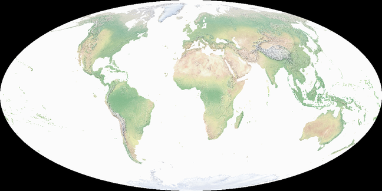

Reprojecting Data with GDAL
===========================

Reprojecting spatial data is a common task in GIS. Coordinate reference system (:term:`CRS`) transformations are handled by |PROJ|
- a required dependency of GDAL. In this tutorial we'll walk through reprojecting both vector and raster data using data from the
`Natural Earth <https://www.naturalearthdata.com/>`__ dataset.

Introduction
------------

We'll start by getting projection information from one of the Natural Earth rasters.

.. code-block:: bash

    gdal raster info NE2_50M_SR.tif

:ref:`gdal_raster_info` returns the projection of the dataset in the WKT2 (Well-Known Text version 2) format.
This format was defined by the |OGC| and represents a complete CRS definition, not just a projection.
It includes everything GDAL needs to perform coordinate transformations - a full datum definition, the projection method
and parameters, and axis definitions. The full specification is found at http://www.opengis.net/doc/is/crs-wkt/2.1.11,
and latest version (and that used by GDAL) is ISO 19162:2019.

A breakdown of the WKT2 CRS contents is provided below.

.. code-block:: bash

    Coordinate System is:
    GEOGCRS["WGS 84",
        ENSEMBLE["World Geodetic System 1984 ensemble",
            MEMBER["World Geodetic System 1984 (Transit)"],
            MEMBER["World Geodetic System 1984 (G730)"],
            MEMBER["World Geodetic System 1984 (G873)"],
            MEMBER["World Geodetic System 1984 (G1150)"],
            MEMBER["World Geodetic System 1984 (G1674)"],
            MEMBER["World Geodetic System 1984 (G1762)"],
            MEMBER["World Geodetic System 1984 (G2139)"],
            MEMBER["World Geodetic System 1984 (G2296)"],
            ELLIPSOID["WGS 84",6378137,298.257223563,
                LENGTHUNIT["metre",1]],
            ENSEMBLEACCURACY[2.0]],
        PRIMEM["Greenwich",0,
            ANGLEUNIT["degree",0.0174532925199433]],
        CS[ellipsoidal,2],
            AXIS["geodetic latitude (Lat)",north,
                ORDER[1],
                ANGLEUNIT["degree",0.0174532925199433]],
            AXIS["geodetic longitude (Lon)",east,
                ORDER[2],
                ANGLEUNIT["degree",0.0174532925199433]],
        USAGE[
            SCOPE["Horizontal component of 3D system."],
            AREA["World."],
            BBOX[-90,-180,90,180]],
        ID["EPSG",4326]]
    Data axis to CRS axis mapping: 2,1

- ``GEOGCRS["WGS 84"`` This means it's a Geographic CRS (latitude and longitude, not a projected CRS like Web Mercator or UTM), and has the name "WGS 84".

- ``ENSEMBLE["World Geodetic System 1984 ensemble",..`` - WGS 84 has been updated multiple times. The ENSEMBLE list contains
  all the different versions.

- ``ENSEMBLEACCURACY[2.0]`` means all the different versions are considered equivalent within ~2 metres.

- ``ELLIPSOID["WGS 84", 6378137, 298.257223563]`` defines the Earth's shape

- ``PRIMEM["Greenwich",0...`` states the Prime meridian is at Greenwich (0° longitude)

- ``CS[ellipsoidal,2],`` the Coordinate System is a 2-dimensional ellipsoidal

- ``AXIS["geodetic longitude (Lon)",east, ORDER[2],`` details the axis order. In this case the CRS defines axis order as latitude, longitude.
  This differs from the traditional GIS display order (longitude, latitude), which can lead to confusion - for more discussion around this
  see :ref:`osr_api_tut_axis_order`.

- ``USAGE[...`` contains metadata associated with the coordinate system.

- ``ID["EPSG",4326]`` - this is the familiar **EPSG:4326** code used to reference the CRS. This identifier links the WKT
  definition to the EPSG registry, but the WKT itself is the authoritative, fully expanded definition used internally by GDAL.

- ``Data axis to CRS axis mapping: 2,1`` - this is a GDAL specific line showing how raster data axes map to the CRS axes.
  Here, the dataset stores coordinates as longitude, latitude, while the CRS defines them as latitude, longitude.

You can look up the details for each coordinate system at https://spatialreference.org, for example https://spatialreference.org/ref/epsg/4326/.
These pages also show coordinate systems in other formats. Alternatively, GDAL includes :ref:`gdalsrsinfo`,
a command-line tool to display and validate a CRS:

.. code-block:: bash

    gdalsrsinfo -V IAU_2015:30100

GDAL can work with the many different CRS formats supported by PROJ, see :example:`gdal-vector-reproject-crs`. See the full list
of options at the `projinfo <https://proj.org/en/stable/apps/projinfo.html>` page.

Now let's reproject the raster dataset to Web Mercator, and look at the projection information.

.. code-block:: bash

    gdal raster reproject --dst-crs=EPSG:3857 NE2_50M_SR.tif NE2_50M_SR_3857.tif
    gdal raster info NE2_50M_SR_3857.tif

The CRS output is shown below.

.. code-block:: bash

    Layer SRS WKT:
    PROJCRS["WGS 84 / Pseudo-Mercator",
        BASEGEOGCRS["WGS 84",
            ENSEMBLE["World Geodetic System 1984 ensemble",
                MEMBER["World Geodetic System 1984 (Transit)"],
                MEMBER["World Geodetic System 1984 (G730)"],
                MEMBER["World Geodetic System 1984 (G873)"],
                MEMBER["World Geodetic System 1984 (G1150)"],
                MEMBER["World Geodetic System 1984 (G1674)"],
                MEMBER["World Geodetic System 1984 (G1762)"],
                MEMBER["World Geodetic System 1984 (G2139)"],
                MEMBER["World Geodetic System 1984 (G2296)"],
                ELLIPSOID["WGS 84",6378137,298.257223563,
                    LENGTHUNIT["metre",1]],
                ENSEMBLEACCURACY[2.0]],
            PRIMEM["Greenwich",0,
                ANGLEUNIT["degree",0.0174532925199433]],
            ID["EPSG",4326]],
        CONVERSION["Popular Visualisation Pseudo-Mercator",
            METHOD["Popular Visualisation Pseudo Mercator",
                ID["EPSG",1024]],
            PARAMETER["Latitude of natural origin",0,
                ANGLEUNIT["degree",0.0174532925199433],
                ID["EPSG",8801]],
            PARAMETER["Longitude of natural origin",0,
                ANGLEUNIT["degree",0.0174532925199433],
                ID["EPSG",8802]],
            PARAMETER["False easting",0,
                LENGTHUNIT["metre",1],
                ID["EPSG",8806]],
            PARAMETER["False northing",0,
                LENGTHUNIT["metre",1],
                ID["EPSG",8807]]],
        CS[Cartesian,2],
            AXIS["easting (X)",east,
                ORDER[1],
                LENGTHUNIT["metre",1]],
            AXIS["northing (Y)",north,
                ORDER[2],
                LENGTHUNIT["metre",1]],
        USAGE[
            SCOPE["Web mapping and visualisation."],
            AREA["World between 85.06°S and 85.06°N."],
            BBOX[-85.06,-180,85.06,180]],
        ID["EPSG",3857]]
    Data axis to CRS axis mapping: 1,2

- ``PROJCRS["WGS 84 / Pseudo-Mercator",`` - this is a *projected* CRS rather than a *geographic* CRS

- ``BASEGEOGCRS["WGS 84", ...]`` - the underlying coordinate system is based on WGS 84. The same properties as
   above are listed here

- ``CONVERSION["Popular Visualisation Pseudo-Mercator", ...]`` this details the map projection itself

- ``CS[Cartesian,2]`` - the projected units are a 2D Cartesian system (X, Y)

- ``AXIS["easting (X)",east] AXIS["northing (Y)",north]`` - X = easting, Y = northing

- ``LENGTHUNIT["metre",1]`` - units are in metres

- ``USAGE[`` - the metadata indicating the CRS is intended for web mapping, and also that the ``BBOX`` does not cover the full extent of WGS84 and
   does not handle data at the poles.

- ``Data axis to CRS axis mapping: 1,2`` - this indicates that the data axis order matches the CRS axis order (X, Y).

In practice, you will often refer to a CRS using an EPSG code (e.g. EPSG:4326), but GDAL internally works with full WKT definitions like the one shown above.
Next, we'll use this CRS information to reproject both raster and vector datasets.

Raster
------

Reprojecting raster data is handled by :ref:`gdal_raster_reproject` (see this page for further examples). Let's try an example using Natural Earth raster data.
The original data is in WGS 84 (EPSG:4326) and we'll reproject it to a CRS not defined in the EPSG registry, `ESRI:53009 <https://spatialreference.org/ref/esri/53009/>`__
- the Mollweide projection. As this is a large file we'll also resize it to 10% of the original size to speed up the reprojection. The order of operations in the
pipeline matters, and in this case we want to resize before reprojecting - this changes the processing time from a few minutes to a few seconds,
but also reduces the output resolution and may affect reprojection accuracy.

   .. tabs::

      .. code-tab:: bash

        gdal raster pipeline \
        ! read NE2_50M_SR.tif \
        ! resize --size=10%,10% \
        ! reproject --dst-crs ESRI:53009 \
        ! write NE2_50M_SR_53009.png --overwrite

      .. code-tab:: ps1

        gdal raster pipeline `
        ! read NE2_50M_SR.tif `
        ! resize --size=10%,10% `
        ! reproject --dst-crs ESRI:53009 `
        ! write NE2_50M_SR_53009.png --overwrite

Note that the output is a PNG file, and the projection information is stored in a companion file with the same name, using the extension ``.aux.xml``.
GDAL refers to these as :term:`PAM` (Persistent Auxiliary Metadata) files. They are used to store metadata that cannot
be stored in the file itself, such as the CRS for formats that do not support it (e.g. PNG, JPEG).

Vector
------

Reprojecting vector data is handled by :ref:`gdal_vector_reproject`. We can reproject the entire Natural Earth vector dataset to Web Mercator with the following command:

.. code-block:: bash

    gdal vector reproject --dst-crs=EPSG:3857 natural_earth_vector.gpkg natural_earth_vector_3857.gpkg --overwrite

If you want to reproject just a single layer, you can specify the layer name with the ``--layer`` option. For example, to reproject just the "ne_10m_admin_0_countries" layer:

.. code-block:: bash

    gdal vector reproject --dst-crs=EPSG:3857 --layer=ne_10m_admin_0_countries natural_earth_vector.gpkg natural_earth_vector_3857.gpkg --overwrite

If your data is already in the correct CRS, but is missing metadata, you can use :ref:`gdal_vector_edit` to assign the CRS information without reprojecting the data.
For example, if you have a GeoPackage that is in WGS 84 but is missing the CRS metadata, you can add it with the following command:

.. code-block:: bash

    gdal vector edit --crs=EPSG:4326 in.gpkg out.gpkg --overwrite

Further Reading
---------------

- For working with projections using the C++ API, see :ref:`osr_api_tut`.
- For discussions about WKT and GDAL, see :ref:`wktproblems`.
