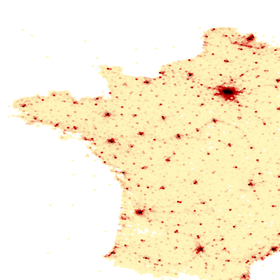

.. _duckdb_tut:

================================================================================
Working with DuckDB
================================================================================

:Last Updated:   2025-09-26
:Version Tested: GDAL 3.11.4 - Linux
:Version Tested: GDAL 3.12.0dev - Windows

.. contents::
    :depth: 3

Overview
--------

This tutorial introduces how to use GDAL together with `DuckDB <https://duckdb.org/>`__, an open-source, in-process database engine. DuckDB enables querying of remote files 
directly, so you only download the subset of data you actually need.

In GDAL, DuckDB is accessed via the :ref:`vector.adbc` driver.

This tutorial provides two examples showing how DuckDB can be used to query, download, and visualize remote datasets from `Overture Maps <https://overturemaps.org/>`__.

Setup and Configuration
-----------------------

First, create a new Conda environment and install GDAL along with the required GDAL :ref:`Conda subpackage <conda>` 
`libgdal-arrow-parquet <https://anaconda.org/conda-forge/libgdal-arrow-parquet>`_, which provides Arrow and Parquet support.  

On Linux, you will also need to install `libgdal-adbc <https://anaconda.org/conda-forge/libgdal-adbc>`_, which is required for the :ref:`vector.adbc` driver. 
This package is available via Conda on Linux and is not required on Windows, since DuckDB support is built into the Windows ADBC driver.

Finally, install the DuckDB package. This is also only available via Conda on Linux. For Windows, you will need to install DuckDB manually in a separate step.

.. tabs::

   .. code-tab:: bash

        conda create --yes --name gdal
        conda activate gdal
        conda install --yes -c conda-forge gdal libgdal-arrow-parquet libgdal-adbc
        conda install --yes libduckdb

   .. code-tab:: powershell

        conda create --yes --name gdal
        conda activate gdal
        # the tutorial only works on Windows with GDAL 3.12 or higher
        conda install --yes -c gdal-master -c conda-forge gdal-master::libgdal-arrow-parquet

On Windows, DuckDB can be installed by downloading a binary release from the `GitHub Releases <https://github.com/duckdb/duckdb/releases/>`_ page.

Be sure to download the shared library ``libduckdb.dll`` rather than the client package ``duckdb_cli-windows-amd64`` (which only provides the ``duckdb.exe`` command-line tool).

After downloading and unzipping the archive, add the folder containing ``libduckdb.dll`` to your Windows ``PATH`` so that GDAL can locate it.

.. code-block:: ps1

    # download the zip file
    $ProgressPreference = "SilentlyContinue"
    Invoke-WebRequest `
        -Uri "https://github.com/duckdb/duckdb/releases/download/v1.3.2/libduckdb-windows-amd64.zip" `
        -OutFile "libduckdb-windows-amd64.zip"

    # unzip the contents
    Expand-Archive -Path "libduckdb-windows-amd64.zip" -DestinationPath "libduckdb-windows-amd64" -Force

    # add the unzipped folder to PATH (for this session only)
    $absPath = (Resolve-Path ".\libduckdb-windows-amd64").Path
    $env:PATH = "$absPath;$env:PATH"

Now, let's verify that all required components have been installed correctly in the environment.

.. tabs::

   .. code-tab:: bash

       gdal --version
       # GDAL 3.11.4 "Eganville", released 2025/09/04
       conda list | grep "libgdal-arrow-parquet"
       # libgdal-arrow-parquet     3.11.4               he2d30bd_3    conda-forge
       conda list | grep "duckdb"
       # libduckdb                 1.3.2                h8eb67b4_2    conda-forge
       gdal vector --formats | grep ADBC
       # ADBC -vector- (ro): Arrow Database Connectivity

       # test the parquet driver is working
       gdal vector info "/vsicurl/https://github.com/opengeospatial/geoparquet/raw/main/examples/example.parquet"

   .. code-tab:: powershell

       # the GDAL environment variables GDAL_DRIVER_PATH and GDAL_DATA don't seem to be set after installing
       # to an active environment, so reactivate it
       conda deactivate
       conda activate gdal
       gdal --version
       # GDAL 3.12.0dev-2b1c4d1fdb-dirty, released 2025/09/22

       gdal vector --formats | Select-String "ADBC"
       # ADBC -vector- (ro): Arrow Database Connectivity

       # test the parquet driver is working
       gdal vector info "/vsicurl/https://github.com/opengeospatial/geoparquet/raw/main/examples/example.parquet"

Downloading Postal Addresses
----------------------------

In this first example, we will download addresses from the `Overture Addresses Dataset <https://docs.overturemaps.org/guides/addresses/>`__, 
which contains over 446 million address point entries.

Using DuckDB, we can query and select only the addresses within a specific bounding box in the US, and then download the results to a local Parquet file 
using GDAL.

Downloading the Data
++++++++++++++++++++

.. note::

    Overture only maintains publicly available datasets for a maximum of 60 days (two monthly releases). As a result, the data version URLs may need to be updated 
    by changing the release name (e.g., ``2025-09-24.0``). Use the ``gdal vsi list`` command, shown below, to retrieve the latest available versions. See the 
    `Overture Data Retention Policy <https://docs.overturemaps.org/release-calendar/#data-retention-policy>`__ for more details.

    If the specified Overture release is no longer available, you may encounter errors similar to the following:

    .. code-block:: console

        ERROR 1: AdbcStatementSetSqlQuery() failed: IO Error: Unknown error for HTTP GET to '/?encoding-type=url&list-type=2&prefix=release%2F2025-06-25.0%2Ftheme%3Dplaces%2Ftype%3Dplace%2F'
        ERROR 1: Unable to open datasource `ADBC:' with the following drivers.

    To check which versions are currently available, use GDAL to list them with:

    .. tabs::

       .. code-tab:: bash

           export AWS_NO_SIGN_REQUEST="YES"
           gdal vsi list "/vsis3/overturemaps-us-west-2/release/"

       .. code-tab:: powershell

           $ENV:AWS_NO_SIGN_REQUEST="YES"
           gdal vsi list "/vsis3/overturemaps-us-west-2/release/"

A few notes on the GDAL commands below:

- The ``--input`` option uses an empty ``ADBC:`` driver prefix. This may look unusual since it does not include a filename or URL; instead,
  all the logic is provided via the SQL ``--oo`` (``--open-option``) parameter.

- Each of the `DuckDB Extensions <https://duckdb.org/docs/stable/extensions/overview.html>`__ must be installed before it can be loaded.
  These extensions are downloaded from `http://extensions.duckdb.org <http://extensions.duckdb.org>`__. Once installed, you only need to provide the ``LOAD`` option to enable them.

- In this tutorial, we use the `spatial <https://duckdb.org/docs/stable/core_extensions/spatial/overview>`__, 
  `parquet <https://duckdb.org/docs/stable/data/parquet/overview.html>`__, 
  `httpfs <https://duckdb.org/docs/stable/core_extensions/httpfs/overview>`__, and 
  `aws <https://duckdb.org/docs/stable/core_extensions/aws.html>`__ extensions. These are all core DuckDB extensions.

- Each ``--oo PRELUDE_STATEMENTS`` option must be provided separately. Unlike the Postgres GDAL driver, you cannot use a ``;`` separator to combine multiple statements on a single line.

- We limit results to addresses within the state of Vermont by adding ``address_levels[1].value='VT'`` to the SQL where clause.

.. tabs::

   .. code-tab:: bash gdal CLI

        gdal vector convert --format parquet --output overture-vt-addresses.parquet \
            --oo ADBC_DRIVER=duckdb \
            --oo PRELUDE_STATEMENTS="INSTALL spatial" \
            --oo PRELUDE_STATEMENTS="LOAD spatial" \
            --oo PRELUDE_STATEMENTS="INSTALL parquet" \
            --oo PRELUDE_STATEMENTS="LOAD parquet" \
            --oo PRELUDE_STATEMENTS="INSTALL httpfs" \
            --oo PRELUDE_STATEMENTS="LOAD httpfs" \
            --oo PRELUDE_STATEMENTS="INSTALL aws" \
            --oo PRELUDE_STATEMENTS="LOAD aws" \
            --oo SQL="select * from read_parquet('s3://overturemaps-us-west-2/release/2025-09-24.0/theme=addresses/type=address/*') where country='US' and bbox.xmin between -74 and -73 and bbox.ymin between 42.7 and 45.1 and address_levels[1].value='VT'" \
            --input ADBC: --overwrite

   .. code-tab:: bash Traditional

        ogr2ogr -f parquet overture-vt-addresses.parquet \
            -oo ADBC_DRIVER=libduckdb \
            -oo PRELUDE_STATEMENTS="INSTALL spatial" \
            -oo PRELUDE_STATEMENTS="LOAD spatial" \
            -oo PRELUDE_STATEMENTS="INSTALL parquet" \
            -oo PRELUDE_STATEMENTS="LOAD parquet" \
            -oo PRELUDE_STATEMENTS="INSTALL httpfs" \
            -oo PRELUDE_STATEMENTS="LOAD httpfs" \
            -oo PRELUDE_STATEMENTS="INSTALL aws" \
            -oo PRELUDE_STATEMENTS="LOAD aws" \
            -oo SQL="select * from read_parquet('s3://overturemaps-us-west-2/release/2025-09-24.0/theme=addresses/type=address/*') where country='US' and bbox.xmin between -74 and -73 and bbox.ymin between 42.7 and 45.1 and address_levels[1].value='VT'" \
            ADBC:

   .. code-tab:: powershell

        gdal vector convert --format parquet --output overture-vt-addresses.parquet `
            --oo ADBC_DRIVER=duckdb `
            --oo PRELUDE_STATEMENTS="INSTALL spatial" `
            --oo PRELUDE_STATEMENTS="LOAD spatial" `
            --oo PRELUDE_STATEMENTS="INSTALL parquet" `
            --oo PRELUDE_STATEMENTS="LOAD parquet" `
            --oo PRELUDE_STATEMENTS="INSTALL httpfs" `
            --oo PRELUDE_STATEMENTS="LOAD httpfs" `
            --oo PRELUDE_STATEMENTS="INSTALL aws" `
            --oo PRELUDE_STATEMENTS="LOAD aws" `
            --oo SQL="select * from read_parquet('s3://overturemaps-us-west-2/release/2025-09-24.0/theme=addresses/type=address/*') where country='US' and bbox.xmin between -74 and -73 and bbox.ymin between 42.7 and 45.1 and address_levels[1].value='VT'" `
            --input ADBC: --overwrite

Visualizing the Data
++++++++++++++++++++

Now that we have our local Parquet file, we can output some sample records to verify its contents.

.. tabs::

   .. code-tab:: bash gdal CLI

        gdal vector pipeline \
            ! read overture-vt-addresses.parquet \
            ! limit 5 \
            ! select number street postcode country \
            ! write /vsistdout/ --output-format CSV

   .. code-tab:: bash Traditional

        ogr2ogr -f CSV /vsistdout/ overture-vt-addresses.parquet -limit 5 -select number,street,postcode,country

   .. code-tab:: powershell

        gdal vector pipeline \
            ! read overture-vt-addresses.parquet \
            ! limit 5 \
            ! select number street postcode country \
            ! write /vsistdout/ --output-format CSV --quiet

The commands above should display 5 records in a tabular format, similar to the example below:

.. code-block:: console

    country,postcode,street,number
    US,"05261",CROW HILL Road,"316"
    US,"05261",KRUM Road,"550"
    US,"05261",KRUM Road,"643"
    US,"05261",NORTHWEST HILL Road,"1744"
    US,"05261",NORTHWEST HILL Road,"1763"

Creating Hex Bins of Point Data
-------------------------------

In this example, we select all points of interest (POIs) in France and use the `h3 <https://duckdb.org/community_extensions/extensions/h3.html>`__ DuckDB 
community extension to group them into hexagonal bins.

The results are saved locally to a new ``POI_FR_H3.parquet`` file, which can then be used with MapServer to generate a density map.

Downloading the Data
++++++++++++++++++++

Some notes on the GDAL commands below:

- Since we installed several DuckDB extensions in the first step, we only need to ``LOAD`` them now; there is no need to run ``INSTALL`` again.
- We install a new `h3 <https://duckdb.org/community_extensions/extensions/h3.html>`__ community extension, which provides hexagonal indexing functionality.

.. tabs::

   .. code-tab:: bash gdal CLI

        gdal vector pipeline \
            ! read --input ADBC: \
            --oo ADBC_DRIVER=libduckdb \
            --oo PRELUDE_STATEMENTS="LOAD spatial" \
            --oo PRELUDE_STATEMENTS="LOAD parquet" \
            --oo PRELUDE_STATEMENTS="LOAD httpfs" \
            --oo PRELUDE_STATEMENTS="LOAD aws" \
            --oo PRELUDE_STATEMENTS="INSTALL h3 FROM community" \
            --oo PRELUDE_STATEMENTS="LOAD h3" \
            --oo SQL="select h3_id, ST_GeomFromText(h3_cell_to_boundary_wkt(h3_id)) geometry, count(*) POI_count \
                from (select id, h3_latlng_to_cell_string(st_y(geometry), st_x(geometry), 6) as h3_id from \
                read_parquet('s3://overturemaps-us-west-2/release/2025-09-24.0/theme=places/type=place/*') \
                where addresses[1].country='FR' and bbox.xmin between -5 and 9 and bbox.ymin between 41 and 51) group by h3_id" \
            ! edit --crs epsg:4326 \
            ! write --format parquet POI_FR_H3.parquet

   .. code-tab:: bash Traditional

        ogr2ogr -f parquet POI_FR_H3.parquet -a_srs epsg:4326 \
            -oo ADBC_DRIVER=libduckdb \
            -oo PRELUDE_STATEMENTS="LOAD spatial" \
            -oo PRELUDE_STATEMENTS="LOAD parquet" \
            -oo PRELUDE_STATEMENTS="LOAD httpfs" \
            -oo PRELUDE_STATEMENTS="LOAD aws" \
            -oo PRELUDE_STATEMENTS="INSTALL h3 FROM community" \
            -oo PRELUDE_STATEMENTS="LOAD h3" \
            -oo SQL="select h3_id, ST_GeomFromText(h3_cell_to_boundary_wkt(h3_id)) geometry, count(*) POI_count \
                from (select id, h3_latlng_to_cell_string(st_y(geometry), st_x(geometry), 6) as h3_id from \
                read_parquet('s3://overturemaps-us-west-2/release/2025-09-24.0/theme=places/type=place/*') \
                where addresses[1].country='FR' and bbox.xmin between -5 and 9 and bbox.ymin between 41 and 51) group by h3_id" \
            ADBC:

   .. code-tab:: powershell

        gdal vector pipeline `
            ! read --input ADBC: `
            --oo ADBC_DRIVER=duckdb `
            --oo PRELUDE_STATEMENTS="LOAD spatial" `
            --oo PRELUDE_STATEMENTS="LOAD parquet" `
            --oo PRELUDE_STATEMENTS="LOAD httpfs" `
            --oo PRELUDE_STATEMENTS="LOAD aws" `
            --oo PRELUDE_STATEMENTS="INSTALL h3 FROM community" `
            --oo PRELUDE_STATEMENTS="LOAD h3" `
            --oo SQL="select h3_id, ST_GeomFromText(h3_cell_to_boundary_wkt(h3_id)) geometry, count(*) POI_count `
                from (select id, h3_latlng_to_cell_string(st_y(geometry), st_x(geometry), 6) as h3_id from `
                read_parquet('s3://overturemaps-us-west-2/release/2025-09-24.0/theme=places/type=place/*') `
                where addresses[1].country='FR' and bbox.xmin between -5 and 9 and bbox.ymin between 41 and 51) group by h3_id" `
            ! edit --crs epsg:4326 `
            ! write --format parquet POI_FR_H3.parquet

Visualizing the Data
++++++++++++++++++++

We will use MapServer to create a simple map from the dataset we downloaded. MapServer can be installed via Conda:

.. code-block:: bash

    conda install --yes -c conda-forge mapserver

Next, create a new Mapfile called ``hexbin.map`` in the same folder as the ``POI_FR_H3.parquet`` dataset created in the previous step, using the code provided below:

.. tabs::

   .. code-tab:: bash

        echo -e 'MAP
            NAME "HEXBIN"
            SIZE 2000 2000
            EXTENT -5.271 44.426 4.084 50.089
            PROJECTION
                "EPSG:4326"
            END
            LAYER
                NAME "POI_FR_H3"
                STATUS ON
                CONNECTION "POI_FR_H3.parquet"
                TYPE POLYGON
                CONNECTIONTYPE OGR
                CLASS
                    STYLE
                        RANGEITEM "POI_count"
                        COLORRANGE "#FFF7BC" "#D73027"
                        DATARANGE 1 1000
                    END
                END
            END
        END' > hexbin.map

   .. code-tab:: powershell

        @'
        MAP
            NAME "HEXBIN"
            SIZE 2000 2000
            EXTENT -5.271 44.426 4.084 50.089
            PROJECTION
                "EPSG:4326"
            END
            LAYER
                NAME "POI_FR_H3"
                STATUS ON
                CONNECTION "POI_FR_H3.parquet"
                TYPE POLYGON
                CONNECTIONTYPE OGR
                CLASS
                    STYLE
                        RANGEITEM "POI_count"
                        COLORRANGE "#FFF7BC" "#D73027"
                        DATARANGE 1 1000
                    END
                END
            END
        END
        '@ | Set-Content -Path "hexbin.map"

Finally, we can run the following command to generate the ``hexbin.png`` image.

.. code-block:: bash

    map2img -m hexbin.map -o hexbin.png

