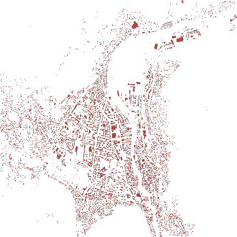
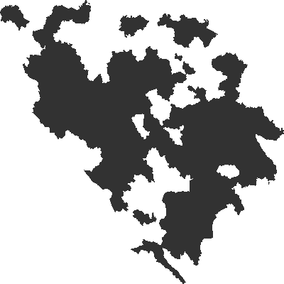

.. _geoparquet_tut:

================================================================================
Downloading GeoParquet Data from Overture Maps
================================================================================

:Last Updated:   2025-09-26
:Version Tested: GDAL 3.11.4

.. contents::
    :depth: 3

Overview
--------

This tutorial guides you through a complete workflow for downloading data from `Overture Maps <https://overturemaps.org/>`__
using GDAL's :ref:`vector.parquet` driver. We'll use the GDAL command-line tools installed via Conda, to download
building and administrative division data for Mostar, Bosnia and Herzegovina, the host city for `FOSS4G Europe 2025 <https://2025.europe.foss4g.org/>`__.

.. note::

    As Overture only maintain publicly available datasets for a maximum of 60 days (two monthly releases) the data version URLs may
    need to be updated (by changing the release name ``2025-09-24.0``). Use the ``gdal vsi list`` command detailed below to get the latest available versions.
    See the `Overture Data retention policy <https://docs.overturemaps.org/release-calendar/#data-retention-policy>`__ for details.

Code examples assume a Bash shell on Linux. Where syntax differs, PowerShell examples are also provided for Windows users.
The tutorial covers both the unified :ref:`gdal command-line interface <programs_gdal>` and the :ref:`traditional <programs_traditional>`
individual GDAL tools.

Setting Up a Conda Environment with Parquet Support
---------------------------------------------------

This tutorial assumes Conda is already installed. We'll start by creating a new Conda environment and installing GDAL.

.. code-block:: console

    $ conda create --yes --name gdal
    $ conda activate gdal
    $ conda install --yes -c conda-forge gdal
    $ conda --version
    conda 24.3.0
    $ gdal --version
    GDAL 3.11.4 "Eganville", released 2025/09/04

.. note::

    Be sure to install GDAL from the ``conda-forge`` channel, as it typically provides more up-to-date versions than the ``defaults`` channel.
    For example, at the time of writing the ``defaults`` channel offers GDAL 3.6.2, while ``conda-forge`` provides version 3.11.4.

Now that GDAL is installed, let's verify that it supports reading and writing Parquet files.

.. tabs::

   .. code-tab:: bash gdal CLI

        gdal vector --formats | grep Parquet

        # in PowerShell we can use
        # gdal vector --formats | Select-String "Parquet"

        # or in a JSON format
        gdal vector --drivers

   .. code-tab:: bash Traditional

        ogrinfo --formats
        # search in the output
        ogrinfo --formats | grep Parquet

If you don't see a Parquet driver listed in the output above, don't worry - it's an optional plugin.
As noted on the :ref:`GeoParquet <vector.parquet>` driver page, support can be added separately via a package available on ``conda-forge``.
Once installed, the driver should appear in the list of supported formats.

.. code-block:: console

    $ conda install --yes -c conda-forge libgdal-arrow-parquet
    $ gdal vector --formats | grep Parquet
    Parquet -vector- (rw+v): (Geo)Parquet (*.parquet)

.. note::

    On Windows, because GDAL was installed after the environment was activated, some required environment variables may not be set.
    If you try to use the Parquet driver now, you might encounter an error like the one below:

    .. code-block:: bat

        ERROR 4: `C:\Users\GDAL\AppData\Local\Temp\_gdal_http_example.parquet'
        not recognized as being in a supported file format. It could have been recognized by driver Parquet, but plugin ogr_Parquet.dll is not available in your installation.
        You may install it with 'conda install -c conda-forge libgdal-arrow-parquet'. The GDAL_DRIVER_PATH configuration option is not set.

    To fix this, simply reactivate the Conda environment. Going forward, these environment variables will be set automatically each time the environment
    is activated.

    .. code-block:: powershell

        conda activate gdal
        # check the library is installed
        conda list | Select-String "libgdal-arrow-parquet"
        # libgdal-arrow-parquet     3.11.4               h33343fa_2    conda-forge

Now that the driver is installed, let's verify it by retrieving information from a sample Parquet dataset in the GDAL repository.

.. tabs::

   .. code-tab:: console  gdal CLI

        $ gdal vector info https://github.com/OSGeo/gdal/raw/refs/heads/master/autotest/ogr/data/parquet/example.parquet -f json
        {
          "description":"https://github.com/OSGeo/gdal/raw/refs/heads/master/autotest/ogr/data/parquet/example.parquet",
          "driverShortName":"Parquet",
          "driverLongName":"(Geo)Parquet",
          "layers":[
            {
              "name":"_gdal_http_example",
              ...

   .. code-tab:: console Traditional

        $ ogrinfo https://github.com/OSGeo/gdal/raw/refs/heads/master/autotest/ogr/data/parquet/example.parquet
        INFO: Open of `https://github.com/OSGeo/gdal/raw/refs/heads/master/autotest/ogr/data/parquet/example.parquet'
              using driver `Parquet' successful.
        1: _gdal_http_example (Multi Polygon)

Listing Overture Data
---------------------

Overture data is hosted in public Amazon S3 buckets. GDAL can be used to access and browse the contents of these buckets.
Although the data is publicly accessible and doesn't require authentication, you'll need to set the ``AWS_NO_SIGN_REQUEST``
configuration option to prevent GDAL from attempting to sign the request.

.. code-block:: console

    $ gdal vsi list "/vsis3/overturemaps-us-west-2/release/" --config AWS_NO_SIGN_REQUEST=YES -f json
    [
      "2025-08-20.0",
      "2025-08-20.1",
      "2025-09-24.0"
    ]

If the configuration option is not provided, an error will occur:

.. code-block:: console

    $ gdal vsi list "/vsis3/overturemaps-us-west-2/release/"
    ERROR 3: list: '/vsis3/overturemaps-us-west-2/release/' cannot be accessed. InvalidCredentials: No valid AWS credentials found.
    For authenticated requests, you need to set AWS_SECRET_ACCESS_KEY, AWS_ACCESS_KEY_ID or other configuration options,
    or create a /home/even/.aws/credentials file.
    Consult https://gdal.org/en/stable/user/virtual_file_systems.html#vsis3-aws-s3-files for more details.
    For unauthenticated requests on public resources, set the AWS_NO_SIGN_REQUEST configuration option to YES.

To avoid including the ``--config AWS_NO_SIGN_REQUEST=YES`` option in every command, you can set an environment variable instead:

.. tabs::

   .. code-tab:: bash

        export AWS_NO_SIGN_REQUEST="YES"
        gdal vsi list "/vsis3/overturemaps-us-west-2/release/"

   .. code-tab:: powershell

        $ENV:AWS_NO_SIGN_REQUEST="YES"
        gdal vsi list "/vsis3/overturemaps-us-west-2/release/"

The :ref:`gdal_vsi` commands were introduced in GDAL 3.11. Before that, a helper Python script included with the GDAL installation was used to
list the contents of an S3 bucket - and remains available until GDAL 3.12.
To run the ``gdal_ls.py`` script, navigate to the ``samples`` directory, set the ``AWS_NO_SIGN_REQUEST`` environment variable,
and execute the script using Python:

.. tabs::

   .. code-tab:: bash

        PYTHON_VERSION=$(python -c 'import sys; print(f"{sys.version_info.major}.{sys.version_info.minor}")')
        cd "$CONDA_PREFIX/lib/python$PYTHON_VERSION/site-packages/osgeo_utils/samples"
        export AWS_NO_SIGN_REQUEST="YES"
        python gdal_ls.py "/vsis3/overturemaps-us-west-2/release/"

   .. code-tab:: powershell

        cd "$ENV:CONDA_PREFIX\Lib\site-packages\osgeo_utils\samples"
        $ENV:AWS_NO_SIGN_REQUEST="YES"
        python gdal_ls.py "/vsis3/overturemaps-us-west-2/release/"

You can list objects at different levels of the hierarchy by changing the input path or by using the ``--recursive`` and ``--depth``
options available in :ref:`gdal_vsi_list`.

.. code-block:: console

    $ gdal vsi list "/vsis3/overturemaps-us-west-2/release/2025-09-24.0/theme=buildings/type=building"
    [
      "part-00000-0df994ca-3323-4d7c-a374-68c653f78289-c000.zstd.parquet",
      "part-00001-0df994ca-3323-4d7c-a374-68c653f78289-c000.zstd.parquet",
      ...

    $ gdal vsi list "/vsis3/overturemaps-us-west-2/release/2025-09-24.0" --recursive --depth 2
    [
      "theme=addresses",
      "theme=addresses/type=address",
      "theme=base",
      "theme=base/type=bathymetry",
      ...

Note the versions used above may need to be updated, as Overture only retail each version for 2 months. If a version has been removed you will
see an error such as:

.. code-block:: console

    ERROR 3: list: '/vsis3/overturemaps-us-west-2/release/2025-09-24.0/theme=buildings/type=building' does not exist


To view details for any of the Parquet files:

.. tabs::

   .. code-tab:: console  gdal CLI

        $ gdal vector info "/vsis3/overturemaps-us-west-2/release/2025-09-24.0/theme=buildings/type=building/part-00212-93d280c5-9152-4ecc-b500-d9681495941f-c000.zstd.parquet"
        {
          "description":"/vsis3/overturemaps-us-west-2/release/2025-09-24.0/theme=buildings/type=building/part-00212-93d280c5-9152-4ecc-b500-d9681495941f-c000.zstd.parquet",
          "driverShortName":"Parquet",
          "driverLongName":"(Geo)Parquet",
          "layers":[
            {
              "name":"part-00212-93d280c5-9152-4ecc-b500-d9681495941f-c000.zstd",
              ...

   .. code-tab:: console Traditional

        $ ogrinfo "/vsis3/overturemaps-us-west-2/release/2025-09-24.0/theme=buildings/type=building/part-00212-93d280c5-9152-4ecc-b500-d9681495941f-c000.zstd.parquet"
        INFO: Open of `/vsis3/overturemaps-us-west-2/release/2025-09-24.0/theme=buildings/type=building/part-00212-93d280c5-9152-4ecc-b500-d9681495941f-c000.zstd.parquet'
              using driver `Parquet' successful.
        1: part-00212-0df994ca-3323-4d7c-a374-68c653f78289-c000.zstd (Multi Polygon)

You can also explore the available data using the map interface at https://explore.overturemaps.org/.

Downloading Data
----------------

Now that we've explored the available data and its organization, let's download building polygons for the Mostar region.
As we saw when listing the data, it's split into hundreds of individual files with names like ``part-00212-0df994ca-3323-4d7c-a374-68c653f78289-c000.zstd``.
However, since version 3.6, GDAL can read entire directories of Parquet files and treat them as a single layer.
To enable this, specify the ``PARQUET`` driver as part of the input string.

Let's apply a spatial filter using a bounding box to retrieve data. Because of the amount of remote data, this operation may take a few minutes to complete.

.. tabs::

   .. code-tab:: bash  gdal CLI

        $ gdal vector filter \
            --input "PARQUET:/vsis3/overturemaps-us-west-2/release/2025-09-24.0/theme=buildings/type=building/" \
            --bbox 17.773,43.331,17.8392,43.3716 \
            --output buildings.parquet

   .. code-tab:: bash Traditional

        $ ogr2ogr buildings.parquet \
            "PARQUET:/vsis3/overturemaps-us-west-2/release/2025-09-24.0/theme=buildings/type=building/" \
            -clipsrc 17.773 43.331 17.8392 43.3716

.. note::

    When using PowerShell on Windows, use the backtick ````` as the line continuation character instead of the backslash ``\``.
    Other than that, the commands are the same.

Now let's check the output. While you can open the file in a GIS application like QGIS, you can also quickly preview it by "burning"
the vector data into an image using GDAL using :ref:`rasterize <gdal_vector_rasterize>`. We use the ``init`` option to set a white background,
and then pass in RGB values as 3 ``burn`` parameters.

.. tabs::

   .. code-tab:: console  gdal CLI

        $ gdal vector rasterize \
            --burn 170 --burn 74 --burn 68 \
            --size 400,400 \
            --output-data-type "Byte" \
            --init 255 \
            buildings.parquet buildings.tif

        # now convert to a PNG
        $ gdal raster convert buildings.tif buildings.png

   .. code-tab:: bash Traditional

        $ gdal_rasterize \
            -burn 170 -burn 74 -burn 68 \
            -ot Byte \
            -ts 400 400 \
            -init 255 \
            buildings.parquet buildings.tif

        $ gdal_translate -of PNG buildings.tif buildings.png



We can also apply attribute filters to control which data is downloaded. In this final example, we'll download administrative divisions
for Bosnia and Herzegovina (country code "BA"), limited to the "county" subtype.
According to the `Divisions documentation <https://docs.overturemaps.org/guides/divisions/#subtype-descriptions>`__,
this represents *"the largest sub-region administrative unit in most countries, unless they have macrocounties."*

.. tabs::

   .. code-tab:: bash  gdal CLI

        gdal vector filter \
            --input "PARQUET:/vsis3/overturemaps-us-west-2/release/2025-09-24.0/theme=divisions/type=division_area/" \
            --where "country='BA' AND subtype='county'" \
            --output counties.parquet

   .. code-tab:: bash Traditional

        ogr2ogr counties.parquet \
            "PARQUET:/vsis3/overturemaps-us-west-2/release/2025-09-24.0/theme=divisions/type=division_area/" \
            -where "country='BA' AND subtype='county'"

Finally, let's generate a quick image preview of the data:

.. code-block:: console

    $ gdal vector rasterize \
        --burn 50 --burn 50 --burn 50 \
        --size 400,400 \
        --output-data-type "Byte" \
        --init 255 \
        counties.parquet counties.tif
    $ gdal raster convert counties.tif counties.png



.. spelling:word-list::
    Mostar
    macrocounties

