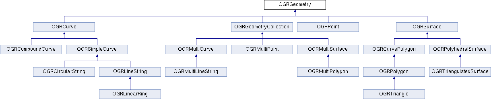

.. _vector_data_model:

================================================================================
Vector Data Model
================================================================================

This page documents the classes used to handle vector data. Many data types and method names are based on the OGC Simple Features data model, so it may be helpful to review the `specifications published by OGC <https://www.ogc.org/standard/sfa/>`__.
For historical reasons, GDAL uses the "OGR" prefix to denote types and functions that apply only to vector data.

Class Overview
--------------

The following classes form the core of the vector data model:

- Geometry (:ref:`ogr_geometry.h <ogrgeometry_cpp>`): The geometry classes (:cpp:class:`OGRGeometry`, etc) encapsulate the OGC vector data types. They provide some geometry operations and translation to/from well known binary and text format. A geometry includes a spatial reference system (projection).
- Spatial Reference (:ref:`ogr_spatialref.h <ogrspatialref>`): An :cpp:class:`OGRSpatialReference` encapsulates the definition of a projection and datum.
- Feature (:ref:`ogr_feature.h <ogrfeature_cpp>`): The :cpp:class:`OGRFeature` encapsulates the definition of a whole feature, that is a set of geometries and attributes relating to a single entity.
- Feature Class Definition (:ref:`ogr_feature.h <ogrfeature_cpp>`): The :cpp:class:`OGRFeatureDefn` class captures the schema (set of field definitions) for a group of related features (normally a whole layer).
- Layer (:ref:`ogrsf_frmts.h <ogrlayer_cpp>`): :cpp:class:`OGRLayer` is an abstract class representing a layer of features in a :cpp:class:`GDALDataset`.
- Dataset (:ref:`gdal_priv.h <gdaldataset_cpp>`): A :cpp:class:`GDALDataset` is an abstract base class representing a file or database containing one or more :cpp:class:`OGRLayer` objects.
- Drivers (:ref:`gdal_priv.h <gdaldriver_cpp>`): A :cpp:class:`GDALDriver` represents a translator for a specific format, capable of opening and possibly writing :cpp:class:`GDALDataset` objects. All available drivers are managed by the :cpp:class:`GDALDriverManager`.

Geometry
--------

Individual geometry classes are used to represent the different types of vector geometry. All the geometry classes derive from :cpp:class:`OGRGeometry` which defines the common functionality of all geometries. Geometry types include :cpp:class:`OGRPoint`, :cpp:class:`OGRLineString`, :cpp:class:`OGRPolygon`, :cpp:class:`OGRGeometryCollection`, :cpp:class:`OGRMultiPoint`, :cpp:class:`OGRMultiLineString`, :cpp:class:`OGRMultiPolygon`, and :cpp:class:`OGRPolyhedralSurface`.
The special case of a triangular polygon can be represented as a :cpp:class:`OGRTriangle`, a non-overlapping collection of which can be represented by an :cpp:class:`OGRTriangulatedSurface`.
An additional set of types is used to store non-linear geometries: :cpp:class:`OGRCircularString`, :cpp:class:`OGRCompoundCurve`, :cpp:class:`OGRCurvePolygon`, :cpp:class:`OGRMultiCurve` and :cpp:class:`OGRMultiSurface`.

Any of the above geometry classes can store coordinates in two (XY), three (XYZ or XYM), or four (XYZM) dimensions.

Additional intermediate classes contain functionality that is used by multiple geometry types. These include :cpp:class:`OGRCurve` (base class for :cpp:class:`OGRLineString`) and :cpp:class:`OGRSurface` (base class for :cpp:class:`OGRPolygon`). Some intermediate interfaces modeled in the simple features abstract model and SFCOM are not modeled in OGR at this time. In most cases the methods are aggregated into other classes.

The :cpp:class:`OGRGeometryFactory` is used to convert well known text (WKT) and well known binary (WKB) format data into the appropriate :cpp:class:`OGRGeometry` subclass. These are predefined ASCII and binary formats for representing all the types of simple features geometries.

The :cpp:class:`OGRGeometry` includes a reference to an :cpp:class:`OGRSpatialReference` object, defining the spatial reference system of that geometry. This is normally a reference to a shared spatial reference object with reference counting for each of the :cpp:class:`OGRGeometry` objects using it.

While it is theoretically possible to derive other or more specific geometry classes from the existing :cpp:class:`OGRGeometry` classes, this isn't an aspect that has been well thought out. In particular, it would be possible to create specialized classes using the :cpp:class:`OGRGeometryFactory` without modifying it.

Compatibility issues with non-linear geometries
+++++++++++++++++++++++++++++++++++++++++++++++

Generic mechanisms have been introduced so that creating or modifying a feature with a non-linear geometry in a layer of a driver that does not support it will transform that geometry in the closest matching linear geometry. This linearization can be controlled using :ref:`configoptions_vector`.

On the other side, when retrieving data from the OGR C API, the :cpp:func:`OGRSetNonLinearGeometriesEnabledFlag` function can be used, so that geometries and layer geometry type returned are also converted to their linear approximation if necessary.

Spatial Reference
-----------------

The :cpp:class:`OGRSpatialReference` class is intended to store an OpenGIS Spatial Reference System definition. Currently local, geographic and projected coordinate systems are supported. Vertical coordinate systems, geocentric coordinate systems, and compound (horizontal + vertical) coordinate systems are as well supported in recent GDAL versions.

The spatial coordinate system data model is inherited from the OpenGIS Well Known Text format. A simple form of this is defined in the Simple Features specifications. A more sophisticated form is found in the Coordinate Transformation specification. The :cpp:class:`OGRSpatialReference` is built on the features of the Coordinate Transformation specification but is intended to be compatible with the earlier simple features form.

There is also an associated :cpp:class:`OGRCoordinateTransformation` class that encapsulates use of |PROJ| for converting between different coordinate systems.

Feature / Feature Definition
----------------------------

The :cpp:class:`OGRGeometry` captures the geometry of a vector feature. The :cpp:class:`OGRFeature` contains geometry, and adds feature attributes, feature id, and a feature class identifier. It may also contain styling information. Several geometries can be associated with an :cpp:class:`OGRFeature`.

The set of attributes (:cpp:class:`OGRFieldDefn`), their types, names and so forth is represented via the :cpp:class:`OGRFeatureDefn` class. One :cpp:class:`OGRFeatureDefn` normally exists for a layer of features. The same definition is shared in a reference counted manner by the feature of that type (or feature class).

The feature id (FID) of a feature is intended to be a unique identifier for the feature within the layer it is a member of. Freestanding features, or features not yet written to a layer may have a null (OGRNullFID) feature id. The feature ids are modeled in OGR as a 64-bit integer; however, this is not sufficiently expressive to model the natural feature ids in some formats. For instance, the GML feature id is a string.

The :cpp:class:`OGRFeatureDefn` also contains an indicator of the types of geometry allowed for that feature class (returned as an :cpp:enum:`OGRwkbGeometryType` from :cpp:func:`OGRFeatureDefn::GetGeomType`). If this is :cpp:enumerator:`OGRwkbGeometryType::wkbUnknown` then any type of geometry is allowed. This implies that features in a given layer can potentially be of different geometry types though they will always share a common attribute schema.

Several geometry fields (:cpp:class:`OGRGeomFieldDefn`) can be associated with an :cpp:class:`OGRFeatureDefn`. Each geometry field has its own indicator of geometry type allowed, returned by :cpp:func:`OGRGeomFieldDefn::GetType`, and its spatial reference system, returned by :cpp:func:`OGRGeomFieldDefn::GetSpatialRef`.

The :cpp:class:`OGRFeatureDefn` also contains a feature class name (normally used as a layer name).

Field Definitions
-----------------

The behavior of each field in a feature class is defined by a shared :cpp:class:`OGRFieldDefn`.
The :cpp:class:`OGRFieldDefn` specifies the field type from the values of :cpp:enum:`OGRFieldType`.
Values stored in this field may be further restricted according to a :cpp:enum:`OGRFieldSubType`.
For example, a field may have a type of :cpp:enumerator:`OGRFieldType::OFTInteger` with a subtype of :cpp:enumerator:`OGRFieldSubType::OFSTBoolean`.

The :cpp:class:`OGRFieldDefn` can also track whether a field is allowed to be null (:cpp:func:`OGRFieldDefn::IsNullable`), whether its value must be unique (:cpp:func:`OGRFieldDefn::IsUnique`), and formatting information such as the number of decimal digits, width, and justification. It may also define a default value in case one is not manually specified.

Field Domains
+++++++++++++

Some formats support the use of field domains that describe the values that can be stored in a given attribute field. An :cpp:class:`OGRFieldDefn` may reference a single :cpp:class:`OGRFieldDomain` that is associated with a :cpp:class:`GDALDataset`.
Programs using GDAL may use the :cpp:class:`OGRFieldDomain` to appropriately constrain user input. GDAL does not perform validation itself and will allow the storage of values that violate a field's associated :cpp:class:`OGRFieldDomain`.

Available types of :cpp:class:`OGRFieldDomain` include:

- :cpp:class:`OGRCodedFieldDomain`, which constrains values those present in a specified enumeration
- :cpp:class:`OGRRangeFieldDomain`, which constrains values to a specified range
- :cpp:class:`OGRGlobFieldDomain`, which constrains values to those matching a specified pattern

Additionally, an :cpp:class:`OGRFieldDomain` may define policies describing the values that should be assigned to domain-controlled fields when features are split or merged.

Layer
-----

An :cpp:class:`OGRLayer` represents a layer of features within a data source. All features in an :cpp:class:`OGRLayer` share a common schema and are of the same :cpp:class:`OGRFeatureDefn`. An :cpp:class:`OGRLayer` class also contains methods for reading features from the data source. The :cpp:class:`OGRLayer` can be thought of as a gateway for reading and writing features from an underlying data source such as a file on disk, or the result of a database query.

The :cpp:class:`OGRLayer` includes methods for sequential and random reading and writing. Read access (via the :cpp:func:`OGRLayer::GetNextFeature` method) normally reads all features, one at a time sequentially; however, it can be limited to return features intersecting a particular geographic region by installing a spatial filter on the :cpp:class:`OGRLayer` (via the :cpp:func:`OGRLayer::SetSpatialFilter` method). A filter on attributes can only be set with the :cpp:func:`OGRLayer::SetAttributeFilter` method. By default, all available attributes and geometries are read but this can be controlled by flagging fields as ignored (:cpp:func:`OGRLayer::SetIgnoredFields`).

Starting with GDAL 3.6, as an alternative to getting features through ``GetNextFeature``, it is possible to retrieve them by batches, with a column-oriented memory layout, using the :cpp:func:`OGRLayer::GetArrowStream` method (cf :ref:`vector_api_tut_arrow_stream`).

An :cpp:class:`OGRLayer` may also store an :cpp:class:`OGRStyleTable` that provides a set of styles that may be used by features in the layer. More information on GDAL's handling of feature styles can be found in the :ref:`ogr_feature_style`.

One flaw in the current OGR architecture is that the spatial and attribute filters are set directly on the :cpp:class:`OGRLayer` which is intended to be the only representative of a given layer in a data source. This means it isn't possible to have multiple read operations active at one time with different spatial filters on each.

..
    This aspect may be revised in the future to introduce an OGRLayerView class or something similar.

Another question that might arise is why the :cpp:class:`OGRLayer` and :cpp:class:`OGRFeatureDefn` classes are distinct. An :cpp:class:`OGRLayer` always has a one-to-one relationship to an :cpp:class:`OGRFeatureDefn`, so why not amalgamate the classes? There are two reasons:

- As defined now :cpp:class:`OGRFeature` and :cpp:class:`OGRFeatureDefn` don't depend on :cpp:class:`OGRLayer`, so they can exist independently in memory without regard to a particular layer in a data store.
- The SF CORBA model does not have a concept of a layer with a single fixed schema the way that the SFCOM and SFSQL models do. The fact that features belong to a feature collection that is potentially not directly related to their current feature grouping may be important to implementing SFCORBA support using OGR.

The :cpp:class:`OGRLayer` class is an abstract base class. An implementation is expected to be subclassed for each file format driver implemented. OGRLayers are normally owned directly by their :cpp:class:`GDALDataset`, and aren't instantiated or destroyed directly.

Dataset
-------

A :cpp:class:`GDALDataset` represents a set of :cpp:class:`OGRLayer` objects. This usually represents a single file, set of files, database or gateway. A :cpp:class:`GDALDataset` has a list of :cpp:class:`OGRLayer` which it owns but can return references to.

:cpp:class:`GDALDataset` is an abstract base class. An implementation is expected to be subclassed for each file format driver implemented. :cpp:class:`GDALDataset` objects are not normally instantiated directly but rather with the assistance of an :cpp:class:`GDALDriver`. Deleting an :cpp:class:`GDALDataset` closes access to the underlying persistent data source, but does not normally result in deletion of that file.

A :cpp:class:`GDALDataset` has a name (usually a filename or database connection string) that can be used to reopen the data source with a :cpp:class:`GDALDriver`.

The :cpp:class:`GDALDataset` also has support for executing a datasource specific command, normally a form of SQL. This is accomplished via the :cpp:func:`GDALDataset::ExecuteSQL` method. While some datasources (such as PostGIS and Oracle) pass the SQL through to an underlying database, OGR also includes support for evaluating a subset of the SQL SELECT statement against any datasource (see :ref:`ogr_sql_sqlite_dialect`.)

When using some drivers, the :cpp:class:`GDALDataset` also offers a mechanism for to start, commit, and rollback transactions when interacting with the underlying data store.

A :cpp:class:`GDALDataset` may also be aware of relationships between layers (e.g., a foreign key relationship between database tables). Information about these relationships is stored in a :cpp:class:`GDALRelationshp`.

.. note::

   Earlier versions of GDAL represented vector datasets using the :cpp:class:`OGRDataSource` class. This class has been maintained for backwards compatibility but is functionally equivalent to a :cpp:class:`GDALDataset` for vector data.

Drivers
-------

A :cpp:class:`GDALDriver` object is instantiated for each file format supported. The :cpp:class:`GDALDriver` objects are registered with the :cpp:class:`GDALDriverManager`, a singleton class that is normally used to open new datasets.

It is intended that a new :cpp:class:`GDALDriver` object is instantiated and define function pointers for operations like Identify(), Open() for each file format to be supported (along with a file format specific :cpp:class:`GDALDataset`, and :cpp:class:`OGRLayer` classes).

On application startup registration functions are normally called for each desired file format. These functions instantiate the appropriate :cpp:class:`GDALDriver` objects, and register them with the :cpp:class:`GDALDriverManager`. When a dataset is to be opened, the driver manager will normally try each :cpp:class:`GDALDataset` in turn, until one succeeds, returning a :cpp:class:`GDALDataset` object.
