.. _install:

================================================================================
Pre-requisites: GDAL installation and workshop sample dataset download
================================================================================

This workshop requires GDAL 3.13.1, released June 2026.

The suggested installation procedure is to use GDAL Conda builds. Conda is a
system package management system that works on all major desktop operating system
(Linux, Windows, MacOS X). It is mainly aimed at the Python ecosystem, but with
a strong focus on tackling correctly the issue of software with native
dependencies such as GDAL.

Linux
-----

You have the choice between:

- using a Docker image
- or using Conda in your host environment to install GDAL and additional
  packages, and download test datasets.

The former is easier if you have Docker/Podman already installed on your system.
The later involves more manual steps but is better integrated with your system.

Docker image containing binaries and workshop sample datasets
+++++++++++++++++++++++++++++++++++++++++++++++++++++++++++++

Assuming you have Docker or Podman already installed.

::

    $ docker pull ghcr.io/rouault/gdal-cli-workshop

Allow X client from inside Docker to connect to the X server with:

::

    $ xhost +local:root

    non-network local connections being added to access control list

Now run the image with:

::

    $ mkdir -p $HOME/gdal-cli-workshop
    $ docker run -it --name gdal-cli-workshop \
            -v /tmp/.X11-unix:/tmp/.X11-unix \
            -v $HOME/gdal-cli-workshop:/data/gdal_cli_workshop_data-master/host \
            ghcr.io/rouault/gdal-cli-workshop

Inside the container:

::

    (base) root@XXXXXXXXXXXX:/# gdal --version

::

    GDAL 3.13.1 "Iowa City", released 2026/06/01

The datasets are there:

::

    (base) root@XXXXXXXXXXXX:/# cd /data/gdal_cli_workshop_data-master/
    (base) root@XXXXXXXXXXXX:/# ls -al

::

    total 91296
    drwxr-xr-x 5 root root     4096 May 22 01:37 .
    drwxr-xr-x 3 root root     4096 May 22 04:12 ..
    -rw-r--r-- 1 root root 18925846 May 22 01:37 20260519_00_tmp2m.nc
    -rw-r--r-- 1 root root 18925846 May 22 01:37 20260519_06_tmp2m.nc
    -rw-r--r-- 1 root root     1756 May 22 01:37 README.md
    drwxr-xr-x 6 root root     4096 May 22 01:37 S2B_MSIL2A_20260423T094029_N0512_R036_T34TDR_20260423T115714.SAFE
    drwxr-xr-x 6 root root     4096 May 22 01:37 S2B_MSIL2A_20260423T094029_N0512_R036_T34TER_20260423T115714.SAFE
    drwxr-xr-x 6 root root     4096 May 22 01:37 S2B_MSIL2A_20260423T094029_N0512_R036_T34TES_20260423T115714.SAFE
    -rw-r--r-- 1 root root 35131910 May 22 01:37 dem.tif
    -rw-r--r-- 1 root root 14909524 May 22 01:37 ne_10m_admin_1_states_provinces.zip
    -rw-r--r-- 1 root root     5493 May 22 01:37 osm_conf_amenity.ini
    -rw-r--r-- 1 root root  5528366 May 22 01:37 timisoara.osm.pbf
    drwxrwxr-x 2 1000 1000     4096 May 22 05:06 host

Make sure that QGIS also starts:

::

    (base) root@XXXXXXXXXXXX:/# qgis

You are done for the installation and can skip everything else in this page!

Conda installation
++++++++++++++++++

If you already have a Conda installation, skip this paragraph.

Download the Miniforge3 installer:

::

    $ curl -LO https://github.com/conda-forge/miniforge/releases/latest/download/Miniforge3-Linux-x86_64.sh

Install it:

::

    $ sh Miniforge3-Linux-x86_64.sh -b
 

will output something like:

::

    PREFIX=/home/even/miniforge3
    Unpacking bootstrapper...
    Unpacking payload...
    Extracting ca-certificates-2026.4.22-hbd8a1cb_0.conda
    Extracting libgomp-15.2.0-he0feb66_19.conda
    Extracting libzlib-1.3.2-h25fd6f3_2.conda
    Extracting nlohmann_json-abi-3.12.0-h0f90c79_1.conda
    [ ... snip ... ]
    Linking conda-package-handling-2.4.0-pyh7900ff3_2
    Linking conda-26.3.2-py313h78bf25f_1

    Transaction finished

    installation finished.

Activate Miniforge3 for the current shell

::

    ~/miniforge3/bin/conda init

will output something like:

::

    no change     /home/even/miniforge3/condabin/conda
    no change     /home/even/miniforge3/bin/conda
    no change     /home/even/miniforge3/bin/activate
    no change     /home/even/miniforge3/bin/deactivate
    no change     /home/even/miniforge3/etc/profile.d/conda.sh
    no change     /home/even/miniforge3/etc/fish/conf.d/conda.fish
    no change     /home/even/miniforge3/shell/condabin/Conda.psm1
    no change     /home/even/miniforge3/shell/condabin/conda-hook.ps1
    no change     /home/even/miniforge3/lib/python3.13/site-packages/xontrib/conda.xsh
    no change     /home/even/miniforge3/etc/profile.d/conda.csh
    modified      /home/even/.bashrc

    ==> For changes to take effect, close and re-open your current shell. <==

.. _install_gdal_linux:

GDAL installation in a dedicated conda environment
++++++++++++++++++++++++++++++++++++++++++++++++++

First, we will create a Conda "environment" for the purpose of this workshop,
and will call it "gdal-cli-workshop". A Conda environment is a kind of workspace where you
can install a set of packages that will not interfere with the ones of other
environments. We use the "conda-forge" channel to get up-to-date official releases
from the conda community (if using the Miniforge3 installer, this is not needed).

::

    $ conda create -y --name gdal-cli-workshop -c conda-forge

::

    Retrieving notices: done
    Channels:
     - conda-forge
    Platform: linux-64
    Collecting package metadata (repodata.json): done
    Solving environment: done

    ## Package Plan ##

      environment location: /home/even/miniforge3/envs/gdal-cli-workshop

    Downloading and Extracting Packages:

    Preparing transaction: done
    Verifying transaction: done
    Executing transaction: done
    #
    # To activate this environment, use
    #
    #     $ conda activate gdal-cli-workshop
    #
    # To deactivate an active environment, use
    #
    #     $ conda deactivate

As suggested, you need to activate the newly created environment with:

::

    $ conda activate gdal-cli-workshop

When an environment is activated, new lines in the shell are prefixed with "(name_of_environment)".

Now, we can finally install GDAL ! We ask to install both the library and command
line utilities with the ``libgdal`` meta package (that installs ``libgdal-core``
and most optional driver plugins such as ``libgdal-jp2openjpeg``, etc), and the
``gdal`` package with the Python bindings and scripts.

::

    (gdal) $ conda install -y -c conda-forge libgdal gdal

::

    Channels:
     - conda-forge
    Platform: linux-64
    Collecting package metadata (repodata.json): done
    Solving environment: done

    ## Package Plan ##

      environment location: /home/even/miniforge3/envs/gdal-cli-workshop

      added / updated specs:
        - gdal
        - libgdal

    The following packages will be downloaded:

    [ ... snip ... ]

    Downloading and Extracting Packages:

    Preparing transaction: done
    Verifying transaction: done
    Executing transaction: done

Now let's check we got the GDAL we expected:

::

    $ gdal --version

::

    GDAL 3.13.1 "Iowa City", released 2026/06/01

MacOS X
-------

.. note:: The instructions for MacOS X are a bit succinct, due to lack of access to that platform.

Conda installation
++++++++++++++++++

If you already have a Conda installation, skip that paragraph.
Otherwise follow the instructions at https://conda-forge.org/download/ and
download the installer corresponding to your CPU architecture.

GDAL installation in a dedicated conda environment
++++++++++++++++++++++++++++++++++++++++++++++++++

Please follow :ref:`Linux instructions <install_gdal_linux>` which should apply to MacOS X as well.

Windows
-------

(tested on Windows 10, hopefully valid for Windows 11)

Conda installation
++++++++++++++++++

If you already have a Conda installation, you can skip this paragraph. However, installing a separate Miniforge3 instance
for this workshop is recommended to avoid any interference with your existing Conda installation.
It will also allow you to use the launcher script described in the next section without modification.

Download the Miniforge3 installer at https://github.com/conda-forge/miniforge/releases/latest/download/Miniforge3-Windows-x86_64.exe

And execute it as an administrator, typically by right-clicking on the executable file and select "Run as administrator".
Running as administrator is to make sure that you have permissions to install into :file:`c:\\gdal` so that later instructions can be applied without modification.

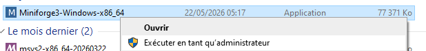

Validate the Welcome dialog:

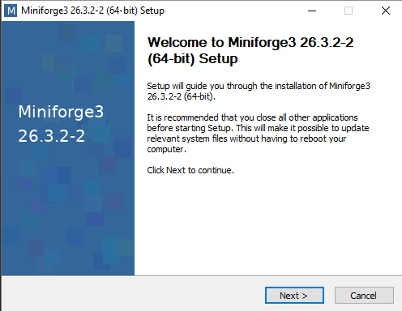

Accept the license agreement:

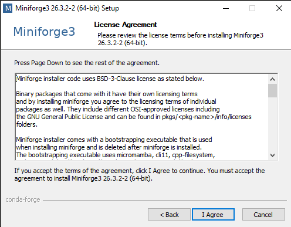

Select "Just Me" and validate:

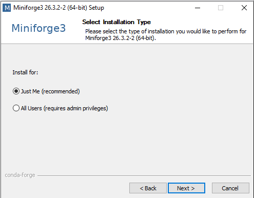

Modify the install path to :file:`c:\\gdal\\miniforge3` and validate:

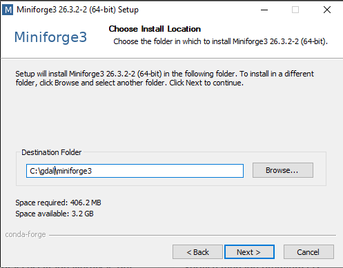

Only select "Create shortcuts" and click Install:

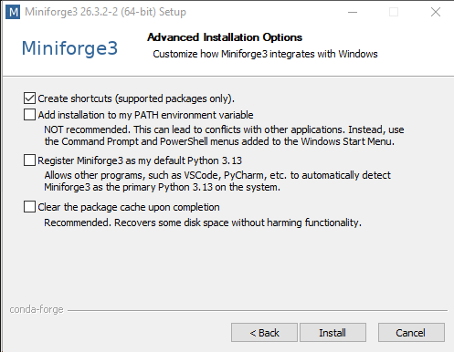

Once installation has completed, click Next:

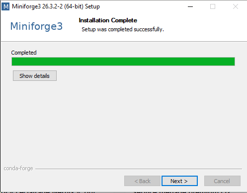

And finally click Finish:

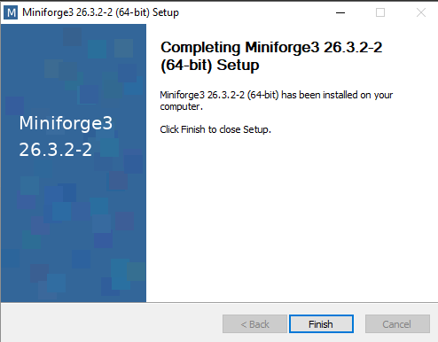

GDAL installation in a dedicated conda environment
++++++++++++++++++++++++++++++++++++++++++++++++++

First, let's start a Conda enabled command line.

From the Start Menu, select "Anaconda Prompt"

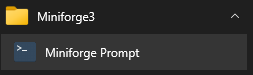

which will open a :file:`cmd` console with Conda executables available in the PATH.

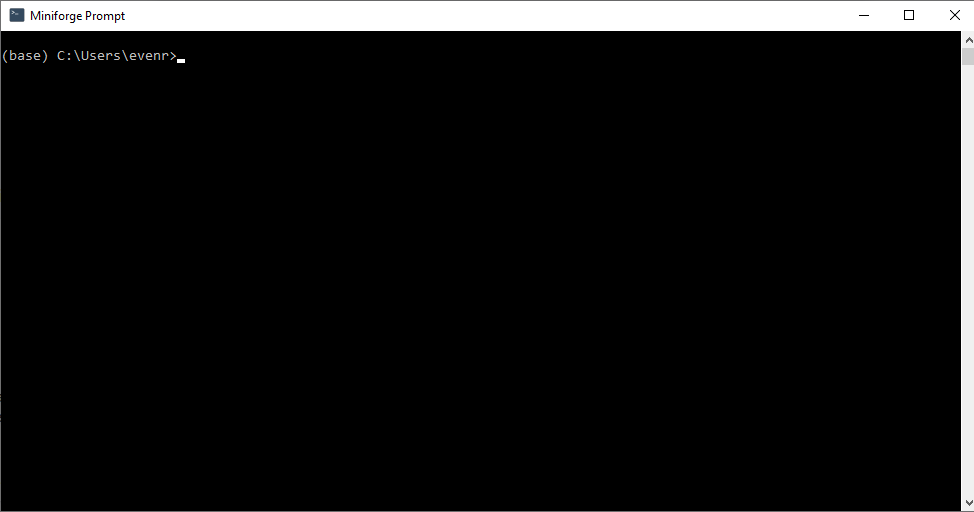

Then we will create a Conda "environment" for the purpose of this workshop,
and will call it "gdal", and install it into :file:`c:\\gdal\\condaenv\\gdal`.
A Conda environment is a kind of workspace where you
can install a set of packages that will not interfere with the ones of other
environments. We use the "conda-forge" channel to get up-to-date official releases
from the conda community.

::

    (base) C:\Users\my_user_name>conda create -y --prefix c:/gdal/condaenv/gdal -c conda-forge

Output:

::

    Retrieving notices: done
    Channels:
     - conda-forge
     - defaults
    Platform: win-64
    Collecting package metadata (repodata.json): done
    Solving environment: done

    ## Package Plan ##

      environment location: c:\gdal\condaenv\gdal

    Downloading and Extracting Packages:

    Preparing transaction: done
    Verifying transaction: done
    Executing transaction: done
    #
    # To activate this environment, use
    #
    #     $ conda activate c:\gdal\condaenv\gdal
    #
    # To deactivate an active environment, use
    #
    #     $ conda deactivate

As suggested, you need to activate the newly created environment with:

::

    (base) C:\Users\my_user_name>conda activate c:\gdal\condaenv\gdal

When an environment is activated, new lines in the shell are prefixed with "(name_of_environment)".

Now, we can finally install GDAL ! We ask to install both the library and command
line utilities with the ``libgdal`` meta package (that installs ``libgdal-core``
and most optional driver plugins such as ``libgdal-jp2openjpeg``, etc), and the
``gdal`` package with the Python bindings and scripts.

::

    (c:\gdal\condaenv\gdal) C:\Users\my_user_name>conda install -y -c conda-forge gdal libgdal

::

    Channels:
     - conda-forge
     - defaults
    Platform: win-64
    Collecting package metadata (repodata.json): done
    Solving environment: done

    ## Package Plan ##

      environment location: c:\gdal\condaenv\gdal

      added / updated specs:
        - gdal
        - libgdal

    The following packages will be downloaded:

        package                    |            build
        [ ... snip ... ]
        ------------------------------------------------------------
                                               Total:       180.9 MB

    The following NEW packages will be INSTALLED:

        [ ... snip ... ]

    [ ... displaying packages in download ... ]

    Downloading and Extracting Packages:

    Preparing transaction: done
    Verifying transaction: done
    Executing transaction: done

Now let's check we got the GDAL we expected:

::

    (c:\gdal\condaenv\gdal) C:\Users\my_user_name>gdal --version

::

    GDAL 3.13.1 "Iowa City", released 2026/06/01

.. _mysys2:

Install a Bash shell
++++++++++++++++++++

The GDAL CLI comes with a powerful auto-completion mechanism, but this requires
it to be used from a Bash-compatible shell. In this paragraph, we will proceed
to installing such shell.

Download the MSYS2 installer at https://github.com/msys2/msys2-installer/releases/download/2026-03-22/msys2-x86_64-20260322.exe

And execute it as an administrator, typically by right-clicking on the executable file and select "Run as administrator".
Running as administrator is to make sure that you have permissions to install into :file:`c:\\gdal` so that later instructions can be applied without modification.

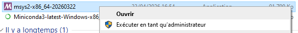

Click on Next:

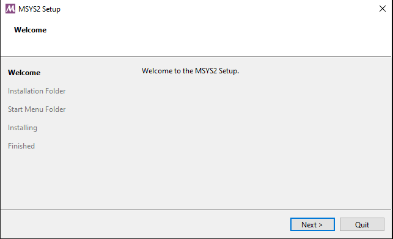

Specify :file:`c:\\gdal\\msys64` as the installation folder and click on Next:

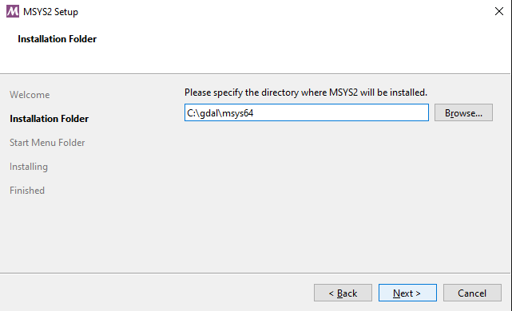

Specify "msys2_gdal" as the Start Menu folder and click on Next:

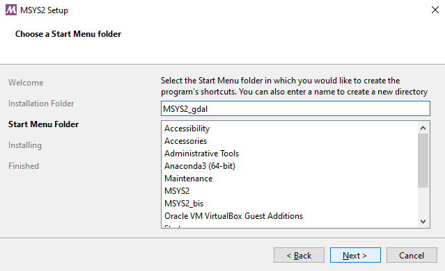

Click on Finish:

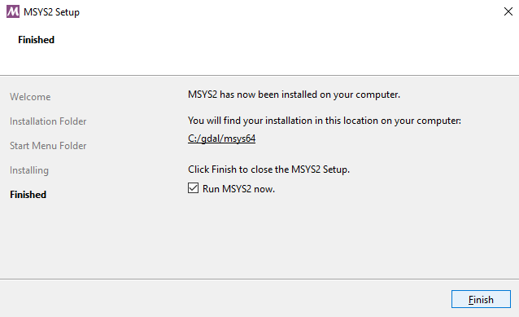

Create a launcher script
++++++++++++++++++++++++

Download the script at https://raw.githubusercontent.com/rouault/gdal_cli_workshop/refs/heads/master/gdal.bat
and save it as :file:`c:\\gdal\\gdal.bat`. This script will launch a Bash shell
with all the necessary environment to run GDAL, including the command line completion.

.. note::

    The launcher script will only work if you have installed Miniforge3 and the Conda environment
    in the default locations as described in the previous sections.
    If you have installed them in different locations, you will need to edit the script to adjust the paths.

Launch  :file:`c:\\gdal\\gdal.bat` from the Explorer or a shortcut you may have
created.

Type (``<TAB>`` means to press the TAB key):

::

    gdal --<TAB><TAB>

And you should see the following options to be proposed:

::

    --config      --drivers     --help        --json-usage  --version   

Getting datasets used in the workshop
-------------------------------------

Download https://github.com/rouault/gdal_cli_workshop_data/archive/refs/heads/master.zip (more than 1 GB)
and unzip its content in a directory of your choice.

For example, on Linux/MacOSX:

::

    $ mkdir $HOME/gdal_cli_workshop_data
    $ cd $HOME/gdal_cli_workshop_data
    $ curl -O https://github.com/rouault/gdal_cli_workshop_data/archive/refs/heads/master.zip
    $ unzip master.zip

On Windows, download and unzip the file. You will need to set the working directory to the unzipped folder to run the exercises.
For example if you unzipped the file in :file:`C:\\gdal\\gdal_cli_workshop_data-master`, then in the command line started by the launcher script,
set the active directory to that location with:

::

    (gdal) /c/gdal$ cd gdal_cli_workshop_data-master

.. note::

    To meet GitHub file size constraints (max 100 MB / file), a few files have been
    removed from original Sentinel 2 datasets and file
    S2B_MSIL2A_20260423T094029_N0512_R036_T34TDR_20260423T115714.SAFE/GRANULE/L2A_T34TDR_A047681_20260423T094113/IMG_DATA/R10m/T34TDR_20260423T094029_B08_10m.jp2
    has been reprocessed to a reduced precision using
    ``gdal raster convert`` with ``--of JP2OpenJPEG --creation-option QUALITY=45 --co BLOCKXSIZE=1024 --co BLOCKYSIZE=1024``
    settings to fit under 100 MB.

Installing ``jq`` utility (JSON processing)
-------------------------------------------

In a Conda enabled shell,

::

    conda install -y -c conda-forge jq

Strongly recommended: installing QGIS for visualisation
-------------------------------------------------------

.. warning::

    QGIS Conda builds for MacOS-X are unfortunately not currently available
    through Conda.
    Go to https://www.qgis.org/download/ for QGIS installers for MacOS-X.

For Linux and Windows, from a Conda enabled shell:

::

    conda install -y -c conda-forge qgis

(1.3 GB extra download size, and presumably ~2 GB of extra package size once
uncompressed)

Text editor
-----------

Have a simple text editor of your choice available to be able to prepare and copy and paste command lines.

Using GDAL development builds (for advanced / risk-tolerant users)
------------------------------------------------------------------

Users that want to test the latest state of the main GDAL development branch
(called "master") can use the ``gdal-master`` Conda channel to get such builds,
as explained in :ref:`gdal-master-conda-builds`.
