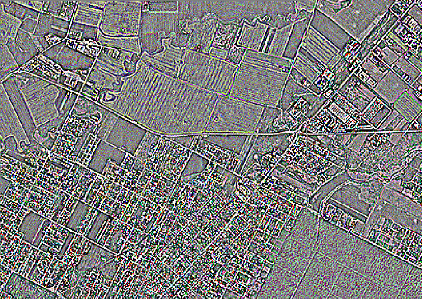

.. _pixel_operations:

================================================================================
Pixel operations
================================================================================

Pixel-wise computations
-----------------------

Using `gdal raster calc <https://gdal.org/en/stable/programs/gdal_raster_calc.html>`__

It performs pixel-wise calculations on one or more input GDAL datasets. This example uses the ``s2_TER_10m.xml``
dataset created in the :ref:`symlinks` section of the tutorial.

Let's compute a grayscale view using the well-known formula:

.. math::

    Y = 0.299 * Red + 0.587 * Green + 0.114 * Blue

::

    $ gdal raster calc --input s2_TER_10m.xml  --output grayscale.tif --output-data-type UInt16 --calc "0.299 * X[1] + 0.587 * X[2] + 0.114 * X[3]"

Let's use an aggregate function ``avg`` with ``--flatten`` to indicate we only want one single output band, so
that avg(X) is expanded to ``avg(X[1], X[2], X[3], X[4], X[5], X[6]``.

::

    $  gdal raster calc --input s2_TER_10m.xml --output avg.tif --output-data-type UInt16 --flatten --calc "avg(X)"

We can also doing the same using the ``mean`` builtin function;

::

    $ gdal raster calc --input s2_TER_10m.xml --output mean.tif --output-data-type UInt16 --flatten --calc "mean" --dialect builtin

    $ gdal raster compare avg.tif mean.tif

Exercise
--------

1. Compute the `Normalized difference vegetation index (NDVI) <https://en.wikipedia.org/wiki/Normalized_difference_vegetation_index>`__
   using the well-know formula:

.. math::

    NDVI = \frac {NIR - Red}{NIR + Red}

2. Do the same but after having separated the NIR and Red bands into 2 separate files,
   and do not create any materialized (i.e. actual image) file in the process.

3. Create a .gdalg.json file with a simple pipeline computing the NDVI for one file,
   and replay that pipeline using `substitutions <https://gdal.org/en/stable/programs/gdal_pipeline.html#substitutions>`__
   to apply it to another Sentinel 2 tile

==> :ref:`solution_calc`
 

Focal statistics
----------------

Using `gdal raster neighbors <https://gdal.org/en/stable/programs/gdal_raster_neighbors.html>`__

Compute the value of each pixel from its neighbors (focal statistics).

Let's attempt edge detection with the ``edge1`` kernel:

.. math::
    \begin{align}
        \begin{bmatrix} 0 & -1 & 0\\ -1 & 4 & -1 \\ 0 & -1 & 0 \end{bmatrix}
    \end{align}

::

    $ gdal raster neighbors s2_TER_10m.xml edge1.tif --kernel edge1 --overwrite 

Result:

Zonal statistics
----------------

Using `gdal raster zonal-stats <https://gdal.org/en/stable/programs/gdal_raster_zonal_stats.html.html>`__

We are going to compute the average elevation in provinces around Timișoara.

First let find out the extent of our DEM:

::

    $ gdal raster info dem.tif

::

    Upper Left  (  19.6854167,  46.9537500) ( 19d41' 7.50"E, 46d57'13.50"N)
    Lower Left  (  19.6854167,  45.0565278) ( 19d41' 7.50"E, 45d 3'23.50"N)
    Upper Right (  22.4426389,  46.9537500) ( 22d26'33.50"E, 46d57'13.50"N)
    Lower Right (  22.4426389,  45.0565278) ( 22d26'33.50"E, 45d 3'23.50"N)
    Center      (  21.0640278,  46.0051389) ( 21d 3'50.50"E, 46d 0'18.50"N)

Let's extract (but not clip) provinces that intersects that extent

::

    $ gdal vector filter --bbox=19.6854167,45.0565278,22.4426389,46.9537500 \
        /vsizip/ne_10m_admin_1_states_provinces.zip admin_1_around_timis.gpkg

.. note::

    If you are using the :ref:`MSYS2 on Windows environment <mysys2>`, and you set
    ``MSYS_NO_PATHCONV=1`` in the :ref:`VSI tutorial <no_pathconv>` you may see the error below:

    ::

        ERROR 4: C:/gdal/msys64/vsizip/ne_10m_admin_1_states_provinces.zip: No such file or directory

    Switch path conversion back on with:

    ::

        $ export MSYS_NO_PATHCONV=0

When run successfully the output will be:

::

    Warning 1: A geometry of type MULTIPOLYGON is inserted into layer ne_10m_admin_1_states_provinces of geometry type POLYGON, which is not normally allowed by the GeoPackage specification, but the driver will however do it. To create a conformant GeoPackage, if using ogr2ogr, the -nlt option can be used to override the layer geometry type. This warning will no longer be emitted for this combination of layer and feature geometry type.

Not critical, but we can fix it cleanly with:

::

    $ gdal vector pipeline read /vsizip/ne_10m_admin_1_states_provinces.zip ! \
        filter --bbox=19.6854167,45.0565278,22.4426389,46.9537500 ! \
        set-geom-type --geometry-type MULTIPOLYGON ! \
        write admin_1_around_timis.gpkg --overwrite

.. only:: html

   .. image:: ../images/pixel_operations.svg
      :width: 0
      :height: 0

   .. raw:: html

      <object type="image/svg+xml"
              data="../_images/pixel_operations.svg">
      </object>

.. only:: not html

   .. image:: ../images/pixel_operations.svg

And finally:

::

    $ gdal raster zonal-stats dem.tif --stat mean --zones admin_1_around_timis.gpkg \
        dem_zonal_mean.gpkg --include-field admin,name --overwrite --include-geom

Exercise
--------

Find the point of maximal elevation in each zone.

Bonus point for a pipeline avoiding the creation of the materialized :file:`admin_1_around_timis.gpkg`.

.. collapse:: (hint)

  .. hint:: Look at documented examples of `gdal raster zonal-stats <https://gdal.org/en/stable/programs/gdal_raster_zonal_stats.html.html>`__

  ==> :ref:`solution_zonal_stats`
 
