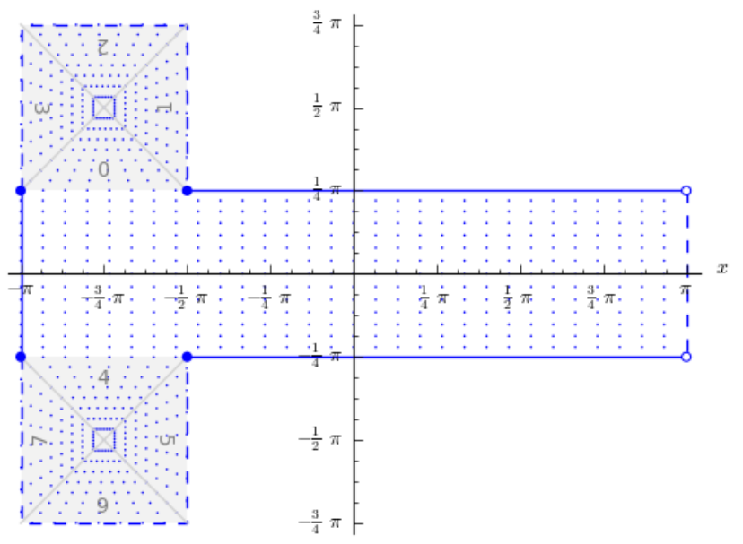
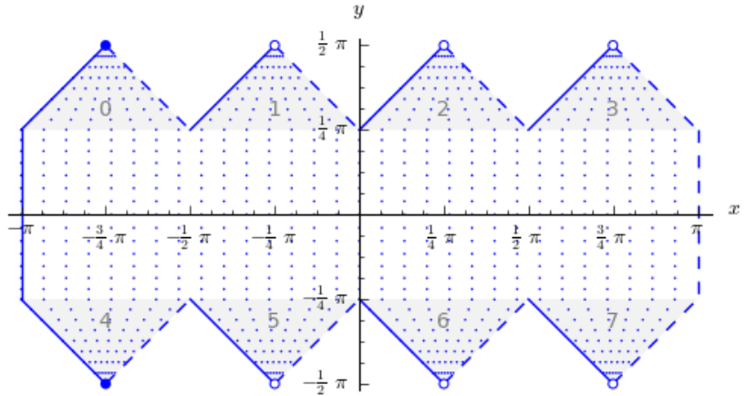

.. _faq:

******************************************************************************
FAQ
******************************************************************************

.. contents:: Contents
   :depth: 3
   :backlinks: none

Where can I find the list of projections and their arguments?
--------------------------------------------------------------------------------

There is no simple single location to find all the required information. The
!PostScript/PDF documents listed on the [http://trac.osgeo.org/proj/wiki main]
PROJ.4 page under documentation are the authoritative source but projections
and options are spread over several documents in a form more related to their
order of implementation than anything else.

The '''proj''' command itself can report the list of projections using the
'''-lp''' option, the list of ellipsoids with the '''-le''' option, the list of
units with the '''-lu''' option, and the list of built-in datums with the
'''-ld''' option.

The [http://www.remotesensing.org/geotiff/proj_list/ GeoTIFF Projections Pages]
include most of the common PROJ.4 projections, and a definition of the
projection specific options for each.

* How do I do datum shifts between NAD27 and NAD83?

While the '''nad2nad''' program can be used in some cases, the '''cs2cs''' is
now the preferred mechanism.   The following example demonstrates using the
default shift parameters for NAD27 to NAD83:

::

    % cs2cs +proj=latlong +datum=NAD27 +to +proj=latlong +datum=NAD83 -117 30

producing:

::

    117d0'2.901"W   30d0'0.407"N 0.000

In order for datum shifting to work properly the various grid shift files must
be available.  See below.  More details are available in the
[wiki:GenParms#nadgrids-GridBasedDatumAdjustments General Parameters] document.

How do I build/configure PROJ.4 to support datum shifting?
--------------------------------------------------------------------------------

After downloading and unpacking the PROJ.4 source, also download and unpack the
set of datum shift files.  See :ref:`download` for instructions how to fetch
and install these files

On Windows the extra nadshift target must be used.  For instance
``nmake /f makefile.vc nadshift`` in the ``proj/src`` directory.

A default build and install on Unix will normally build knowledge of the
directory where the grid shift files are installed into the PROJ.4 library
(usually /usr/local/share/proj).  On Windows the library is normally built
thinking that C:\PROJ\NAD is the installed directory for the grid shift files.
If the built in concept of the PROJ.4 data directory is incorrect, the ``PROJ_LIB``
environment can be defined with the correct directory.

How do I debug problems with NAD27/NAD83 datum shifting?
--------------------------------------------------------------------------------

1. Verify that you have the binary files (eg. /usr/local/share/proj/conus)
   installed on your system.  If not, see the previous question.
2. Try a datum shifting operation in relative isolation, such as with the cs2cs
   command listed above.  Do you get reasonable results?  If not it is likely
   the grid shift files aren't being found.  Perhaps you need to define
   PROJ_LIB?
3. The cs2cs command and the underlying pj_transform() API know how to do a
   grid shift as part of a more complex coordinate transformation; however, it
   is imperative that both the source and destination coordinate system be
   defined with appropriate datum information.  That means that implicitly or
   explicitly there must be a +datum= clause, a +nadgrids= clause or a
   +towgs84= clause.  For instance
   ``cs2cs +proj=latlong +datum=NAD27 +to +proj=latlong +ellps=WGS84`` won't work because defining the output
   coordinate system as using the ellipse WGS84 isn't the same as defining it
   to use the datum WGS84 (use +datum=WGS84).  If either the input or output
   are not identified as having a datum, the datum shifting (and ellipsoid
   change) step is just quietly skipped!
4. The ``PROJ_DEBUG`` environment can be defined (any value) to force extra output
   from the PROJ.4 library to stderr (the text console normally) with
   information on what data files are being opened and in some cases why a
   transformation fails.

   ::

        export PROJ_DEBUG=ON
        cs2cs ...

   .. note::
        ``PROJ_DEBUG`` support is not yet very mature in the PROJ.4 library.

5. The ``-v`` flag to cs2cs can be useful in establishing more detail on what
   parameters being used internally for a coordinate system.  This will include
   expanding the definition of +datum clause.

How do I use EPSG coordinate system codes with PROJ.4?
--------------------------------------------------------------------------------

There is somewhat imperfect translation between 2d geographic and projected
coordinate system codes and PROJ.4 descriptions of the coordinate system
available in the epsg definition file that normally lives in the proj/nad
directory.  If installed (it is installed by default on Unix), it is possible
to use EPSG numbers like this:

::

    % cs2cs -v +init=epsg:26711
    # ---- From Coordinate System ----
    #Universal Transverse Mercator (UTM)
    #       Cyl, Sph
    #       zone= south
    # +init=epsg:26711 +proj=utm +zone=11 +ellps=clrk66 +datum=NAD27 +units=m
    # +no_defs +nadgrids=conus,ntv1_can.dat
    #--- following specified but NOT used
    # +ellps=clrk66
    # ---- To Coordinate System ----
    #Lat/long (Geodetic)
    #
    # +proj=latlong +datum=NAD27 +ellps=clrk66 +nadgrids=conus,ntv1_can.dat

The proj/nad/epsg file can be browsed and searched in a text editor for
coordinate systems.  There are known to be problems with some coordinate
systems, and any coordinate systems with odd axes, a non-greenwich prime
meridian or other quirkyness are unlikely to work properly.  Caveat Emptor!

How do I use 3 parameter and 7 parameter datum shifting
--------------------------------------------------------------------------------

Datum shifts can be approximated with 3 and 7 parameter transformations.  Their
use is more fully described in the
[wiki:GenParms#towgs84-DatumtransformationtoWGS84 towgs84] parameter
discussion.

Does PROJ.4 work in different international numeric locales?
--------------------------------------------------------------------------------

No.  PROJ.4 makes extensive use of sprintf() and atof() internally to translate
numeric values.  If a locale is in effect that modifies formatting of numbers,
altering the role of commas and periods in numbers, then PROJ.4 will not work.
This problem is common in some European locales.

On unix-like platforms, this problem can be avoided by forcing the use of the
default numeric locale by setting the LC_NUMERIC environment variable to C.

::

    $ export LC_NUMERIC=C
    $ proj ...

.. note::

    NOTE: Per ticket #49, in PROJ 4.7.0 and later pj_init() operates with locale
    overriden to "C" to avoid most locale specific processing for applications
    using the API.  Command line tools may still have issues.

Changing Ellipsoid / Why can't I convert from WGS84 to Google Earth / Virtual Globe Mercator?
----------------------------------------------------------------------------------------------

The coordinate system definition for Google Earth, and Virtual Globe Mercator
is as follows, which uses a sphere as the earth model for the Mercator
projection.

::

    +proj=merc +a=6378137 +b=6378137 +lat_ts=0.0 +lon_0=0.0
         +x_0=0.0 +y_0=0 +k=1.0 +units=m +no_defs

But, if you do something like:

::

    cs2cs +proj=latlong +datum=WGS84
        +to +proj=merc +a=6378137 +b=6378137 +lat_ts=0.0 +lon_0=0.0
                       +x_0=0.0 +y_0=0 +k=1.0 +units=m +no_defs

to convert between WGS84 and mercator on the sphere there will be substantial
shifts in the Y mercator coordinates.  This is because internally cs2cs is
having to adjust the lat/long coordinates from being on the sphere to being on
the WGS84 datum which has a quite differently shaped ellipsoid.

In this case, and many other cases using spherical projections, the desired
approach is to actually treat the lat/long locations on the sphere as if they
were on WGS84 without any adjustments when using them for converting to other
coordinate systems.  The solution is to "trick" PROJ.4 into applying no change
to the lat/long values when going to (and through) WGS84.  This can be
accomplished by asking PROJ to use a null grid shift file for switching from
your spherical lat/long coordinates to WGS84.

::

    cs2cs +proj=latlong +datum=WGS84 \
        +to +proj=merc +a=6378137 +b=6378137 +lat_ts=0.0 +lon_0=0.0 \
        +x_0=0.0 +y_0=0 +k=1.0 +units=m +nadgrids=@null +no_defs

Note the strategic addition of +nadgrids=@null to the spherical projection
definition.

Similar issues apply with many other datasets distributed with projections
based on a spherical earth model - such as many NASA datasets.  This coordinate
system is now known by the EPSG code 3857 and has in the past been known as
EPSG:3785 and EPSG:900913.  When using this coordinate system with GDAL/OGR it
is helpful to include the +wktext so the exact proj.4 string will be preserved
in the WKT representation (otherwise key parameters like `+nadgrids=@null` will
be dropped):

::

    +proj=merc +a=6378137 +b=6378137 +lat_ts=0.0 +lon_0=0.0 +x_0=0.0 +y_0=0 +k=1.0
               +units=m +nadgrids=@null +wktext  +no_defs

Why do I get different results with 4.5.0 and 4.6.0?
--------------------------------------------------------------------------------

The default datum application behavior changed with the 4.6.0 release.  PROJ.4
will now only apply a datum shift if both the source and destination coordinate
system have valid datum shift information.

From the PROJ.4 4.6.0 Release Notes (in NEWS):
 * MAJOR: Rework pj_transform() to avoid applying ellipsoid to ellipsoid
   transformations as a datum shift when no datum info is available.

How do I calculate distances/directions on the surface of the earth?
--------------------------------------------------------------------------------

These are called geodesic calculations. There is a page about it here:
[wiki:GeodesicCalculations]

What is the HEALPix projection and how can I use it?
--------------------------------------------------------------------------------

The HEALPix projection is area preserving and can be used with a
spherical and ellipsoidal model.  It was initially developed for mapping cosmic
background microwave radiation.  The image below is the graphical
representation of the mapping and consists of eight isomorphic triangular
interrupted map graticules.  The north and south contains four in which
straight meridians converge polewards to a point and unequally spaced
horizontal parallels.  HEALPix provides a mapping in which points of equal
latitude and equally spaced longitude are mapped to points of equal latitude
and equally spaced longitude with the module of the polar interruptions. ||

To run a forward HEALPix projection on a unit sphere model, use the following command:

::

    proj +proj=healpix +lon_0=0 +a=1 -E <<EOF
    0 0
    EOF

Output of the above command.

::

    0 0 0.00 0.00

What is the rHEALPix projection and how can I use it?
--------------------------------------------------------------------------------

rHEALPix is a projection based on the HEALPix projection.  The implementation
of rHEALPix uses the HEALPix projection.  The rHEALPix combines the peaks of
the HEALPix into a square.  The square's position can be translated and rotated
across the x-axis which is a noval approach for the rHEALPix projection.  The
initial intention of using rHEALPix in the Spatial Computation Engine Science
Collaboration Environment (SCENZGrid).

To run a inverse rHEALPix projection on a WGS84 ellipsoidal model, use the following command:

::

    proj +proj=rhealpix -f '%.2f' -I +lon_0=0 +a=1 +ellps=WGS84 +npole=0 +spole=0 -E <<EOF
    0 0.7853981633974483
    EOF

Where spole and npole are integers from the range of 0 to 3 inclusive and represent the positions of the north polar and south polar squares.

Output of above command:

::

    0 0.7853981633974483 0.00 41.94

What options does proj.4 allow for the shape of the Earth (geodesy)?
--------------------------------------------------------------------------------

See https://github.com/OSGeo/proj.4/blob/master/src/pj_ellps.c
for possible ellipse options. For example, putting ``+ellps=WGS84`` uses
the ``WGS84`` Earth shape.

What if I want a spherical Earth?
--------------------------------------------------------------------------------

Use ``+ellps=sphere``.  See https://github.com/OSGeo/proj.4/blob/master/src/pj_ellps.c
for the radius used in this case.

How do I change the radius of the Earth?  How do I use proj.4 for work on Mars?
--------------------------------------------------------------------------------

You can supply explicit values for the semi minor and semi major axes instead
of using the symbolic "sphere" value.  Eg, if the radius were 2000000m:

::

     +proj=laea +lon_0=-40.000000 +lat_0=74.000000 +x_0=1000000 +y_0=1700000 +a=2000000 +b=2000000"

How do I do False Eastings and False Northings?
--------------------------------------------------------------------------------

Use ``+x_0`` and ``+y_0`` in the projection string.

