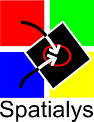

.. _service_providers:

*****************************************************************************
GDAL Service Providers
*****************************************************************************

GDAL is developed and supported by a rich ecosystem of businesses and
individuals around the world.

In this page we provide a list of service providers who
can assist you in getting the best out of your GDAL investment.
Their services can range from training and technical support to help you
get started, all the way to specialized development and support services
to advance the software and support your organization's mission-critical
applications.

.. note::

    This list is non-exhaustive, and there are quite likely other service
    providers in your region of the world who are not listed here.
    If you think your organization should be listed here, please submit a
    pull request to add it to this page.

.. note::
    We take responsibility for the accuracy, reliability or completeness
    of the provided information for Core Contributors only.

.. only:: html

    .. note::
        Service Providers order is randomized on page load.

Core Contributors
-----------------

Core Contributor organizations have GDAL Committers and/or PSC members
as part of their team and as such they are the closest to the core development
of the software and are usually the best to go to for support.

They are close enough to the architecture to know what is possible, and to
ensure that any improvement to be made to GDAL gets done in the right
way and will be included in future releases of the software.

They wrote the software that you use, so you can trust them to help you get
the most out of it.

.. container:: service-provider

  |logo_spatialys|

  .. container:: service-provider-description

      `Spatialys`_ (France) is a company founded by Even Rouault that is dedicated
      to providing to its clients the best of its expertise around Open Source
      geospatial software - such as GDAL/OGR, PROJ, MapServer, and QGIS - and Open standards.

Contributors
------------

The Contributors listed here usually have power users and experienced
integrators as part of their team who are recognized in the GDAL
community for their contributions to various aspects of the software over
the years and are very well positioned to assist you with GDAL.

.. container:: service-provider

  None listed yet.

Other Service Providers
-----------------------

The service providers in this category offer services around GDAL
and related Open Source technologies.

.. container:: service-provider

  |logo_faunalia|

  .. container:: service-provider-description

      `Faunalia`_ (Italy) is a company that operates since more than 15 years in the field of Geographic Information Systems (GIS) based on free and open source software (chiefly QGIS, PostGIS, and more). Our main customers are public administrations, private companies, associations. Faunalia has its main branch in Italy, and operates worldwide. Faunalia provides training services on GDAL.

.. container:: service-provider

  |logo_mundialis|

  .. container:: service-provider-description

      `mundialis`_ (Germany) is specialized in the processing of massive geospatial and remote sensing data. Our services centered on the Open Source geospatial systems GRASS GIS, actinia and QGIS are incorporated into our process chains, projects and tailored solutions. We analyse satellite, aerial and drone imagery for land degradation and landuse change. We offer support and training for GRASS GIS and GDAL.

.. raw:: html

   

.. seealso::
    Search for GDAL service providers with the `OSGeo Service Providers <https://www.osgeo.org/service-providers/>`__

How to Add a Company
--------------------

The steps to add a company to the service providers list are outlined in the :ref:`rfc-79` document.

.. ###########
.. Core Contributors - use max(width=200px,height=200px) for logo
.. ###########

.. _`Spatialys`: http://www.spatialys.com/

.. ###########
.. Contributors - use max(width=150px,height=150px) for logo
.. ###########

.. ###########
.. Other service providers - use max(width=100px,height=100px) for logo
.. ###########

.. _`Faunalia`: https://www.faunalia.eu/
.. |logo_faunalia| image:: ../../images/logo-faunalia.png
   :class: img-logos
   :width: 100 px
   :target: `Faunalia`_

.. _`mundialis`: https://www.mundialis.de/

