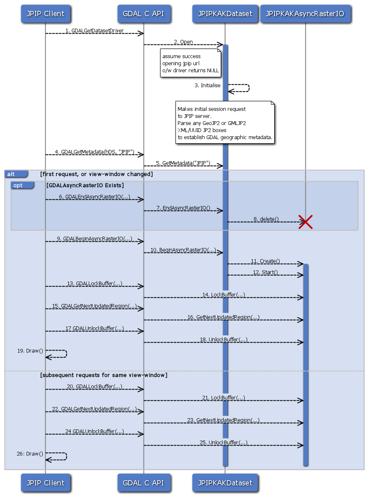

.. _raster.jpipkak:

================================================================================
JPIPKAK - JPIP Streaming
================================================================================

.. shortname:: JPIPKAK

.. build_dependencies:: Kakadu library

JPEG 2000 Interactive Protocol (JPIP) flexibility with respect to random
access, code stream reordering and incremental decoding is highly
exploitable in a networked environment allowing access to remote large
files using limited bandwidth connections or high contention networks.

Driver capabilities
-------------------

.. supports_georeferencing::

JPIPKAK - JPIP Overview
-----------------------

A brief overview of the JPIP event sequence is presented in this
section, more information can be found at `JPEG 2000 Interactive
Protocol (Part 9 – JPIP) <http://www.jpeg.org/jpeg2000/j2kpart9.html>`__
and the specification can (and should) be purchased from
`ISO <http://www.iso.org>`__.

An earlier version of JPEG 2000 Part 9 is available here
http://www.jpeg.org/public/fcd15444-9v2.pdf, noting the ISO copyright,
diagrams are not replicated in this documentation.

The JPIP protocol has been abstracted in this format driver, requests
are made at the 1:1 resolution level.

|JPIP Sequence Diagram|

#. Initial JPIP request for a target image, a target id, a session over
   http, data to be returned as a jpp-stream are requested and a maximum
   length is put on the response. In this case no initial window is
   requested, though it can be. Server responds with a target identifier
   that can be used to identify the image on the server and a JPIP-cnew
   response header which includes the path to the JPIP server which will
   handle all future requests and a cid session identifier. A session is
   required so that that the server can model the state of the client
   connection, only sending the data that is required.
#. Client requests particular view windows on the target image with a
   maximum response length and includes the session identifier
   established in the previous communication. 'fsiz' is used to identify
   the resolution associated with the requested view-window. The values
   'fx' and 'fy' specify the dimensions of the desired image resolution.
   'roff' is used to identify the upper left hand corner off the spatial
   region associated with the requested view-windw. 'rsiz' is used to
   identify the horizontal and vertical extents of the spatial region
   associated with the requested view-window.

JPIPKAK -approach
-----------------

The JPIPKAK driver uses an approach that was first demonstrated here,
`J2KViewer <http://www.drc-dev.ohiolink.edu/browser/J2KViewer>`__, by
Juan Pablo Garcia Ortiz of separating the communication layer (socket /
http) from the Kakadu kdu_cache object. Separating the communication
layer from the data object is desirable since it allows the use of
optimized http client libraries such as libcurl, Apache HttpClient (note
that jportiz used a plain Java socket) and allows SSL communication
between the client and server.

Kakadu's implementation of client communication with a JPIP server uses
a socket, and this socket connection holds the state for this client
session. A client session with Kakadu can be recreated using the JPIP
cache operations between client and server, but no use of traditional
HTTP cookies is supported since JPIP is neutral to the transport layer.

The JPIPKAK driver is written using a HTTP client library with the
Kakadu cache object and supports optimized communication with a JPIP
server (which may or may not support HTTP sessions) and the high
performance of the kakadu kdu_region_decompressor.

|Component Diagram|

JPIPKAK - implementation
------------------------

The implementation supports the GDAL C++ and C API, and provides an
initial SWIG wrapper for this driver with a Java ImageIO example
(**TODO** - qGIS Example).

The driver uses a simple threading model to support requesting reads of
the data and remote fetching. This threading model supports two separate
client windows, with just one connection to the server. Requests to the
server are multiplexed to utilize available bandwidth efficiently. The
client identifies these windows by using “0” (low) or “1” (high) values
to a “PRIORITY” metadata request option.

Note: SSL support

If the client is built with support for SSL, then driver determines
whether to use SSL if the request is a jpips:// protocol as opposed to
jpip:// . Note that the driver does not verify server certificates using
the Curl certificate bundle and is currently set to accept all SSL
server certificates.

Note: libCurl

JPIP sets client/server values using HTTP headers, modifications have
been made to the GDAL HTTP portability library to support this.

|GDAL Sequence Diagram|

#. GDALGetDatasetDriver

   Fetch the driver to which this dataset relates.

#. Open

   If the filename contained in the ``GDALOpenInfo`` object has a case
   insensitive URI scheme of JPIP or JPIPS the ``JPIPKAKDataset`` is
   created and initialized, otherwise NULL is returned.

#. Initialize

   Initialization involves making an initial connection to the JPIP
   Server to establish a session and to retrieve the initial metadata
   about the image (ref. `JPIP Sequence Diagram <#initJPIP>`__).

   If the connection fails, the function returns false and the ``Open``
   function returns NULL indicating that opening the dataset with this
   driver failed.

   If the connection is successful, then subsequent requests to the JPIP
   server are made to retrieve all the available metadata about the
   image. Metadata items are set using the
   ``GDALMajorObject->SetMetadataItem`` in the "JPIP" domain.

   If the metadata returned from the server includes GeoJP2 UUID box, or
   a GMLJP2 XML box then this metadata is parsed and sets the geographic
   metadata of this dataset.

#. GDALGetMetadata

   C API to ``JPIPKAKDataset->GetMetadata``

#. GetMetadata

   returns metadata for the "JPIP" domain, keys are
   "JPIP_NQUALITYLAYERS", "JPIP_NRESOLUTIONLEVELS", "JPIP_NCOMPS" and
   "JPIP_SPRECISION"

#. GDALEndAsyncRasterIO

   If the asynchronous raster IO is active and not required, the C API
   calls ``JPIPKAKDataset->EndAsyncRasterIO``

#. EndAsyncRasterIO

   The JPIPKAKAsyncRasterIO object is deleted

#. delete
#. GDALBeginAsyncRasterIO

   C API to ``JPIPKAKDataset->BeginAsyncRasterIO``

#. BeginAsyncRasterIO

   The client has set the requested view window at 1:1 and have
   optionally set the discard level, quality layers and thread priority
   metadata items.

#. Create

   Creates a JPIPKAKAsyncRasterIO Object

#. Start

   Configures the kakadu machinery and starts a background thread (if
   not already running) to communicate to the server the current view
   window request. The background thread results in the ``kdu_cache``
   object being updated until the JPIP server sends an "End Of Response"
   (EOR) message for the current view window request.

#. GDALLockBuffer

   C API to LockBuffer

#. LockBuffer

   Not implemented in ``JPIPKAKAsyncRasterIO``, a lock is acquired in
   ``JPIPKAKAsyncRasterIO->GetNextUpdatedRegion``

#. GDALGetNextUpdatedRegion

   C API to GetNextUpdatedRegion

#. GetNextUpdatedRegion

   The function decompresses the available data to generate an image
   (according to the dataset buffer type set in
   ``JPIPKAKDataset->BeginAsyncRasterIO``) The window width, height (at
   the requested discard level) decompressed is returned in the region
   pointer and can be rendered by the client. The status of the
   rendering operation is one of
   ``GARIO_PENDING, GARIO_UPDATE, GARIO_ERROR, GARIO_COMPLETE`` from the
   ``GDALAsyncStatusType`` structure. ``GARIO_UPDATE, GARIO_PENDING``
   require more reads of GetNextUpdatedRegion to get the full image
   data, this is the progressive rendering of JPIP. ``GARIO_COMPLETE``
   indicates the window is complete.

   ``GDALAsyncStatusType`` is a structure used
   by\ ``GetNextUpdatedRegion`` to indicate whether the function should
   be called again when either kakadu has more data in its cache to
   decompress, or the server has not sent an End Of Response (EOR)
   message to indicate the request window is complete.

   The region passed into this function is passed by reference, and the
   caller can read this region when the result returns to find the
   region that has been decompressed. The image data is packed into the
   buffer, e.g. RGB if the region requested has 3 components.

#. GDALUnlockBuffer

   C Api to UnlockBuffer

#. UnlockBuffer

   Not implemented in ``JPIPKAKAsyncRasterIO``, a lock is acquired in
   ``JPIPKAKAsyncRasterIO->GetNextUpdatedRegion``

#. Draw

   Client renders image data

#. `GDALLockBuffer <#GDALLockBuffer>`__
#. `LockBuffer <#LockBuffer>`__
#. `GDALGetNextUpdatedRegion <#GDALGetNextUpdatedRegion>`__
#. `GetNextUpdatedRegion <#GetNextUpdatedRegion>`__
#. `GDALUnlockBuffer <#GDALUnlockBuffer>`__
#. `UnlockBuffer <#UnlockBuffer>`__
#. `Draw <#Draw>`__

JPIPKAK - installation requirements
-----------------------------------

-  `Libcurl 7.9.4 <http://curl.haxx.se/>`__
-  `OpenSSL 0.9.8K <http://www.openssl.org/>`__ (if SSL is required, a
   JPIPS connection)
-  `Kakadu <http://www.kakadusoftware.com>`__ (tested with v5.2.6 and
   v6)

Currently only a Windows makefile is provided, however this should
compile on Linux as well as there are no Windows dependencies.

See Also
--------

-  `JPEG 2000 Interactive Protocol (Part 9 –
   JPIP) <http://www.jpeg.org/jpeg2000/j2kpart9.html>`__
-  http://www.opengeospatial.org/standards/gmljp2
-  `Kakadu Software <http://www.kakadusoftware.com>`__
-  `IAS demo (example JPIP(S) streams) <http://iasdemo.ittvis.com/>`__

NOTES
-----

Driver originally developed by `ITT VIS <http://www.ittvis.com>`__ and
donated to GDAL to enable SSL enabled JPIP client streaming of remote
JPEG 2000 datasets.

.. |JPIP Sequence Diagram| image:: ../../../images/jpipsequence.PNG
.. |Component Diagram| image:: ../../../images/components.PNG

