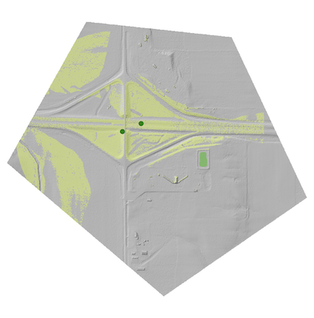

.. _gdal_viewshed:

================================================================================
gdal_viewshed
================================================================================

.. only:: html

    Calculates a viewshed raster from an input raster DEM using method defined in [Wang2000]_ for a user defined point.

.. Index:: gdal_viewshed

Synopsis
--------

.. code-block::

   gdal_viewshed [-b <band>] [-inodata]
                 [-snodata n] [-f <formatname>]
                 [-oz <observer_height>] [-tz <target_height>] [-md <max_distance>]
                 [-ox <observer_x>] [-oy <observer_y>]
                 [-vv <visibility>] [-iv <invisibility>]
                 [-ov <out_of_range>] [-cc <curvature_coef>]
                 [[-co NAME=VALUE] ...]
                 [-q]
                 <src_filename> <dst_filename>

Description
-----------

The :program:`gdal_viewshed` generates a 0-1 visibility raster with 1 band from the input
raster elevation model (DEM).

.. program:: gdal_viewshed

.. versionadded:: 3.1.0

.. include:: options/co.rst

.. option:: -b <band>

   Select an input band **band** containing the DEM data. Bands are numbered from 1.
   Only a single band can be used. Only the part of the raster within the specified 
   maximum distance around the observer point is processed.

.. option:: -a_nodata <value>

   The value to be set for the cells in the output raster that has no data.

.. option:: -ox <value>

   The X position of the observer (in SRS units).

.. option:: -oy <value>

   The Y position of the observer (in SRS units).

.. option:: -oz <value>

   The height of the observer above the DEM surface in the height unit of the DEM. Default: 2

.. option:: -tz <value>

   The height of the target above the DEM surface in the height unit of the DEM. Default: 0

.. option:: -md <value>

   Maximum distance from observer to compute visibiliy.

.. option:: -cc <value>

   Coefficient to consider the effect of the curvature and refraction.
   The height of the DEM is corrected according to the following formula:

   .. math::

      Height_{Corrected}=Height_{DEM}-{CurvCoeff}\frac{{TargetDistance}^2}{SphereDiameter}

   For atmospheric refraction we can use 0.85714

.. option:: -iv <value>

   Pixel value to set for invisible areas. Default: -1

.. option:: -ov <value>

   Pixel value to set for the cells that fall outside of the range specified by 
   the observer location and the maximum distance. Default: 0

.. option:: -vv <value>

   Pixel value to set for visible areas. Default: 255

C API
-----

Functionality of this utility can be done from C with :cpp:func:`GDALViewshedGenerate`.

Example
-------

Compute the visibility of an elevation raster data source with defaults

   A computed visibility for two separate `-ox` and `-oy` points on a DEM.

.. code-block::

    gdal_viewshed -md 500 -ox -10147017 -oy 5108065 source.tif destination.tif

.. [Wang2000] Generating Viewsheds without Using Sightlines. Wang, Jianjun,
   Robinson, Gary J., and White, Kevin. Photogrammetric Engineering and Remote
   Sensing. p81. https://www.asprs.org/wp-content/uploads/pers/2000journal/january/2000_jan_87-90.pdf
