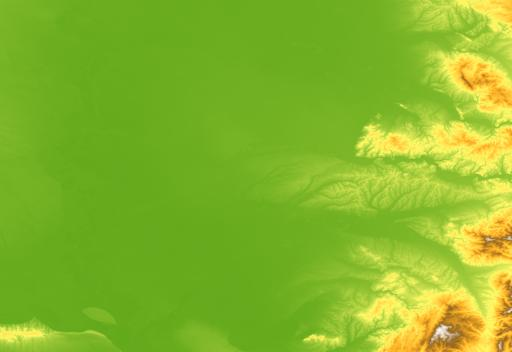
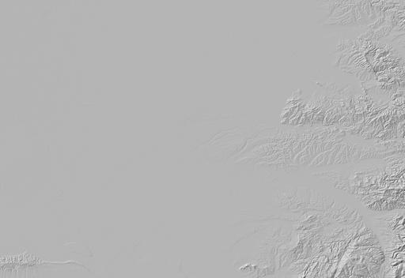
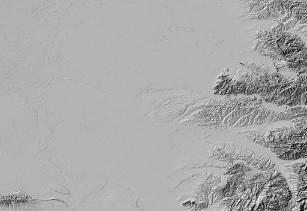
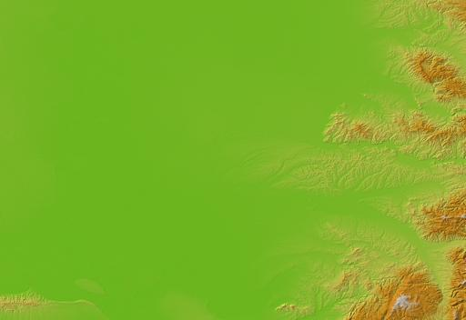
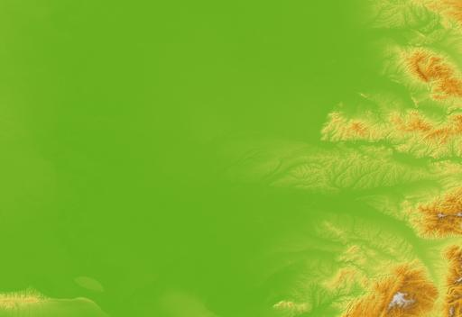

.. dem:

================================================================================
DEM, VSI and nested pipelines
================================================================================

Failed attempt at getting a remote DEM
--------------------------------------

Let's find a DEM:

https://ec.europa.eu/eurostat/web/gisco/geodata/digital-elevation-model/eu-dem

::

    $ gdal vsi ls -l /vsicurl/https://gisco-services.ec.europa.eu/dem/100k/EU_DEM_mosaic_1000K.ZIP

::

    ---------- 1 unknown unknown  25648052226 1970-01-01 00:00 /vsicurl/https://gisco-services.ec.europa.eu/dem/100k/EU_DEM_mosaic_1000K.ZIP

25 GB... hum

Let's have a look inside:

::

    $ gdal vsi ls -l /vsizip/vsicurl/https://gisco-services.ec.europa.eu/dem/100k/EU_DEM_mosaic_1000K.ZIP

::

    ---------- 1 unknown unknown  24145219947 2013-10-02 19:55 eudem_dem_3035_europe.tif
    ---------- 1 unknown unknown   2374678674 2013-10-02 16:06 eudem_dem_3035_europe.tif.ovr
    ---------- 1 unknown unknown       290568 2013-10-16 10:16 metadata_iso19139.pdf
    ---------- 1 unknown unknown        18269 2013-10-16 10:00 metadata_iso19139.xml
    ---------- 1 unknown unknown         2836 2013-11-04 11:27 readme.txt

Let's be brave and inspect that huge TIFF file:

::

    $ gdal info /vsizip/vsicurl/https://gisco-services.ec.europa.eu/dem/100k/EU_DEM_mosaic_1000K.ZIP/eudem_dem_3035_europe.tif

::

    Driver: GTiff/GeoTIFF
    [ ... takes forever ... ]

If that file had not been a compressed file (that is not using ZIP deflate compression), that
would have been just fine, but nothing we can do about bad choices of data producers.

Successful attempt
------------------

Fortunately https://github.com/OpenTopography/OT_BulkAccess_COGs/blob/main/OT_BulkAccessCOGs.ipynb
gives a good hints:

::

    $ gdal raster info --no-fl /vsicurl/https://opentopography.s3.sdsc.edu/raster/SRTM_GL1/SRTM_GL1_srtm.vrt

::

    Driver: VRT/Virtual Raster
    Size is 1296001, 417601
    Coordinate Reference System:
      - name: WGS 84
      - ID: EPSG:4326
      - type: Geographic 2D
    Data axis to CRS axis mapping: 2,1
    Origin = (-180.000138888888898,60.000138888888891)
    Pixel Size = (0.000277777777778,-0.000277777777778)
    Corner Coordinates:
    Upper Left  (-180.0001389,  60.0001389) (180d 0' 0.50"W, 60d 0' 0.50"N)
    Lower Left  (-180.0001389, -56.0001389) (180d 0' 0.50"W, 56d 0' 0.50"S)
    Upper Right ( 180.0001389,  60.0001389) (180d 0' 0.50"E, 60d 0' 0.50"N)
    Lower Right ( 180.0001389, -56.0001389) (180d 0' 0.50"E, 56d 0' 0.50"S)
    Center      (   0.0000000,   2.0000000) (  0d 0' 0.00"E,  2d 0' 0.00"N)
    Band 1 Block=128x128 Type=Int16, ColorInterp=Gray
      NoData Value=-32768

Now we can selectively download DEM covering our 3 Sentinel 2 tiles with:

::

    $ gdal raster clip \
        /vsicurl/https://opentopography.s3.sdsc.edu/raster/SRTM_GL1/SRTM_GL1_srtm.vrt \
        dem.tif \
        --like s2.vrt \
        --co COMPRESS=LZW --co TILED=YES --co PREDICTOR=2

Other successful attempt (using ``/vsis3/``)
--------------------------------------------

From https://hub.openeo.org/,  Copernicus Data Space Ecosystem / Collections / COPERNICUS_30 / Items,
one reaches https://stac.dataspace.copernicus.eu/v1/collections/cop-dem-glo-30-dged-cog/items
which shows that one provider has a self-hosted (at least not under Amazon URL) S3 bucket
at https://eodata.dataspace.copernicus.eu,
which requires creating an account and getting credentials as indicated in
https://documentation.dataspace.copernicus.eu/APIs/S3.html

Documentation of GDAL S3 related configuration options at:
https://gdal.org/en/stable/user/virtual_file_systems.html#vsis3-aws-s3-files

Let's list the bucket content

::

    $ gdal vsi ls -l /vsis3/eodata \
        --config AWS_S3_ENDPOINT=https://eodata.dataspace.copernicus.eu \
        --config AWS_ACCESS_KEY_ID=$EODATA_AWS_ACCESS_KEY_ID \
        --config AWS_SECRET_ACCESS_KEY=$EODATA_AWS_SECRET_ACCESS_KEY \
        --config AWS_VIRTUAL_HOSTING=NO

::

    d--------- 1 unknown unknown            0 1970-01-01 00:00 C3S
    d--------- 1 unknown unknown            0 1970-01-01 00:00 CAMS
    d--------- 1 unknown unknown            0 1970-01-01 00:00 CEMS
    d--------- 1 unknown unknown            0 1970-01-01 00:00 CLMS
    d--------- 1 unknown unknown            0 1970-01-01 00:00 CLMS_archive
    d--------- 1 unknown unknown            0 1970-01-01 00:00 Envisat
    d--------- 1 unknown unknown            0 1970-01-01 00:00 Envisat-ASAR
    d--------- 1 unknown unknown            0 1970-01-01 00:00 Global-Mosaics
    d--------- 1 unknown unknown            0 1970-01-01 00:00 Jason-3
    d--------- 1 unknown unknown            0 1970-01-01 00:00 Landsat-5
    d--------- 1 unknown unknown            0 1970-01-01 00:00 Landsat-7
    d--------- 1 unknown unknown            0 1970-01-01 00:00 Landsat-8-ESA
    d--------- 1 unknown unknown            0 1970-01-01 00:00 SMOS
    d--------- 1 unknown unknown            0 1970-01-01 00:00 SRTM
    d--------- 1 unknown unknown            0 1970-01-01 00:00 Sentinel-1
    d--------- 1 unknown unknown            0 1970-01-01 00:00 Sentinel-1-RTC
    d--------- 1 unknown unknown            0 1970-01-01 00:00 Sentinel-2
    d--------- 1 unknown unknown            0 1970-01-01 00:00 Sentinel-3
    d--------- 1 unknown unknown            0 1970-01-01 00:00 Sentinel-5P
    d--------- 1 unknown unknown            0 1970-01-01 00:00 Sentinel-6
    d--------- 1 unknown unknown            0 1970-01-01 00:00 auxdata

.. hint::

    You can streamline the access to such buckets by setting the credentials in
    a :file:`${HOME}/.gdal/gdalrc` file (or :file:`${USERPROFILE}/.gdal/gdalrc`
    on Windows)

    ::

        [credentials]

        [.eodata]
        path=/vsis3/eodata
        AWS_ACCESS_KEY_ID=<your-access-key-id-here>
        AWS_SECRET_ACCESS_KEY=<your-secret-access-key-here>
        AWS_S3_ENDPOINT=https://eodata.dataspace.copernicus.eu
        AWS_VIRTUAL_HOSTING=NO

and them simply access a DEM 1 degree x 1 degree tile with:

::

    $ gdal raster info \
        /vsis3/eodata/auxdata/CopDEM_COG/copernicus-dem-30m/Copernicus_DSM_COG_10_N45_00_E021_00_DEM/Copernicus_DSM_COG_10_N45_00_E021_00_DEM.tif

::

    Driver: GTiff/GeoTIFF
    Files: /vsis3/eodata/auxdata/CopDEM_COG/copernicus-dem-30m/Copernicus_DSM_COG_10_N45_00_E021_00_DEM/Copernicus_DSM_COG_10_N45_00_E021_00_DEM.tif
    Size is 3600, 3600
    Coordinate Reference System:
      - name: WGS 84
      - ID: EPSG:4326
      - type: Geographic 2D
      - area of use: World, west -180.00, south -90.00, east 180.00, north 90.00
    Data axis to CRS axis mapping: 2,1
    Origin = (20.999861111111112,46.000138888888891)
    Pixel Size = (0.000277777777778,-0.000277777777778)
    Metadata:
      AREA_OR_POINT=Point
    Image Structure Metadata:
      LAYOUT=COG
      COMPRESSION=DEFLATE
      INTERLEAVE=BAND
      PREDICTOR=3
    Corner Coordinates:
    Upper Left  (  20.9998611,  46.0001389) ( 20d59'59.50"E, 46d 0' 0.50"N)
    Lower Left  (  20.9998611,  45.0001389) ( 20d59'59.50"E, 45d 0' 0.50"N)
    Upper Right (  21.9998611,  46.0001389) ( 21d59'59.50"E, 46d 0' 0.50"N)
    Lower Right (  21.9998611,  45.0001389) ( 21d59'59.50"E, 45d 0' 0.50"N)
    Center      (  21.4998611,  45.5001389) ( 21d29'59.50"E, 45d30' 0.50"N)
    Band 1 Block=1024x1024 Type=Float32, ColorInterp=Gray
      Overviews: 1800x1800, 900x900, 450x450

Hypsometric rendering
---------------------

With `gdal raster color-map <https://gdal.org/en/stable/programs/gdal_raster_color_map.html>`__.

and following color ramp placed in :file:`test.cpt` (Source: "elevation1" from https://hub.qgis.org/styles/28/ ported from XML)

::

    0%     74,156,15,255
    25%    255,250,104,255
    50%    255,179,38,255
    75%    146,100,30,255
    100%   255,255,255,255
    nv     0,0,0,0

.. note:: Above is optimized for high contrast for the analyzed area. Not appropriate for comparing different regions with different elevation ranges.

::

    $ gdal raster color-map dem.tif --color-map test.cpt dem_colorized.tif

Result:

Shaded map
----------

With `gdal raster hillshade <https://gdal.org/en/stable/programs/gdal_raster_hillshade.html>`__.

::

    $ gdal raster hillshade dem.tif dem_hillshade.tif

Result:

You can exaggerate the effect of altitudes to accentuate slopes

::

    $ gdal raster hillshade dem.tif dem_hillshade_z_5.tif --zfactor 5

Result:

Combining hypsometric rendering and hillshade
---------------------------------------------

With `gdal raster blend <https://gdal.org/en/stable/programs/gdal_raster_blend.html>`__.

::

    $ gdal raster blend --color-input dem_colorized.tif \
            --overlay dem_hillshade.tif \
            --output dem_colorized_hillshade.tif \
            --operator hsv-value

Result:

You can adjust the opacity of the overlay layer:

::

    $ gdal raster blend --color-input dem_colorized.tif \
            --overlay dem_hillshade.tif \
            --output dem_colorized_hillshade_50pct.tif \
            --operator hsv-value --opacity 50

Result:

Doing it in one step: nested pipeline !
---------------------------------------

Using `gdal raster pipeline <https://gdal.org/en/stable/programs/gdal_raster_pipeline.html>`__,
and write is a :file:`.gdalg.json` file

::

    $ gdal raster pipeline \
        read dem.tif ! \
        color-map --color-map test.cpt ! \
        blend [ read dem.tif ! hillshade ] --operator hsv-value ! \
        write dem_pipeline.gdalg.json

And let's open it in QGIS.

Exercise
--------

Modify the above pipeline:
 
1. such that the hillshade stage appears first and the ``color-map`` one is
   done as a nested input pipeline.

.. collapse:: (hint)

  .. hint::
  
      Specify the hypsometric rendering with a nested input pipeline as the value
      of the ``--input`` argument of ``blend`` and use the special
      placeholder `_PIPE_ <https://gdal.org/en/stable/programs/gdal_pipeline.html#placeholder-dataset-name>`__

|

2. to generate colorized and hillshaded maps as intermediate results

.. collapse:: (hint)

  .. hint::
  
      1. Use the `tee <https://gdal.org/en/stable/programs/gdal_pipeline.html#output-nested-pipeline>`__ pipeline operator

      2. You may also use it inside a nested input pipeline

|

==> :ref:`solution_dem_pipeline`.
