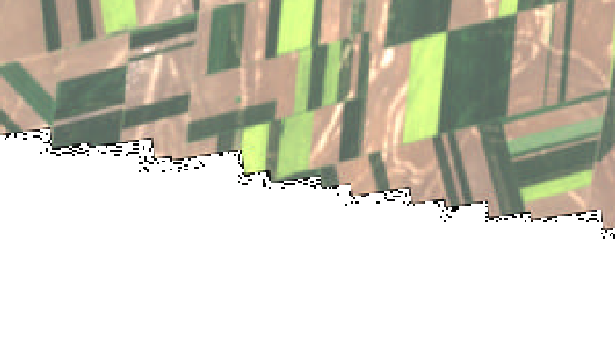

.. subsetting_resampling_reprojection:

================================================================================
Subsetting, resampling, reprojection
================================================================================

Raster resampling/resizing
--------------------------

Use `gdal raster resize <https://gdal.org/en/stable/programs/gdal_raster_resize.html>`__

::

    $ gdal raster resize \
        SENTINEL2_L2A:S2B_MSIL2A_20260423T094029_N0512_R036_T34TER_20260423T115714.SAFE/MTD_MSIL2A.xml:10m:EPSG_32634 \
        10m_bands_to_20m.tif \
        --resolution 20,20 \
        --resampling cubic

or

::

    $ gdal raster resize \
        SENTINEL2_L2A:S2B_MSIL2A_20260423T094029_N0512_R036_T34TER_20260423T115714.SAFE/MTD_MSIL2A.xml:10m:EPSG_32634 \
        10m_bands_half_size.tif \
        --size 50%,50% \
        --resampling cubic

Let's compare them with `gdal raster compare <https://gdal.org/en/stable/programs/gdal_raster_compare.html>`__

::

    $ gdal raster compare 10m_bands_to_20m.tif 10m_bands_half_size.tif 

==> no output, meaning they are bit-to-bit identical

Let's do that in Python
-----------------------

.. code-block:: python

    from osgeo import gdal
    filename = "SENTINEL2_L2A:S2B_MSIL2A_20260423T094029_N0512_R036_T34TER_20260423T115714.SAFE/MTD_MSIL2A.xml:10m:EPSG_32634"
    with gdal.alg.raster.resize(input=filename, output_format="MEM", output="", size=["50%","50%"]) as alg:
        output_dataset = alg.Output()
        print(output_dataset.ReadAsArray().shape)

::

    (6, 5490, 5490)

Alternatively:

.. code-block:: python

    from osgeo import gdal
    filename = "SENTINEL2_L2A:S2B_MSIL2A_20260423T094029_N0512_R036_T34TER_20260423T115714.SAFE/MTD_MSIL2A.xml:10m:EPSG_32634"
    alg = gdal.Algorithm("raster", "resize")
    alg["input"] = filename
    alg["output_format"] = "MEM"
    alg["output"] = ""
    alg["size"]=["50%","50%"]
    alg.Run()
    output_dataset = alg.Output()
    print(output_dataset.ReadAsArray().shape)
    output_dataset.Close()  # needed when the output is a "real" file, to make sure it is closed

Clipping
--------

Use `gdal raster clip <https://gdal.org/en/stable/programs/gdal_raster_clip.html>`__
and `gdal vector clip <https://gdal.org/en/stable/programs/gdal_vector_clip.html>`__

::

    $ gdal raster clip \
        SENTINEL2_L2A:S2B_MSIL2A_20260423T094029_N0512_R036_T34TER_20260423T115714.SAFE/MTD_MSIL2A.xml:10m:EPSG_32634 \
        clip.tif \
        --bbox 21.06809,45.64922,21.43590,45.86361 \
        --bbox-crs EPSG:4326

::

    $ gdal vector clip timisoara_points.gpkg \
        timisoara_points_clipped.gpkg \
        --like clip.tif

Exercise
--------

Clip :file:`SENTINEL2_L2A:S2B_MSIL2A_20260423T094029_N0512_R036_T34TER_20260423T115714.SAFE/MTD_MSIL2A.xml:10m:EPSG_32634`
with a circle centered on Timișoara center (45.7558° N, 21.2322° E) with a radius of 1 km.`

.. collapse:: (hint)

    .. hint::

        1. Create a GeoJSON file with a single point with the center.

        .. code-block::

            {"type":"Point", "coordinates":[<X>,<Y>]}

        2. With ``gdal vector info``, note the name of the layer

        3. With ``gdal vector sql``, create a circle centered around that geometry using
           options ``--sql`` and ``--dialect Spatialite``, knowing that the geometry
           column name will be ``geometry`` and using SQL functions ``ST_Transform`` to
           reproject the coordinate to the EPSG code of the raster layer, and
           ``ST_Buffer`` to create the circle.

==> :ref:`solution_clip`.

Reprojection
------------

Use `gdal raster reproject <https://gdal.org/en/stable/programs/gdal_raster_reproject.html>`__
and `gdal vector reproject <https://gdal.org/en/stable/programs/gdal_vector_reproject.html>`__

::

    $ gdal raster reproject s2_TDR_10m.xml --output-crs <TAB><TAB>

::

    EPSG:      ESRI:      IAU_2015:  IGNF:      NKG:       OGC:       PROJ:      

::

    $ gdal raster reproject s2_TDR_10m.xml --output-crs EPSG:<TAB><TAB>

::

    10659 -- ETRF2000 + EOMA 1980 height                     10596 -- WGS 84 / GLANCE Europe                          7902 -- ITRF90 (geographic 3D)
    10660 -- HD72 / EOV + EOMA 1980 height                   27704 -- WGS 84 / Equi7 Europe                           7903 -- ITRF91 (geographic 3D)
    23700 -- HD72 / EOV                                      4230 -- ED50 (geographic 2D)                             7904 -- ITRF92 (geographic 3D)
    3819 -- HD1909 (geographic 2D)                           3034 -- ETRS89-extended / LCC Europe                     7905 -- ITRF93 (geographic 3D)
    4237 -- HD72 (geographic 2D)                             3035 -- ETRS89-extended / LAEA Europe                    7906 -- ITRF94 (geographic 3D)
    4075 -- SREF98 (geographic 2D)                           32234 -- WGS 72 / UTM zone 34N                           7907 -- ITRF96 (geographic 3D)
    4074 -- SREF98 (geographic 3D)                           32434 -- WGS 72BE / UTM zone 34N                         7908 -- ITRF97 (geographic 3D)
    8682 -- SRB_ETRS89 / UTM zone 34N                        32634 -- WGS 84 / UTM zone 34N                           8997 -- ITRF2000 (geographic 2D)
    8685 -- SRB_ETRS89 (geographic 2D)                       3571 -- WGS 84 / North Pole LAEA Bering Sea              7909 -- ITRF2000 (geographic 3D)
    8684 -- SRB_ETRS89 (geographic 3D)                       3572 -- WGS 84 / North Pole LAEA Alaska                  7910 -- ITRF2005 (geographic 3D)
    6316 -- MGI 1901 / Balkans zone 7                        3573 -- WGS 84 / North Pole LAEA Canada                  7911 -- ITRF2008 (geographic 3D)
    3836 -- Pulkovo 1942(83) / Gauss-Kruger zone 4           3574 -- WGS 84 / North Pole LAEA Atlantic                7912 -- ITRF2014 (geographic 3D)
    31600 -- Dealul Piscului 1930 / Stereo 33                3575 -- WGS 84 / North Pole LAEA Europe                  8857 -- WGS 84 / Equal Earth Greenwich
    4316 -- Dealul Piscului 1930 (geographic 2D)             3576 -- WGS 84 / North Pole LAEA Russia                  8888 -- WGS 84 (Transit) (geographic 2D)
    3844 -- Pulkovo 1942(58) / Stereo70                      10598 -- WGS 84 / GLANCE North America                   8988 -- ITRF88 (geographic 2D)
    3906 -- MGI 1901 (geographic 2D)                         27705 -- WGS 84 / Equi7 North America                    8989 -- ITRF89 (geographic 2D)
    4805 -- MGI (Ferro) (geographic 2D)                      32600 -- WGS 84 / UTM grid system (northern hemisphere)  8990 -- ITRF90 (geographic 2D)
    4178 -- Pulkovo 1942(83) (geographic 2D)                 3408 -- NSIDC EASE-Grid North                            8991 -- ITRF91 (geographic 2D)
    3331 -- Pulkovo 1942(58) / 3-degree Gauss-Kruger zone 7  6931 -- WGS 84 / NSIDC EASE-Grid 2.0 North               8992 -- ITRF92 (geographic 2D)
    3334 -- Pulkovo 1942(58) / Gauss-Kruger zone 4           3395 -- WGS 84 / World Mercator                          8993 -- ITRF93 (geographic 2D)
    4179 -- Pulkovo 1942(58) (geographic 2D)                 3857 -- WGS 84 / Pseudo-Mercator                         8994 -- ITRF94 (geographic 2D)
    7409 -- ETRS89 + EVRF2000 height                         3410 -- NSIDC EASE-Grid Global                           8995 -- ITRF96 (geographic 2D)
    7423 -- ETRS89 + EVRF2007 height                         6933 -- WGS 84 / NSIDC EASE-Grid 2.0 Global              8996 -- ITRF97 (geographic 2D)
    9422 -- ETRS89 + EVRF2019 height                         10178 -- IGS20 (geographic 2D)                           8998 -- ITRF2005 (geographic 2D)
    9423 -- ETRS89 + EVRF2019 mean-tide height               10177 -- IGS20 (geographic 3D)                           8999 -- ITRF2008 (geographic 2D)
    25834 -- ETRS89 / UTM zone 34N                           10345 -- Hughes 1980 (geographic 2D)                     9000 -- ITRF2014 (geographic 2D)
    3046 -- ETRS89 / UTM zone 34N (N-E)                      10346 -- NSIDC Authalic Sphere (geographic 2D)           9003 -- IGS97 (geographic 2D)
    23034 -- ED50 / UTM zone 34N                             10606 -- WGS 84 (G2296) (geographic 2D)                  9002 -- IGS97 (geographic 3D)
    4231 -- ED87 (geographic 2D)                             10605 -- WGS 84 (G2296) (geographic 3D)                  9006 -- IGS00 (geographic 2D)
    4668 -- ED79 (geographic 2D)                             10781 -- ITRF2020-u2023 (geographic 2D)                  9005 -- IGS00 (geographic 3D)
    10571 -- ETRF2020 (geographic 2D)                        10780 -- ITRF2020-u2023 (geographic 3D)                  9009 -- IGb00 (geographic 2D)
    10570 -- ETRF2020 (geographic 3D)                        10785 -- IGb20 (geographic 2D)                           9008 -- IGb00 (geographic 3D)
    4258 -- ETRS89 (geographic 2D)                           10784 -- IGb20 (geographic 3D)                           9012 -- IGS05 (geographic 2D)
    4937 -- ETRS89 (geographic 3D)                           4087 -- WGS 84 / World Equidistant Cylindrical           9011 -- IGS05 (geographic 3D)
    9059 -- ETRF89 (geographic 2D)                           4276 -- NSWC 9Z-2 (geographic 2D)                        9014 -- IGS08 (geographic 2D)
    7915 -- ETRF89 (geographic 3D)                           4322 -- WGS 72 (geographic 2D)                           9013 -- IGS08 (geographic 3D)
    7917 -- ETRF90 (geographic 3D)                           4324 -- WGS 72BE (geographic 2D)                         9017 -- IGb08 (geographic 2D)
    7919 -- ETRF91 (geographic 3D)                           4326 -- WGS 84 (geographic 2D)                           9016 -- IGb08 (geographic 3D)
    7921 -- ETRF92 (geographic 3D)                           4740 -- PZ-90 (geographic 2D)                            9019 -- IGS14 (geographic 2D)
    7923 -- ETRF93 (geographic 3D)                           4760 -- WGS 66 (geographic 2D)                           9018 -- IGS14 (geographic 3D)
    7925 -- ETRF94 (geographic 3D)                           4891 -- WGS 66 (geographic 3D)                           9053 -- WGS 84 (G730) (geographic 2D)
    7927 -- ETRF96 (geographic 3D)                           4923 -- PZ-90 (geographic 3D)                            9054 -- WGS 84 (G873) (geographic 2D)
    7929 -- ETRF97 (geographic 3D)                           4979 -- WGS 84 (geographic 3D)                           9055 -- WGS 84 (G1150) (geographic 2D)
    8399 -- ETRF2005 (geographic 3D)                         4985 -- WGS 72 (geographic 3D)                           9056 -- WGS 84 (G1674) (geographic 2D)
    8403 -- ETRF2014 (geographic 3D)                         4987 -- WGS 72BE (geographic 3D)                         9057 -- WGS 84 (G1762) (geographic 2D)
    9060 -- ETRF90 (geographic 2D)                           6893 -- WGS 84 / World Mercator + EGM2008 height         9380 -- IGb14 (geographic 2D)
    9061 -- ETRF91 (geographic 2D)                           7657 -- WGS 84 (G730) (geographic 3D)                    9379 -- IGb14 (geographic 3D)
    9062 -- ETRF92 (geographic 2D)                           7659 -- WGS 84 (G873) (geographic 3D)                    9474 -- PZ-90.02 (geographic 2D)
    9063 -- ETRF93 (geographic 2D)                           7661 -- WGS 84 (G1150) (geographic 3D)                   9475 -- PZ-90.11 (geographic 2D)
    9064 -- ETRF94 (geographic 2D)                           7663 -- WGS 84 (G1674) (geographic 3D)                   9518 -- WGS 84 + EGM2008 height
    9065 -- ETRF96 (geographic 2D)                           7665 -- WGS 84 (G1762) (geographic 3D)                   9705 -- WGS 84 + MSL height
    9066 -- ETRF97 (geographic 2D)                           7678 -- PZ-90.02 (geographic 3D)                         9707 -- WGS 84 + EGM96 height
    9067 -- ETRF2000 (geographic 2D)                         7680 -- PZ-90.11 (geographic 3D)                         9755 -- WGS 84 (G2139) (geographic 2D)
    7931 -- ETRF2000 (geographic 3D)                         7816 -- WGS 84 (Transit) (geographic 3D)                 9754 -- WGS 84 (G2139) (geographic 3D)
    9068 -- ETRF2005 (geographic 2D)                         7900 -- ITRF88 (geographic 3D)                           9990 -- ITRF2020 (geographic 2D)
    9069 -- ETRF2014 (geographic 2D)                         7901 -- ITRF89 (geographic 3D)                           9989 -- ITRF2020 (geographic 3D)

Or use `CRS explorer at spatialreference.org <https://spatialreference.org/explorer.html?latlng=45.740693,21.211853&ignoreWorld=false&allowDeprecated=false&authorities=EPSG&activeTypes=PROJECTED_CRS>`__

and let's write as a replayable :file:`.gdalg.json` file:
https://gdal.org/en/stable/drivers/raster/gdalg.html

::

    $ gdal raster scale TDR_rgb.tif TDR_rgb_byte_clamped.gdalg.json  \
            --input-min 400 \
            --input-max 2400 \
            --output-data-type uint8

::

    $ cat TDR_rgb_byte_clamped.gdalg.json

.. code-block:: json

    {
      "type":"gdal_streamed_alg",
      "command_line":"gdal raster scale --input TDR_rgb.tif --output-data-type UInt8 --input-min 400 --input-max 2400 --output-format stream --output streamed_dataset",
      "gdal_version":"3130000"
    }
    
::

    $ gdal info TDR_rgb_byte_clamped.gdalg.json

::

    Driver: GDALG/GDAL Streamed Algorithm driver
    Files: TDR_rgb_byte_clamped.gdalg.json
    Size is 10980, 10980
    Coordinate Reference System:
      - name: WGS 84 / UTM zone 34N
      - ID: EPSG:32634
      - type: Projected
      - projection type: UTM zone 34N, Transverse Mercator
      - units: metre
      - area of use: Between 18°E and 24°E..., west 18.00, south 0.00, east 24.00, north 84.00
    Data axis to CRS axis mapping: 1,2
    Origin = (399960.000000000000000,5100000.000000000000000)
    Pixel Size = (10.000000000000000,-10.000000000000000)
    Metadata:
      AOT_QUANTIFICATION_VALUE=1000.0
      AOT_QUANTIFICATION_VALUE_UNIT=none
      AOT_RETRIEVAL_ACCURACY=0.0
      AOT_RETRIEVAL_METHOD=SEN2COR_DDV
      AREA_OR_POINT=Area
      BOA_QUANTIFICATION_VALUE=10000
      BOA_QUANTIFICATION_VALUE_UNIT=none
      CAST_SHADOW_PERCENTAGE=0.020978
      CLOUDY_PIXEL_OVER_LAND_PERCENTAGE=13.652931
      CLOUD_COVERAGE_ASSESSMENT=13.622445
      CLOUD_SHADOW_PERCENTAGE=4.0E-6
      DATATAKE_1_DATATAKE_SENSING_START=2026-04-23T09:40:29.024Z
      DATATAKE_1_DATATAKE_TYPE=INS-NOBS
      DATATAKE_1_ID=GS2B_20260423T094029_047681_N05.12
      DATATAKE_1_SENSING_ORBIT_DIRECTION=DESCENDING
      DATATAKE_1_SENSING_ORBIT_NUMBER=36
      DATATAKE_1_SPACECRAFT_NAME=Sentinel-2B
      DEGRADED_ANC_DATA_PERCENTAGE=0.0
      DEGRADED_MSI_DATA_PERCENTAGE=0
      FORMAT_CORRECTNESS=PASSED
      GENERAL_QUALITY=PASSED
      GENERATION_TIME=2026-04-23T11:57:14.000000Z
      GEOMETRIC_QUALITY=PASSED
      GRANULE_MEAN_AOT=0.06598
      GRANULE_MEAN_WV=0.75046
      HIGH_PROBA_CLOUDS_PERCENTAGE=0.001836
      L2A_QUALITY=PASSED
      MEDIUM_PROBA_CLOUDS_PERCENTAGE=0.009661
      NODATA_PIXEL_PERCENTAGE=9.990737
      NOT_VEGETATED_PERCENTAGE=28.988278
      OZONE_SOURCE=AUX_ECMWFT
      OZONE_VALUE=416.167104
      PREVIEW_GEO_INFO=Not applicable
      PREVIEW_IMAGE_URL=Not applicable
      PROCESSING_BASELINE=05.12
      PROCESSING_LEVEL=Level-2A
      PRODUCT_DOI=https://doi.org/10.5270/S2_-znk9xsj
      PRODUCT_START_TIME=2026-04-23T09:40:29.024Z
      PRODUCT_STOP_TIME=2026-04-23T09:40:29.024Z
      PRODUCT_TYPE=S2MSI2A
      PRODUCT_URI=S2B_MSIL2A_20260423T094029_N0512_R036_T34TDR_20260423T115714.SAFE
      RADIATIVE_TRANSFER_ACCURACY=0.0
      RADIOMETRIC_QUALITY=PASSED
      REFERENCE_BAND=B4
      REFLECTANCE_CONVERSION_U=0.991700831171221
      SATURATED_DEFECTIVE_PIXEL_PERCENTAGE=0.0
      SENSOR_QUALITY=PASSED
      SNOW_ICE_PERCENTAGE=0.0
      SPECIAL_VALUE_NODATA=0
      SPECIAL_VALUE_SATURATED=65535
      THIN_CIRRUS_PERCENTAGE=13.610949
      UNCLASSIFIED_PERCENTAGE=0.243549
      VEGETATION_PERCENTAGE=56.460464
      WATER_PERCENTAGE=0.664281
      WATER_VAPOUR_RETRIEVAL_ACCURACY=0.0
      WVP_QUANTIFICATION_VALUE=1000.0
      WVP_QUANTIFICATION_VALUE_UNIT=cm
    Image Structure Metadata:
      INTERLEAVE=PIXEL
    Corner Coordinates:
    Upper Left  (  399960.000, 5100000.000) ( 19d42'25.02"E, 46d 2'46.53"N)
    Lower Left  (  399960.000, 4990200.000) ( 19d43'45.90"E, 45d 3'29.49"N)
    Upper Right (  509760.000, 5100000.000) ( 21d 7'34.20"E, 46d 3'12.62"N)
    Lower Right (  509760.000, 4990200.000) ( 21d 7'26.31"E, 45d 3'54.69"N)
    Center      (  454860.000, 5045100.000) ( 20d25'17.86"E, 45d33'28.71"N)
    Band 1 Block=256x256 Type=Byte, ColorInterp=Red
      Metadata:
        BANDNAME=B4
        BANDWIDTH=30
        BANDWIDTH_UNIT=nm
        BOA_ADD_OFFSET=-1000
        SOLAR_IRRADIANCE=1512.79
        SOLAR_IRRADIANCE_UNIT=W/m2/um
        WAVELENGTH=665
        WAVELENGTH_UNIT=nm
    Band 2 Block=256x256 Type=Byte, ColorInterp=Green
      Metadata:
        BANDNAME=B3
        BANDWIDTH=35
        BANDWIDTH_UNIT=nm
        BOA_ADD_OFFSET=-1000
        SOLAR_IRRADIANCE=1824.93
        SOLAR_IRRADIANCE_UNIT=W/m2/um
        WAVELENGTH=560
        WAVELENGTH_UNIT=nm
    Band 3 Block=256x256 Type=Byte, ColorInterp=Blue
      Metadata:
        BANDNAME=B2
        BANDWIDTH=65
        BANDWIDTH_UNIT=nm
        BOA_ADD_OFFSET=-1000
        SOLAR_IRRADIANCE=1959.75
        SOLAR_IRRADIANCE_UNIT=W/m2/um
        WAVELENGTH=490
        WAVELENGTH_UNIT=nm

::

    $ gdal raster reproject TDR_rgb_byte_clamped.gdalg.json TDR_3035.tif \
        --output-crs EPSG:3035 -r cubic --creation-option TILED=YES --creation-option COMPRESS=JPEG

Let's look at it in QGIS.

Nice, but can we get rid of the black collar ?

Sure let's say the nodata value (invalid value, sentinel value) to zero.

::

    $ gdal raster edit TDR_3035.tif --nodata 0

.. note::

    ``gdal raster edit`` is a bit of an exception in that it does not take an
    input and output dataset, but a single one. The "edit" wording should make
    it clear that this is edition in place.

Let's look again in QGIS. Zoom in on the south-western border. Hum "interesting"
artifacts appear.

Let's clean them with `gdal raster clean-collar <https://gdal.org/en/stable/programs/gdal_raster_clean-collar.html>`__

::

    $ gdal raster clean-collar TDR_3035.tif TDR_3035_with_mask.tif \
        --add-mask --creation-option TILED=YES  --creation-option COMPRESS=JPEG

Exercise
--------

Generate in a single step a tiled JPEG-compressed GeoTIFF reprojected image.

And make sure it includes overviews.

.. collapse:: (hint)

    .. hint::

        1. Use the ``--input-nodata`` and ``--add-alpha`` options

        2. Use `gdal raster overview add <https://gdal.org/en/stable/programs/gdal_raster_overview_add.html>`__
           or think to a format whose generation with GDAL automatically includes
           overviews.

==> :ref:`solution_reproject`.
